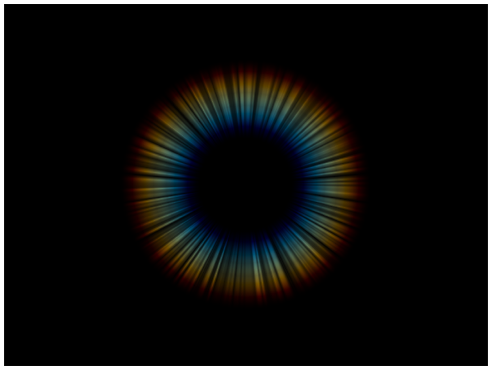

> Navigation: [Technologies](../../technologies.md) · [Core Image](../../coreimage.md) · [CIFilter](../cifilter-swift.class.md)

# lenticularHaloGenerator()

<sub>Type Method</sub>

Generates a lenticular halo image.

<sub>iOS, iPadOS, Mac Catalyst, macOS, tvOS, visionOS</sub>

```swift
class func lenticularHaloGenerator() -> any CIFilter & CILenticularHaloGenerator
```

## Return Value

The generated image.

## Discussion

This method generates a lenticular halo image. You commonly combine this effect with an image to simulate a halo generated by the spread of light on a lens.

The lenticular halo generator filter uses the following properties:

- **`center`** — A `vector` representing the center of the lens flare as a [CIVector](../civector.md).
- **`color`** — A [CIColor](../cicolor.md) controlling the proportion of red, green, and blue halos.
- **`haloWidth`** — A `float` representing the halo width as an [NSNumber](../../foundation/nsnumber.md).
- **`haloRadius`** — A `float` representing the halo radius as an [NSNumber](../../foundation/nsnumber.md).
- **`haloOverlap`** — A `float` representing the overlap of red, green, and blue halos as an [NSNumber](../../foundation/nsnumber.md). A value of 1 results in a full overlap.
- **`striationStrength`** — A `float` representing the brightness of the rainbow-colored halo area as an [NSNumber](../../foundation/nsnumber.md).
- **`striationContrast`** — A `float` representing the contrast of the rainbow-colored halo area as an [NSNumber](../../foundation/nsnumber.md).
- **`time`** — A `float` representing the addition of brightness to the halo as an [NSNumber](../../foundation/nsnumber.md).

The following code creates a filter that generates a lenticular halo image:

```swift
func lenticularHalo() -> CIImage {
    let lenticularHaloGenerator = CIFilter.lenticularHaloGenerator()
    lenticularHaloGenerator.center = CGPoint(x: 200, y: 200)
    lenticularHaloGenerator.color = CIColor(red: 1.2, green: 2.7, blue: 2.5)
    lenticularHaloGenerator.haloWidth = 87
    lenticularHaloGenerator.haloRadius = 70
    lenticularHaloGenerator.haloOverlap = 0.77
    lenticularHaloGenerator.striationStrength = 0.50
    lenticularHaloGenerator.striationContrast = 1.00
    lenticularHaloGenerator.time = 0.00
    return lenticularHaloGenerator.outputImage!
}
```



<sub>An object made of colored rings gradually changing in color from the center rings made of shades of blues while the outer rings are made of darker shades of red and orange. Each ring of the halo is made of angled striations.</sub>

## See Also

### Filters

- [+ attributedTextImageGeneratorFilter](<attributedtextimagegenerator().md>) — Generates an attributed-text image.
- [+ aztecCodeGeneratorFilter](<azteccodegenerator().md>) — Generates a low-density barcode.
- [+ barcodeGeneratorFilter](<barcodegenerator().md>) — Generates a barcode as an image from the descriptor.
- [+ blurredRectangleGeneratorFilter](<blurredrectanglegenerator().md>) — Generates a blurred rectangle.
- [+ checkerboardGeneratorFilter](<checkerboardgenerator().md>) — Generates a checkerboard image.
- [+ code128BarcodeGeneratorFilter](<code128barcodegenerator().md>) — Generates a high-density, linear barcode.
- [+ meshGeneratorFilter](<meshgenerator().md>) — Generates a pattern made from an array of line segments.
- [+ PDF417BarcodeGenerator](<pdf417barcodegenerator().md>) — Generates a high-density linear barcode.
- [+ QRCodeGenerator](<qrcodegenerator().md>) — Generates a quick response (QR) code image.
- [+ randomGeneratorFilter](<randomgenerator().md>) — Generates a random filter image.
- [+ roundedRectangleGeneratorFilter](<roundedrectanglegenerator().md>) — Generates a rounded rectangle image.
- [+ roundedRectangleStrokeGeneratorFilter](<roundedrectanglestrokegenerator().md>) — Creates an image containing the outline of a rounded rectangle.
- [+ starShineGeneratorFilter](<starshinegenerator().md>) — Generates a star-shine image.
- [+ stripesGeneratorFilter](<stripesgenerator().md>) — Generates a line of stripes as an image
- [+ sunbeamsGeneratorFilter](<sunbeamsgenerator().md>) — Generates an image resembling the sun.
