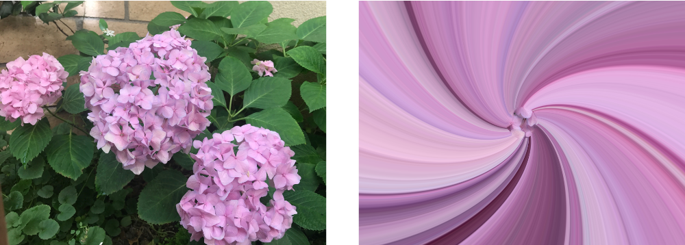

> Navigation: [Technologies](../../technologies.md) · [Core Image](../../coreimage.md) · [CIFilter](../cifilter-swift.class.md)

# lightTunnel()

<sub>Type Method</sub>

Distorts an image by generating a light tunnel.

<sub>iOS, iPadOS, Mac Catalyst, macOS, tvOS, visionOS</sub>

```swift
class func lightTunnel() -> any CIFilter & CILightTunnel
```

## Return Value

The distorted image.

## Discussion

This method applies the light tunnel filter to an image. This effect distorts the input image by warping the image to cylinder shape.

The light tunnel filter uses the following properties:

- **`inputImage`** — An image with the type [CIImage](../ciimage.md).
- **`center`** — A set of coordinates marking the center of the light tunnel as a [CGPoint](../../corefoundation/cgpoint.md).
- **`radius`** — A `float` representing the amount of pixels the filter uses to create the light tunnel as an [NSNumber](../../foundation/nsnumber.md).
- **rotation** — A `float` representing the rotation angle of the light tunnel as an [NSNumber](../../foundation/nsnumber.md).

The following code creates a filter that generates a swirling pattern from the input image:

```swift
func lightTunnel(inputImage: CIImage) -> CIImage {
    let filter = CIFilter.lightTunnel()
    filter.inputImage = inputImage
    filter.radius = 100
    filter.rotation = .pi
    filter.center = CGPoint(
        x: inputImage.extent.width / 2,
        y: inputImage.extent.size.height / 2
    )
    return filter.outputImage!.cropped(to: inputImage.extent)
}
```



<sub>Two images arranged horizontally. The left image contains a photograph of three hydrangea flowers with leaves in the background. The image on the right shows the result of applying the light tunnel filter, which produces a swirling pattern that shrinks towards the center of the image.</sub>

## See Also

### Filters

- [+ bumpDistortionFilter](<bumpdistortion().md>) — Distorts an image with a concave or convex bump.
- [+ bumpDistortionLinearFilter](<bumpdistortionlinear().md>) — Linearly distorts an image with a concave or convex bump.
- [+ circleSplashDistortionFilter](<circlesplashdistortion().md>) — Distorts an image with radiating circles to the periphery of the image.
- [+ circularWrapFilter](<circularwrap().md>) — Distorts an image by increasing the distance of the center of the image.
- [+ displacementDistortionFilter](<displacementdistortion().md>) — Applies the grayscale values of the second image to the first image.
- [+ drosteFilter](<droste().md>) — Stylizes an image with the Droste effect.
- [+ glassDistortionFilter](<glassdistortion().md>) — Distorts an image by applying a glass-like texture.
- [+ glassLozengeFilter](<glasslozenge().md>) — Creates a lozenge-shaped lens and distorts the image.
- [+ holeDistortionFilter](<holedistortion().md>) — Distorts an image with a circular area that pushes the image outward.
- [+ ninePartStretchedFilter](<ninepartstretched().md>) — Distorts an image by stretching it between two breakpoints.
- [+ ninePartTiledFilter](<nineparttiled().md>) — Distorts an image by tiling portions of it.
- [+ pinchDistortionFilter](<pinchdistortion().md>) — Distorts an image by creating a pinch effect with stronger distortion in the center.
- [+ stretchCropFilter](<stretchcrop().md>) — Distorts an image by stretching or cropping to fit a specified size.
- [+ torusLensDistortionFilter](<toruslensdistortion().md>) — Creates a torus-shaped lens to distort the image.
- [+ twirlDistortionFilter](<twirldistortion().md>) — Distorts an image by rotating pixels around a center point.
