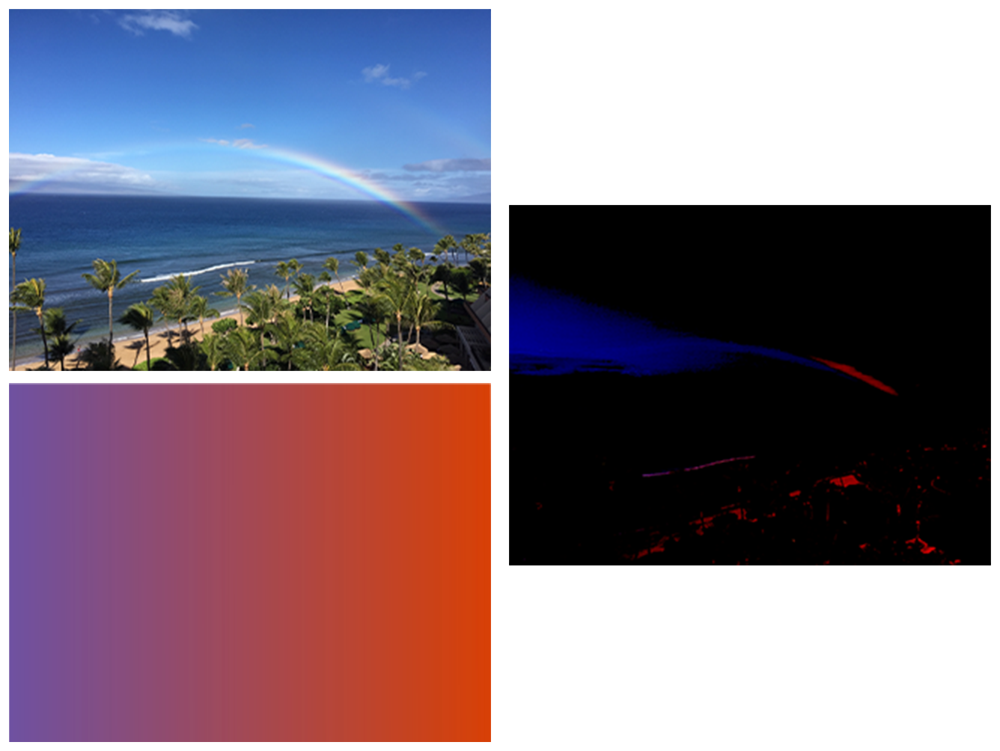

> Navigation: [Technologies](../../technologies.md) · [Core Image](../../coreimage.md) · [CIFilter](../cifilter-swift.class.md)

# linearBurnBlendMode()

<sub>Type Method</sub>

Blends color from two images while increasing contrast.

<sub>iOS, iPadOS, Mac Catalyst, macOS, tvOS, visionOS</sub>

```swift
class func linearBurnBlendMode() -> any CIFilter & CICompositeOperation
```

## Return Value

The modified image.

## Discussion

This method applies the linear-burn blend mode filter to an image. The effect calculates the brightness value for the background image then darkens it to reflect the brightness of the input image. The effect then decreases the contrast in the output image.

The linear-burn blend mode filter uses the following properties:

- **`inputImage`** — An image with the type [CIImage](../ciimage.md).
- **`backgroundImage`** — An image with the type [CIImage](../ciimage.md).

The following code creates a filter that results in an output image that’s much darker with very little visible detail:

```swift
func linearBurnBlendMode(inputImage: CIImage, backgroundImage: CIImage) -> CIImage {
    let colorBlendFilter = CIFilter.linearBurnBlendMode()
    colorBlendFilter.inputImage = inputImage
    colorBlendFilter.backgroundImage = backgroundImage
    return colorBlendFilter.outputImage!
}
```



<sub>The image on the top left shows a beach with multiple palm trees and a rainbow arching across the blue sky.  The image below is a gradient image displaying a gradual color shift from purple to a dark orange. The image on the right shows the output from applying a linear burn blend mode filter. The result displays the beach rainbow image with very little detail and brightness.</sub>

## See Also

### Filters

- [+ additionCompositingFilter](<additioncompositing().md>) — Blends colors from two images by addition.
- [+ colorBlendModeFilter](<colorblendmode().md>) — Blends color from two images using the luminance values from the background image and the hue and saturation values from the input image.
- [+ colorBurnBlendModeFilter](<colorburnblendmode().md>) — Blends color from two images while darkening the image.
- [+ colorDodgeBlendModeFilter](<colordodgeblendmode().md>) — Blends color from two images using dodging.
- [+ darkenBlendModeFilter](<darkenblendmode().md>) — Blends colors from two images while darkening lighter pixels.
- [+ differenceBlendModeFilter](<differenceblendmode().md>) — Subtracts color values to blend colors.
- [+ divideBlendModeFilter](<divideblendmode().md>) — Divides color values to blend colors.
- [+ exclusionBlendModeFilter](<exclusionblendmode().md>) — Subtracts color values to blend colors with less contrast.
- [+ hardLightBlendModeFilter](<hardlightblendmode().md>) — Blends colors of two images by screening and multiplying.
- [+ hueBlendModeFilter](<hueblendmode().md>) — Blends colors of two images by computing the sum of image color values.
- [+ lightenBlendModeFilter](<lightenblendmode().md>) — Blends colors from two images by brightening colors.
- [+ linearDodgeBlendModeFilter](<lineardodgeblendmode().md>) — Blends colors of two images with dodging.
- [+ linearLightBlendModeFilter](<linearlightblendmode().md>) — A combination of linear burn and linear dodge blend modes.
- [+ luminosityBlendModeFilter](<luminosityblendmode().md>) — Blends color from two images by calculating the color, hue, and saturation.
- [+ minimumCompositingFilter](<minimumcompositing().md>) — Blends colors from two images by computing minimum values.
