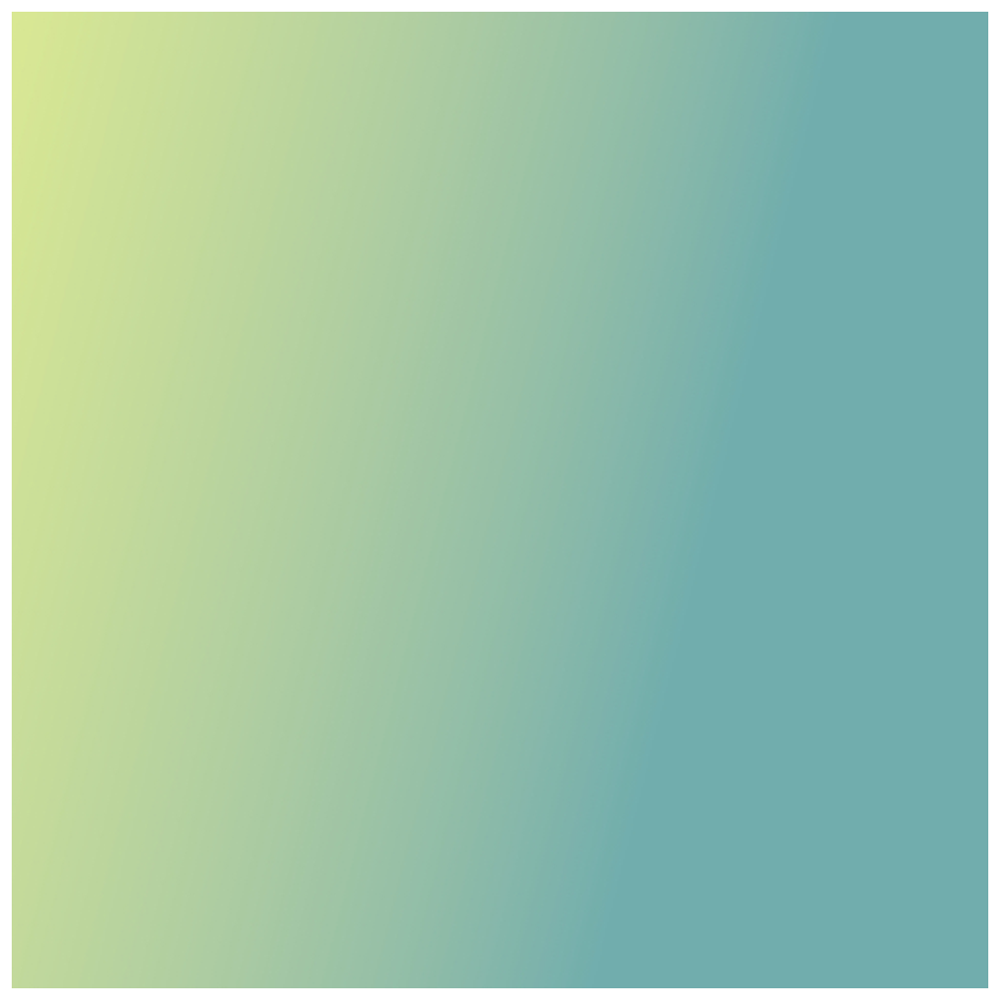

> Navigation: [Technologies](../../technologies.md) · [Core Image](../../coreimage.md) · [CIFilter](../cifilter-swift.class.md)

# linearGradient()

<sub>Type Method</sub>

Generates a color gradient that varies along a linear axis between two defined endpoints.

<sub>iOS, iPadOS, Mac Catalyst, macOS, tvOS, visionOS</sub>

```swift
class func linearGradient() -> any CIFilter & CILinearGradient
```

## Return Value

The generated image.

## Discussion

This method generates a linear-gradient image. The effect creates a gradient that varies linearly between the two input properties of `point0` and `point1`.

The linear-gradient filter uses the following properties:

- **`point0`** — A [CGPoint](../../corefoundation/cgpoint.md) representing the starting position of the gradient.
- **`point1`** — A [CGPoint](../../corefoundation/cgpoint.md) representing the ending position of the gradient.
- **`color0`** — A [CIColor](../cicolor.md) representing the first color to use in the gradient.
- **`color1`** — A [CIColor](../cicolor.md) representing the second color to use the gradient.

The following code creates a filter that generates a gradient image:

```swift
func linear() -> CIImage {
    let linearGradient = CIFilter.linearGradient()
    linearGradient.point0 = CGPoint(x: 0, y: 0)
    linearGradient.point1 = CGPoint(x: 200, y: 200)
    linearGradient.color0 = CIColor(red: 216/255, green: 232/255, blue: 146/255)
    linearGradient.color1 = CIColor(red: 0/255, green: 112/255, blue: 201/255)
    return linearGradient.outputImage!
}
```



## See Also

### Filters

- [+ gaussianGradientFilter](<gaussiangradient().md>) — Generates a gradient that varies from one color to another using a Gaussian distribution.
- [+ hueSaturationValueGradientFilter](<huesaturationvaluegradient().md>) — Generates a gradient representing a specified color space.
- [+ radialGradientFilter](<radialgradient().md>) — Generates a gradient that varies radially between two circles having the same center.
- [+ smoothLinearGradientFilter](<smoothlineargradient().md>) — Generates a gradient that blends colors along a linear axis between two defined endpoints.
