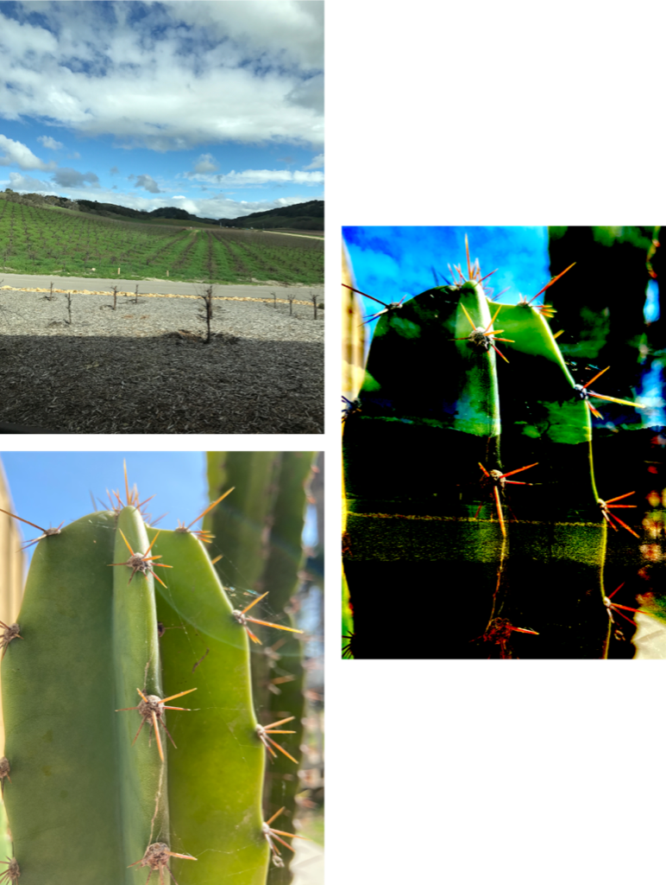

> Navigation: [Technologies](../../technologies.md) · [Core Image](../../coreimage.md) · [CIFilter](../cifilter-swift.class.md)

# linearLightBlendMode()

<sub>Type Method</sub>

A combination of linear burn and linear dodge blend modes.

<sub>iOS, iPadOS, Mac Catalyst, macOS, tvOS, visionOS</sub>

```swift
class func linearLightBlendMode() -> any CIFilter & CICompositeOperation
```

## Return Value

The blended image as a [CIImage](../ciimage.md).

## Discussion

The linear-light blend mode combines the linear-dodge and linear-burn blend modes (rescaled so that neutral colors become middle gray). If the input image’s values are lighter than middle gray, the filter uses dodge; for darker values, the filter uses burn.

- **`inputImage`** — A [CIImage](../ciimage.md) containing the input image
- **`backgroundImage`** — A [CIImage](../ciimage.md) containing the background image.

The following code sample applies the linear-light blend mode filter to two images:

```swift
func linearLightBlendMode(inputImage: CIImage, backgroundImage: CIImage) -> CIImage {
    let filter = CIFilter.linearLightBlendMode()
    filter.inputImage = inputImage
    filter.backgroundImage = backgroundImage
    return filter.outputImage!
}
```



<sub>Two images arranged vertically on the left and a third image on the right. The top left image contains a photograph of a vineyard. The lower third of the image contains gravel with a deep shadow in the foreground. The image on the bottom left is a closeup photograph of a cactus. The image on the right shows the result of applying the linear-light blend mode filter.</sub>

## See Also

### Filters

- [+ additionCompositingFilter](<additioncompositing().md>) — Blends colors from two images by addition.
- [+ colorBlendModeFilter](<colorblendmode().md>) — Blends color from two images using the luminance values from the background image and the hue and saturation values from the input image.
- [+ colorBurnBlendModeFilter](<colorburnblendmode().md>) — Blends color from two images while darkening the image.
- [+ colorDodgeBlendModeFilter](<colordodgeblendmode().md>) — Blends color from two images using dodging.
- [+ darkenBlendModeFilter](<darkenblendmode().md>) — Blends colors from two images while darkening lighter pixels.
- [+ differenceBlendModeFilter](<differenceblendmode().md>) — Subtracts color values to blend colors.
- [+ divideBlendModeFilter](<divideblendmode().md>) — Divides color values to blend colors.
- [+ exclusionBlendModeFilter](<exclusionblendmode().md>) — Subtracts color values to blend colors with less contrast.
- [+ hardLightBlendModeFilter](<hardlightblendmode().md>) — Blends colors of two images by screening and multiplying.
- [+ hueBlendModeFilter](<hueblendmode().md>) — Blends colors of two images by computing the sum of image color values.
- [+ lightenBlendModeFilter](<lightenblendmode().md>) — Blends colors from two images by brightening colors.
- [+ linearBurnBlendModeFilter](<linearburnblendmode().md>) — Blends color from two images while increasing contrast.
- [+ linearDodgeBlendModeFilter](<lineardodgeblendmode().md>) — Blends colors of two images with dodging.
- [+ luminosityBlendModeFilter](<luminosityblendmode().md>) — Blends color from two images by calculating the color, hue, and saturation.
- [+ minimumCompositingFilter](<minimumcompositing().md>) — Blends colors from two images by computing minimum values.
