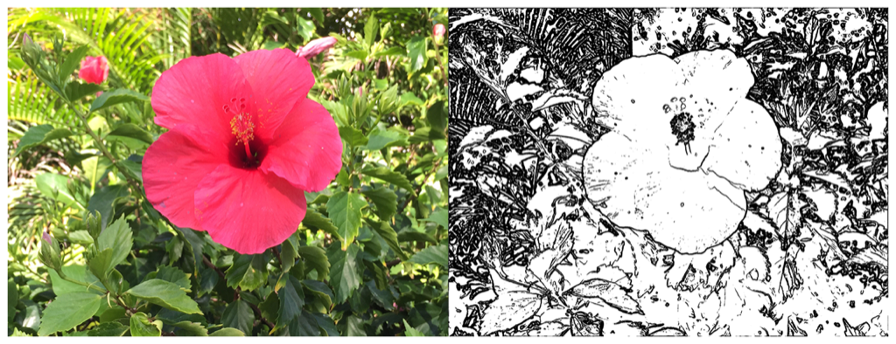

> Navigation: [Technologies](../../technologies.md) · [Core Image](../../coreimage.md) · [CIFilter](../cifilter-swift.class.md)

# lineOverlay()

<sub>Type Method</sub>

Creates an image that resembles a sketch of the outlines of objects.

<sub>iOS, iPadOS, Mac Catalyst, macOS, tvOS, visionOS</sub>

```swift
class func lineOverlay() -> any CIFilter & CILineOverlay
```

## Return Value

The modified image.

## Discussion

This method applies the line overlay filter to an image. The effect creats a sketch that outlines the edges of the image in black, leaving the non-outlined portion of the image transparent.

The line overlay filter uses the following properties:

- **`inputImage`** — An image with the type [CIImage](../ciimage.md).
- **`nrNoiseLevel`** — A `float` representing the desired level of noise as an [NSNumber](../../foundation/nsnumber.md).
- **`nrSharpness`** — A `float` representing the desired level of sharpness as an [NSNumber](../../foundation/nsnumber.md).
- **`edgeIntensity`** — A `float` representing the Sobel gradient information for edge tracing as an [NSNumber](../../foundation/nsnumber.md).
- **`threshold`** — A `float` representing the threshold of edge visibilty as an [NSNumber](../../foundation/nsnumber.md).
- **`contrast`** — A `float` representing the desired contrast as an [NSNumber](../../foundation/nsnumber.md).

The following code creates a filter that results in a monochrome image with lines outlining the edges of objects:

```swift
func lineOverlay(inputImage: CIImage) -> CIImage {
    let lineOverlay = CIFilter.lineOverlay()
    lineOverlay.inputImage = inputImage
    lineOverlay.nrNoiseLevel = 0.07
    lineOverlay.nrSharpness = 0.71
    lineOverlay.edgeIntensity = 1
    lineOverlay.threshold = 0.1
    lineOverlay.contrast = 50.00
    return lineOverlay.outputImage!
}
```



<sub>Two pictures of a pink flower surrounded by foliage. The photo on the left shows a single flower photographed close up, in focus, with good light and no effects. In the photo on the right, the line overlay filter is applied, resulting in a monochrome image with the edges of objects outlined in black.</sub>

## See Also

### Filters

- [+ blendWithAlphaMaskFilter](<blendwithalphamask().md>) — Blends two images by using an alpha mask image.
- [+ blendWithBlueMaskFilter](<blendwithbluemask().md>) — Blends two images by using a blue mask image.
- [+ blendWithMaskFilter](<blendwithmask().md>) — Blends two images by using a mask image.
- [+ blendWithRedMaskFilter](<blendwithredmask().md>) — Blends two images by using a red mask image.
- [+ bloomFilter](<bloom().md>) — Adjusts an image’s colors by applying a blur effect.
- [+ cannyEdgeDetectorFilter](<cannyedgedetector().md>) — Applies the Canny edge-detection algorithm to an image.
- [+ comicEffectFilter](<comiceffect().md>) — Creates an image with a comic book effect.
- [+ coreMLModelFilter](<coremlmodel().md>) — Filters an image with a Core ML model.
- [+ crystallizeFilter](<crystallize().md>) — Creates an image made with a series of colorful polygons.
- [+ depthOfFieldFilter](<depthoffield().md>) — Simulates a depth of field effect.
- [+ edgesFilter](<edges().md>) — Hilghlights edges of objects found within an image.
- [+ edgeWorkFilter](<edgework().md>) — Produces a black-and-white image that looks similar to a woodblock print.
- [+ gaborGradientsFilter](<gaborgradients().md>) — Highlights textures in an image.
- [+ gloomFilter](<gloom().md>) — Adjusts an image’s color by applying a gloom filter.
- [+ heightFieldFromMaskFilter](<heightfieldfrommask().md>) — Creates a realistic shaded height-field image.
