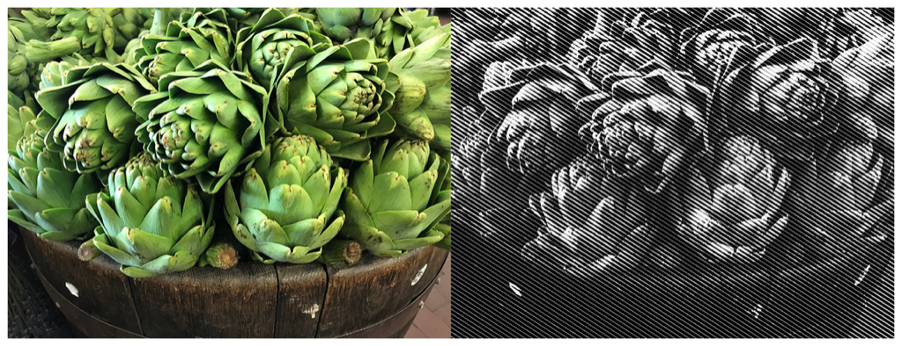

> Navigation: [Technologies](../../technologies.md) · [Core Image](../../coreimage.md) · [CIFilter](../cifilter-swift.class.md)

# lineScreen()

<sub>Type Method</sub>

Creates a monochrome image with a series of small lines to add detail.

<sub>iOS, iPadOS, Mac Catalyst, macOS, tvOS, visionOS</sub>

```swift
class func lineScreen() -> any CIFilter & CILineScreen
```

## Return Value

The modified image.

## Discussion

This method applies a line screen filter to an image. The effect generates a monochrome image containing a series of lines creating detail. The halftone effect is a set of lines, dots, or circles that contain detail. When viewing the image from a distance, the markings blend together, creating the illusion of continuous lines and shapes. Print media commonly uses this effect.

The line screen filter uses the following properties:

- **`inputImage`** — An image with the type [CIImage](../ciimage.md).
- **`center`** — A set of coordinates marking the center of the image as a [CGPoint](../../corefoundation/cgpoint.md).
- **`angle`** — A `float` representing the angle of the pattern as an [NSNumber](../../foundation/nsnumber.md).
- **`width`** — A `float` representing the distance between lines in the pattern as an [NSNumber](../../foundation/nsnumber.md).
- **`sharpness`** — A `float` representing the sharpness of the pattern as an [NSNumber](../../foundation/nsnumber.md).

The following code creates a filter that creates a monochrome image containing small lines of detail on a black background:

```swift
func line(inputImage: CIImage) -> CIImage {
    let lineScreen = CIFilter.lineScreen()
    lineScreen.inputImage = inputImage
    lineScreen.center = CGPoint(x: 2016, y: 1512)
    lineScreen.angle = 1
    lineScreen.width = 35
    lineScreen.sharpness = 0.7
    return lineScreen.outputImage!
}
```



<sub>Two photographs of a wooden barrel of green artichokes. The artichokes are crisp with good lighting. The photo one the left has no modifications to color or detail. In the photo on the right, a line screen filter is applied, resulting in a lighter, monochrome image with an overlay of lines, creating the detail of the image.</sub>

## See Also

### Filters

- [+ circularScreenFilter](<circularscreen().md>) — Adds a circular overlay to an image.
- [+ CMYKHalftone](<cmykhalftone().md>) — Adds a series of colorful dots to an image.
- [+ dotScreenFilter](<dotscreen().md>) — Creates a monochrome image with a series of dots to add detail.
- [+ hatchedScreenFilter](<hatchedscreen().md>) — Creates a monochrome image with a series of lines to add detail.
