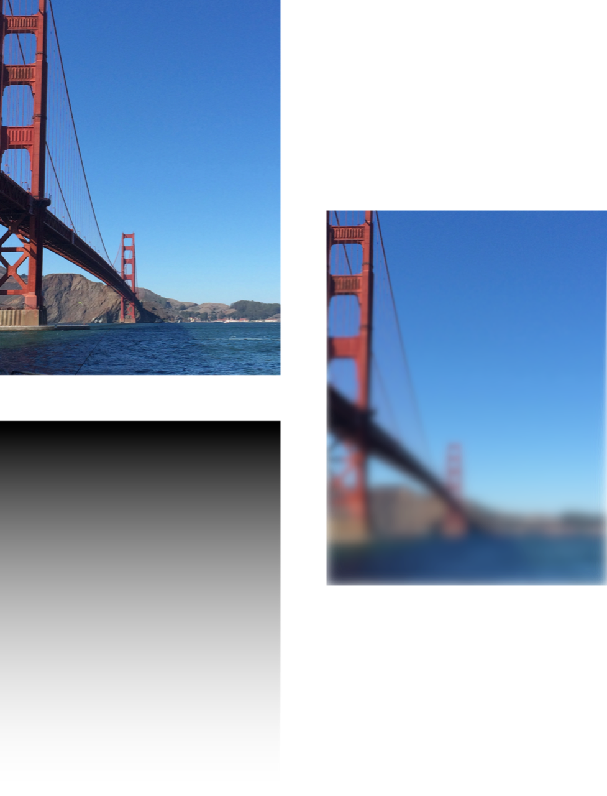

> Navigation: [Technologies](../../technologies.md) · [Core Image](../../coreimage.md) · [CIFilter](../cifilter-swift.class.md)

# maskedVariableBlur()

<sub>Type Method</sub>

Blurs a specified portion of an image.

<sub>iOS, iPadOS, Mac Catalyst, macOS, tvOS, visionOS</sub>

```swift
class func maskedVariableBlur() -> any CIFilter & CIMaskedVariableBlur
```

## Return Value

The blurred image.

## Discussion

This method applies the masked variable blur to an image. The effect blurs the image in an area defined by the mask image. The mask image contains shades of grey that define the strength of the blur. Black colors in the mask cause no blurring, and white colors cause maximum blur.

The masked variable blur filter uses the following properties:

- **`radius`** — A `float` representing the area of effect as an [NSNumber](../../foundation/nsnumber.md).
- **`mask`** — An image that masks an area on the input image with the type [CIImage](../ciimage.md).
- **`inputImage`** — A [CIImage](../ciimage.md) representing the input image to apply the filter to.

The following code creates a filter that adds a blur to the bottom of the input image:

```swift
func maskedVariableBlur(inputImage: CIImage) -> CIImage {
    let filter = CIFilter.maskedVariableBlur()
    filter.inputImage = inputImage
    // Create a mask that goes from white to black vertially.
    let mask = CIFilter.smoothLinearGradient()
    mask.color0 = CIColor.white
    mask.color1 = CIColor.black
    mask.point0 = CGPoint(x: 0, y: 0)
    mask.point1 = CGPoint(x:0, y: inputImage.extent.height)
    filter.mask = mask.outputImage
    filter.radius = 25
    return filter.outputImage!
}
```



<sub>Three images, with two images on the left arranged vertically and a third image on the right vertically centered. The top left image contains a photo of the Golden Gate Bridge with a clear sky in the background. The bottom left image contains a white to black gradient with white at the bottom and black at the top. The right image shows the result of applying the masked variable blur filter using the two images on the left as inputs. The resulting image has a strong blur at the bottom that reduces to zero blur at the top.</sub>

## See Also

### Filters

- [+ bokehBlurFilter](<bokehblur().md>) — Applies a bokeh effect to an image.
- [+ boxBlurFilter](<boxblur().md>) — Applies a square-shaped blur to an area of an image.
- [+ discBlurFilter](<discblur().md>) — Applies a circle-shaped blur to an area of an image.
- [+ gaussianBlurFilter](<gaussianblur().md>) — Blurs an image with a Gaussian distribution pattern.
- [+ medianFilter](<median().md>) — Calculates the median of an image to refine detail.
- [+ morphologyGradientFilter](<morphologygradient().md>) — Detects and highlights edges of objects.
- [+ morphologyMaximumFilter](<morphologymaximum().md>) — Blurs a circular area by enlarging contrasting pixels.
- [+ morphologyMinimumFilter](<morphologyminimum().md>) — Blurs a circular area by reducing contrasting pixels.
- [+ morphologyRectangleMaximumFilter](<morphologyrectanglemaximum().md>) — Blurs a rectangular area by enlarging contrasting pixels.
- [+ morphologyRectangleMinimumFilter](<morphologyrectangleminimum().md>) — Blurs a rectangular area by reducing contrasting pixels.
- [+ motionBlurFilter](<motionblur().md>) — Creates motion blur on an image.
- [+ noiseReductionFilter](<noisereduction().md>) — Reduces noise by sharpening the edges of objects.
- [+ zoomBlurFilter](<zoomblur().md>) — Creates a zoom blur centered around a single point on the image.
