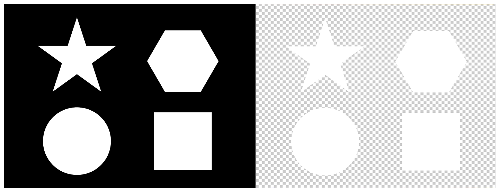

> Navigation: [Technologies](../../technologies.md) · [Core Image](../../coreimage.md) · [CIFilter](../cifilter-swift.class.md)

# maskToAlpha()

<sub>Type Method</sub>

Converts an image to a white image with an alpha component.

<sub>iOS, iPadOS, Mac Catalyst, macOS, tvOS, visionOS</sub>

```swift
class func maskToAlpha() -> any CIFilter & CIMaskToAlpha
```

## Return Value

The modified image.

## Discussion

This method applies the mask-to-alpha filter to an image. The value of the alpha component is determined by the grayscale value of the input image. Black pixels become completely transparent, white pixels are completely solid.

The mask-to-alpha filter uses the following properties:

- **`inputImage`** — An image with the type [CIImage](../ciimage.md).

The following code creates a filter that makes the input image’s background transparent:

```swift
func maskToAlpha(inputImage: CIImage) -> CIImage {
    let maskToAlphaFilter = CIFilter.maskToAlpha()
    maskToAlphaFilter.inputImage = inputImage
    return maskToAlphaFilter.outputImage!
}
```



<sub>Two photographs of a triangle, hexagon, circle, and a square arranged in the center of the image on a black background. In the photo on the right, a mask-to-alpha filter is applied. The image no longer has a black background and all of the white shapes are now on a transparent layer.</sub>

## See Also

### Color Effect Filters

- [+ colorCrossPolynomialFilter](<colorcrosspolynomial().md>) — Adjusts an image’s color by applying polynomial cross-products.
- [+ colorCubeFilter](<colorcube().md>) — Adjusts an image’s pixels using a three-dimensional color table.
- [+ colorCubeWithColorSpaceFilter](<colorcubewithcolorspace().md>) — Adjusts an image’s pixels using a three-dimensional color table in specified color space.
- [+ colorCubesMixedWithMaskFilter](<colorcubesmixedwithmask().md>) — Alters an image’s pixels using a three-dimensional color tables and a mask image.
- [+ colorCurvesFilter](<colorcurves().md>) — Adjusts an image’s color curves.
- [+ colorInvertFilter](<colorinvert().md>) — Inverts an image’s colors.
- [+ colorMapFilter](<colormap().md>) — Performs a transformation of the input image colors to colors from a gradient image.
- [+ colorMonochromeFilter](<colormonochrome().md>) — Adjusts an image’s colors to shades of a single color.
- [+ colorPosterizeFilter](<colorposterize().md>) — Flattens an image’s colors.
- [+ convertLabToRGBFilter](<convertlabtorgb().md>) — Converts an image from CIELAB to RGB color space.
- [+ convertRGBtoLabFilter](<convertrgbtolab().md>) — Converts an image from RGB to CIELAB color space.
- [+ ditherFilter](<dither().md>) — Applies randomized noise to produce a processed look.
- [+ documentEnhancerFilter](<documentenhancer().md>) — Adjusts an image’s shadows and contrast.
- [+ falseColorFilter](<falsecolor().md>) — Replaces an image’s colors with specified colors.
- [+ LabDeltaE](<labdeltae().md>) — Compares an image’s color values.
