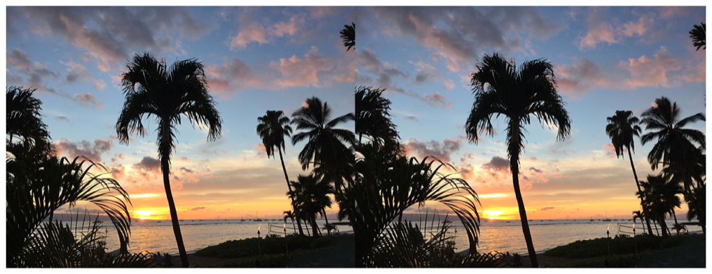

> Navigation: [Technologies](../../technologies.md) · [Core Image](../../coreimage.md) · [CIFilter](../cifilter-swift.class.md)

# median()

<sub>Type Method</sub>

Calculates the median of an image to refine detail.

<sub>iOS, iPadOS, Mac Catalyst, macOS, tvOS, visionOS</sub>

```swift
class func median() -> any CIFilter & CIMedian
```

## Return Value

The blurred image.

## Discussion

This method applies the median filter to an image. The effect computes the median value of colors for a group of neighboring pixels and replaces each pixel with calculated data.

The median filter uses the following properties:

- **inputImage** — A [CIImage](../ciimage.md) representing the input image to apply the filter to.

The following code creates a filter that refines the detail in the input image:

```swift
    func medianBlur(inputImage: CIImage) -> CIImage? {

        let medianBlurFilter = CIFilter.median()
        medianBlurFilter.inputImage = inputImage
        return medianBlurFilter.outputImage
    }
```



<sub>Two photographs of a beach at sunset with multiple palm trees. The photo on the left is clear. In the photo on the right, a median effect has been applied, and the image is sharper and has more detail in the leafs of the trees in the foreground.</sub>

## See Also

### Filters

- [+ bokehBlurFilter](<bokehblur().md>) — Applies a bokeh effect to an image.
- [+ boxBlurFilter](<boxblur().md>) — Applies a square-shaped blur to an area of an image.
- [+ discBlurFilter](<discblur().md>) — Applies a circle-shaped blur to an area of an image.
- [+ gaussianBlurFilter](<gaussianblur().md>) — Blurs an image with a Gaussian distribution pattern.
- [+ maskedVariableBlurFilter](<maskedvariableblur().md>) — Blurs a specified portion of an image.
- [+ morphologyGradientFilter](<morphologygradient().md>) — Detects and highlights edges of objects.
- [+ morphologyMaximumFilter](<morphologymaximum().md>) — Blurs a circular area by enlarging contrasting pixels.
- [+ morphologyMinimumFilter](<morphologyminimum().md>) — Blurs a circular area by reducing contrasting pixels.
- [+ morphologyRectangleMaximumFilter](<morphologyrectanglemaximum().md>) — Blurs a rectangular area by enlarging contrasting pixels.
- [+ morphologyRectangleMinimumFilter](<morphologyrectangleminimum().md>) — Blurs a rectangular area by reducing contrasting pixels.
- [+ motionBlurFilter](<motionblur().md>) — Creates motion blur on an image.
- [+ noiseReductionFilter](<noisereduction().md>) — Reduces noise by sharpening the edges of objects.
- [+ zoomBlurFilter](<zoomblur().md>) — Creates a zoom blur centered around a single point on the image.
