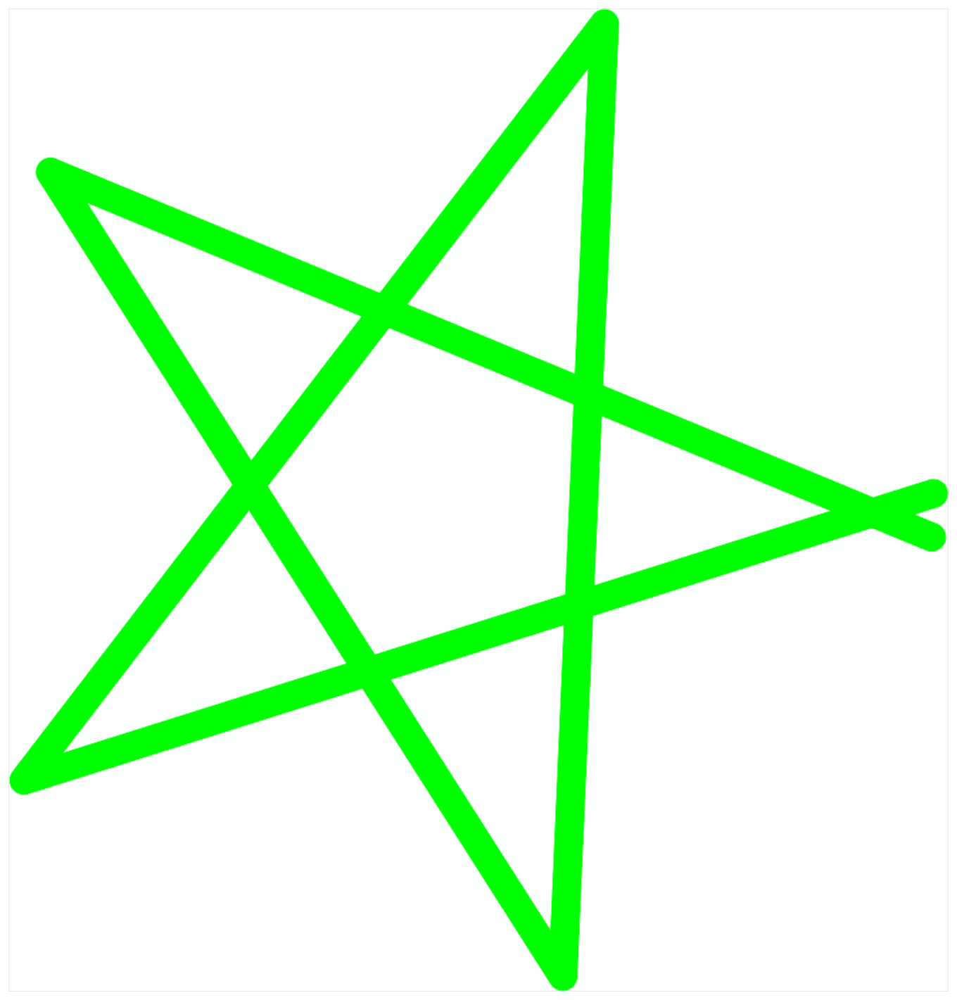

> Navigation: [Technologies](../../technologies.md) · [Core Image](../../coreimage.md) · [CIFilter](../cifilter-swift.class.md)

# meshGenerator()

<sub>Type Method</sub>

Generates a pattern made from an array of line segments.

<sub>iOS, iPadOS, Mac Catalyst, macOS, tvOS, visionOS</sub>

```swift
class func meshGenerator() -> any CIFilter & CIMeshGenerator
```

## Return Value

The generated image.

## Discussion

This method generates a mesh generator image. The effect uses an array of line segments to create the resulting image.

The mesh generator filter uses the following properties:

- **`inputMesh`** — An `array` of line segments stored as an array of [CIVector](../civector.md), each containing a start point and end point.
- **`color`** — A [CIColor](../cicolor.md) representing the color used to make the mesh.
- **`width`** — A `float` representing the width of the line segments as an [NSNumber](../../foundation/nsnumber.md)

The following code creates a filter that generates a green star made from mesh segments:

```swift
func mesh(mesh: NSdata) -> CIImage {
    let meshGenerator = CIFilter.meshGenerator()
    meshGenerator.color = CIColor.green
    meshGenerator.width = 3
    meshGenerator.inputmesh = mesh
    return meshGenerator.outputImage!
}
```



## See Also

### Filters

- [+ attributedTextImageGeneratorFilter](<attributedtextimagegenerator().md>) — Generates an attributed-text image.
- [+ aztecCodeGeneratorFilter](<azteccodegenerator().md>) — Generates a low-density barcode.
- [+ barcodeGeneratorFilter](<barcodegenerator().md>) — Generates a barcode as an image from the descriptor.
- [+ blurredRectangleGeneratorFilter](<blurredrectanglegenerator().md>) — Generates a blurred rectangle.
- [+ checkerboardGeneratorFilter](<checkerboardgenerator().md>) — Generates a checkerboard image.
- [+ code128BarcodeGeneratorFilter](<code128barcodegenerator().md>) — Generates a high-density, linear barcode.
- [+ lenticularHaloGeneratorFilter](<lenticularhalogenerator().md>) — Generates a lenticular halo image.
- [+ PDF417BarcodeGenerator](<pdf417barcodegenerator().md>) — Generates a high-density linear barcode.
- [+ QRCodeGenerator](<qrcodegenerator().md>) — Generates a quick response (QR) code image.
- [+ randomGeneratorFilter](<randomgenerator().md>) — Generates a random filter image.
- [+ roundedRectangleGeneratorFilter](<roundedrectanglegenerator().md>) — Generates a rounded rectangle image.
- [+ roundedRectangleStrokeGeneratorFilter](<roundedrectanglestrokegenerator().md>) — Creates an image containing the outline of a rounded rectangle.
- [+ starShineGeneratorFilter](<starshinegenerator().md>) — Generates a star-shine image.
- [+ stripesGeneratorFilter](<stripesgenerator().md>) — Generates a line of stripes as an image
- [+ sunbeamsGeneratorFilter](<sunbeamsgenerator().md>) — Generates an image resembling the sun.
