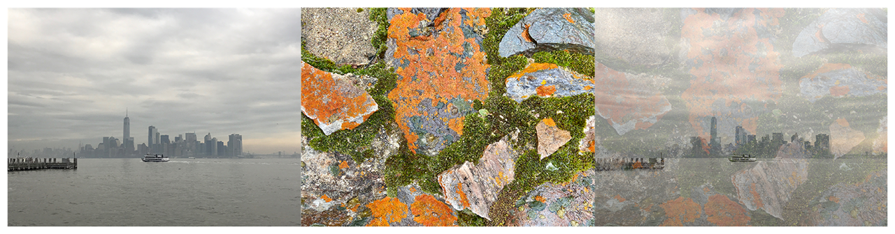

> Navigation: [Technologies](../../technologies.md) · [Core Image](../../coreimage.md) · [CIFilter](../cifilter-swift.class.md)

# mix()

<sub>Type Method</sub>

Blends two images together.

<sub>iOS, iPadOS, Mac Catalyst, macOS, tvOS, visionOS</sub>

```swift
class func mix() -> any CIFilter & CIMix
```

## Return Value

The modified image.

## Discussion

This method applies the mix filter to an image. The effect uses the amount property to interpolate between the input image and the background image, resulting in both images visible in the output image.

The mix filter uses the following properties:

- **`inputImage`** — An image with the type [CIImage](../ciimage.md).
- **`backgroundImage`** — An image representing the background image with the type [CIImage](../ciimage.md).
- **`amount`** — A `float` representing the strength of the effect as an [NSNumber](../../foundation/nsnumber.md).

The following code creates a filter that combines the input and background images to create one image with both images visible:

```swift
func mix(inputImage: CIImage, backgroundImage: CIImage) -> CIImage {
    let mixFilter = CIFilter.mix()
    mixFilter.inputImage = inputImage
    mixFilter.backgroundImage = backgroundImage
    mixFilter.amount = 0.25
    return mixFilter.outputImage!
}
```



<sub>Three pictures side by side. The first photo on the left is of the New York City skyline taken from across a river on an overcast day, with a single boat in the center of the image. The center photo is of multiple colorful rocks with green moss covering them. In the photo on the right, a mix filter is applied, and the image has detail from both the city skyline and mossy rock photo.</sub>

## See Also

### Filters

- [+ blendWithAlphaMaskFilter](<blendwithalphamask().md>) — Blends two images by using an alpha mask image.
- [+ blendWithBlueMaskFilter](<blendwithbluemask().md>) — Blends two images by using a blue mask image.
- [+ blendWithMaskFilter](<blendwithmask().md>) — Blends two images by using a mask image.
- [+ blendWithRedMaskFilter](<blendwithredmask().md>) — Blends two images by using a red mask image.
- [+ bloomFilter](<bloom().md>) — Adjusts an image’s colors by applying a blur effect.
- [+ cannyEdgeDetectorFilter](<cannyedgedetector().md>) — Applies the Canny edge-detection algorithm to an image.
- [+ comicEffectFilter](<comiceffect().md>) — Creates an image with a comic book effect.
- [+ coreMLModelFilter](<coremlmodel().md>) — Filters an image with a Core ML model.
- [+ crystallizeFilter](<crystallize().md>) — Creates an image made with a series of colorful polygons.
- [+ depthOfFieldFilter](<depthoffield().md>) — Simulates a depth of field effect.
- [+ edgesFilter](<edges().md>) — Hilghlights edges of objects found within an image.
- [+ edgeWorkFilter](<edgework().md>) — Produces a black-and-white image that looks similar to a woodblock print.
- [+ gaborGradientsFilter](<gaborgradients().md>) — Highlights textures in an image.
- [+ gloomFilter](<gloom().md>) — Adjusts an image’s color by applying a gloom filter.
- [+ heightFieldFromMaskFilter](<heightfieldfrommask().md>) — Creates a realistic shaded height-field image.
