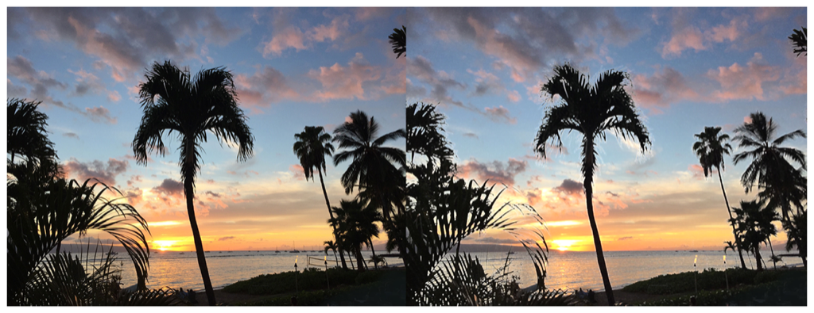

> Navigation: [Technologies](../../technologies.md) · [Core Image](../../coreimage.md) · [CIFilter](../cifilter-swift.class.md)

# morphologyRectangleMaximum()

<sub>Type Method</sub>

Blurs a rectangular area by enlarging contrasting pixels.

<sub>iOS, iPadOS, Mac Catalyst, macOS, tvOS, visionOS</sub>

```swift
class func morphologyRectangleMaximum() -> any CIFilter & CIMorphologyRectangleMaximum
```

## Return Value

The blurred image.

## Discussion

This method applies the morphology rectangle maximum filter to an image. The effect targets a rectangular section of the image, calculating the median color values to find colors that make up more than half the working area. Using this calculation, the effect enlarges the pixels with contrasting colors to take up more of the working area. The effect is then repeated throughout the image.

The morphology rectangle maximum filter uses the following properties:

- **`width`** — A `float` representing the width in pixels of the working area as an [NSNumber](../../foundation/nsnumber.md).
- **`height`** — A `float` representing the height in pixels of the working area as an [NSNumber](../../foundation/nsnumber.md).
- **`inputImage`** — A [CIImage](../ciimage.md) representing the input image to apply the filter to.

The following code creates a filter that adds a blur to the input image while brighting the palm trees:

```swift
    func morphologyRectangleMaximum(inputImage: CIImage) -> CIImage? {

        let morphologyRectangleMaximumFilter = CIFilter.morphologyRectangleMaximum()
        morphologyRectangleMaximumFilter.inputImage = inputImage
        morphologyRectangleMaximumFilter.width = 5
        morphologyRectangleMaximumFilter.height = 5
        return morphologyRectangleMaximumFilter.outputImage
    }
```



<sub>Two photographs of a beach at sunset with multiple palm trees. The photo on the left is clear and crisp. In the photo on the right, a morphology rectangle maximum blur has been applied, resulting in the palm trees becoming lighter and less distinct.</sub>

## See Also

### Filters

- [+ bokehBlurFilter](<bokehblur().md>) — Applies a bokeh effect to an image.
- [+ boxBlurFilter](<boxblur().md>) — Applies a square-shaped blur to an area of an image.
- [+ discBlurFilter](<discblur().md>) — Applies a circle-shaped blur to an area of an image.
- [+ gaussianBlurFilter](<gaussianblur().md>) — Blurs an image with a Gaussian distribution pattern.
- [+ maskedVariableBlurFilter](<maskedvariableblur().md>) — Blurs a specified portion of an image.
- [+ medianFilter](<median().md>) — Calculates the median of an image to refine detail.
- [+ morphologyGradientFilter](<morphologygradient().md>) — Detects and highlights edges of objects.
- [+ morphologyMaximumFilter](<morphologymaximum().md>) — Blurs a circular area by enlarging contrasting pixels.
- [+ morphologyMinimumFilter](<morphologyminimum().md>) — Blurs a circular area by reducing contrasting pixels.
- [+ morphologyRectangleMinimumFilter](<morphologyrectangleminimum().md>) — Blurs a rectangular area by reducing contrasting pixels.
- [+ motionBlurFilter](<motionblur().md>) — Creates motion blur on an image.
- [+ noiseReductionFilter](<noisereduction().md>) — Reduces noise by sharpening the edges of objects.
- [+ zoomBlurFilter](<zoomblur().md>) — Creates a zoom blur centered around a single point on the image.
