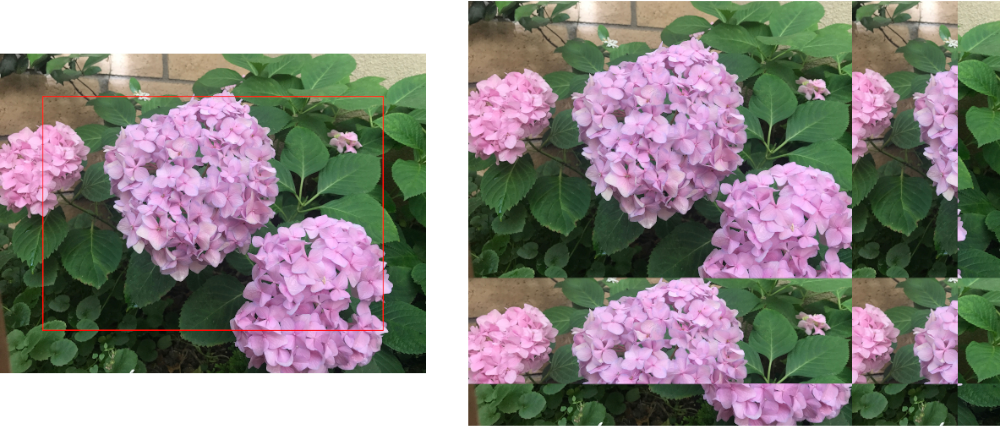

> Navigation: [Technologies](../../technologies.md) · [Core Image](../../coreimage.md) · [CIFilter](../cifilter-swift.class.md)

# ninePartTiled()

<sub>Type Method</sub>

Distorts an image by tiling portions of it.

<sub>iOS, iPadOS, Mac Catalyst, macOS, tvOS, visionOS</sub>

```swift
class func ninePartTiled() -> any CIFilter & CINinePartTiled
```

## Return Value

The distorted image.

## Discussion

This method applies the nine-part tiled filter to an image. This effect distorts an image by tiling an image based on the breakpoints properties.

The nine-part tiled filter uses the following properties:

- **`inputImage`** — An image with the type [CIImage](../ciimage.md).
- **`flipYTiles`** — A `Boolean` value representing if the y-axis should be flipped.
- **`growAmount`** — A [CGPoint](../../corefoundation/cgpoint.md) representing the amount of stretching applied.
- **`breakpoint1`** — A [CGPoint](../../corefoundation/cgpoint.md) representing the upper-right corner of the image to retain after tiling ends.
- **`breakpoint0`** — A [CGPoint](../../corefoundation/cgpoint.md) representing the lower-left corner of image to retain before stretching begins.

The following code creates a filter that results in distorted tiles of the image becoming flipped:

```swift
func ninePartTiled(inputImage: CIImage) -> CIImage {
    let filter = CIFilter.ninePartTiled()
    filter.inputImage = inputImage
    filter.setDefaults()
    filter.breakpoint0 = CGPoint(x: 200, y: 200)
    filter.breakpoint1 = CGPoint(x: inputImage.extent.size.width-200, y: inputImage.extent.size.height - 200)
    filter.growAmount = CGPoint(x: 500, y: 500)
    return filter.outputImage!
}
```



<sub>Two images arranged horizontally. The left image contains a photograph of three hydrangea flowers with leaves in the background. An area inset by 200 pixels from all sides is highlighted using a rectangle. The image on the right shows the result of applying the nine part tiled filter. The area within the red rectangle has been placed in the top left and the area outside of the rectangle has been tiled to right and bottom of the image.</sub>

## See Also

### Filters

- [+ bumpDistortionFilter](<bumpdistortion().md>) — Distorts an image with a concave or convex bump.
- [+ bumpDistortionLinearFilter](<bumpdistortionlinear().md>) — Linearly distorts an image with a concave or convex bump.
- [+ circleSplashDistortionFilter](<circlesplashdistortion().md>) — Distorts an image with radiating circles to the periphery of the image.
- [+ circularWrapFilter](<circularwrap().md>) — Distorts an image by increasing the distance of the center of the image.
- [+ displacementDistortionFilter](<displacementdistortion().md>) — Applies the grayscale values of the second image to the first image.
- [+ drosteFilter](<droste().md>) — Stylizes an image with the Droste effect.
- [+ glassDistortionFilter](<glassdistortion().md>) — Distorts an image by applying a glass-like texture.
- [+ glassLozengeFilter](<glasslozenge().md>) — Creates a lozenge-shaped lens and distorts the image.
- [+ holeDistortionFilter](<holedistortion().md>) — Distorts an image with a circular area that pushes the image outward.
- [+ lightTunnelFilter](<lighttunnel().md>) — Distorts an image by generating a light tunnel.
- [+ ninePartStretchedFilter](<ninepartstretched().md>) — Distorts an image by stretching it between two breakpoints.
- [+ pinchDistortionFilter](<pinchdistortion().md>) — Distorts an image by creating a pinch effect with stronger distortion in the center.
- [+ stretchCropFilter](<stretchcrop().md>) — Distorts an image by stretching or cropping to fit a specified size.
- [+ torusLensDistortionFilter](<toruslensdistortion().md>) — Creates a torus-shaped lens to distort the image.
- [+ twirlDistortionFilter](<twirldistortion().md>) — Distorts an image by rotating pixels around a center point.
