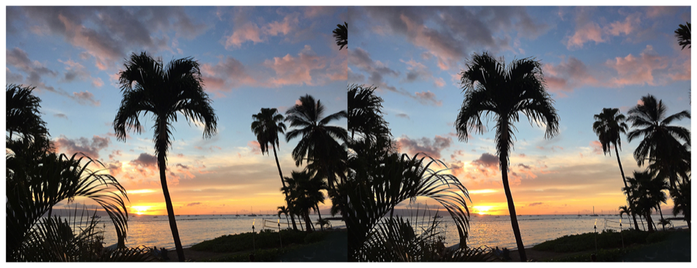

> Navigation: [Technologies](../../technologies.md) · [Core Image](../../coreimage.md) · [CIFilter](../cifilter-swift.class.md)

# noiseReduction()

<sub>Type Method</sub>

Reduces noise by sharpening the edges of objects.

<sub>iOS, iPadOS, Mac Catalyst, macOS, tvOS, visionOS</sub>

```swift
class func noiseReduction() -> any CIFilter & CINoiseReduction
```

## Return Value

The blurred image.

## Discussion

This method applies the noise reduction filter to an image. The effect calculates changes in luminance below the noise level and locally blurs the area. Values above the threshold are determined to be edges, and become sharpened.

The morphology noise reduction filter uses the following properties:

- **`noiseLevel`** — A `float` representing the amount of noise reduction as an [NSNumber](../../foundation/nsnumber.md).
- **`sharpness`** — A `float` representing the sharpness of the final image as an [NSNumber](../../foundation/nsnumber.md).
- **`inputImage`** — A [CIImage](../ciimage.md) representing the input image to apply the filter to.

The following code creates a filter that reduces noise in the input image:

```swift
    func noiseReduction(inputImage: CIImage) -> CIImage? {

        let noiseReductionfilter = CIFilter.noiseReduction()
        noiseReductionfilter.inputImage = inputImage
        noiseReductionfilter.noiseLevel = 0.2
        noiseReductionfilter.sharpness = 0.4
        return noiseReductionfilter.outputImage
    }
```



<sub>Two photographs of a beach at sunset with multiple palm trees. The photo on the left is in focus. In the photo on the right, a noise reduction filter has been applied, and the edges of the objects such as the palm fronds have more sharpness and detail.</sub>

## See Also

### Filters

- [+ bokehBlurFilter](<bokehblur().md>) — Applies a bokeh effect to an image.
- [+ boxBlurFilter](<boxblur().md>) — Applies a square-shaped blur to an area of an image.
- [+ discBlurFilter](<discblur().md>) — Applies a circle-shaped blur to an area of an image.
- [+ gaussianBlurFilter](<gaussianblur().md>) — Blurs an image with a Gaussian distribution pattern.
- [+ maskedVariableBlurFilter](<maskedvariableblur().md>) — Blurs a specified portion of an image.
- [+ medianFilter](<median().md>) — Calculates the median of an image to refine detail.
- [+ morphologyGradientFilter](<morphologygradient().md>) — Detects and highlights edges of objects.
- [+ morphologyMaximumFilter](<morphologymaximum().md>) — Blurs a circular area by enlarging contrasting pixels.
- [+ morphologyMinimumFilter](<morphologyminimum().md>) — Blurs a circular area by reducing contrasting pixels.
- [+ morphologyRectangleMaximumFilter](<morphologyrectanglemaximum().md>) — Blurs a rectangular area by enlarging contrasting pixels.
- [+ morphologyRectangleMinimumFilter](<morphologyrectangleminimum().md>) — Blurs a rectangular area by reducing contrasting pixels.
- [+ motionBlurFilter](<motionblur().md>) — Creates motion blur on an image.
- [+ zoomBlurFilter](<zoomblur().md>) — Creates a zoom blur centered around a single point on the image.
