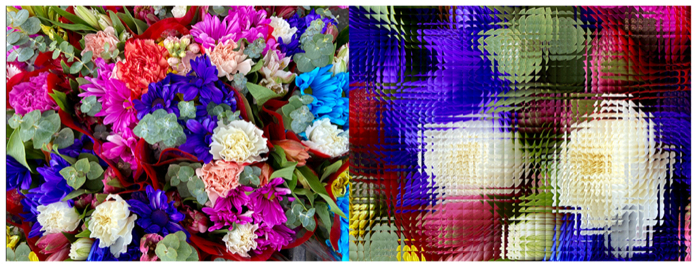

> Navigation: [Technologies](../../technologies.md) · [Core Image](../../coreimage.md) · [CIFilter](../cifilter-swift.class.md)

# opTile()

<sub>Type Method</sub>

Produces an effect that mimics a style of visual art that uses optical illusions.

<sub>iOS, iPadOS, Mac Catalyst, macOS, tvOS, visionOS</sub>

```swift
class func opTile() -> any CIFilter & CIOpTile
```

## Return Value

The tiled image.

## Discussion

This filter extracts a tile from the image, applies any specified scaling and rotation, and then assembles the image again to give an optical illusion effect.

The optical illusion tile filter uses the following properties:

- **`inputImage`** — An image with the type [CIImage](../ciimage.md).
- **`center`** — A set of coordinates marking the center of the image as a [CGPoint](../../corefoundation/cgpoint.md).
- **`angle`** — A `float` representing the direction of distortion, in radians as an [NSNumber](../../foundation/nsnumber.md).
- **`width`** — A `float` representing the set width of each tile as an [NSNumber](../../foundation/nsnumber.md).
- **`scale`** — A `float` representing the scale of numbers of tiles in the output image as an [NSNumber](../../foundation/nsnumber.md).

The following code creates a filter that results in a distorted image with less detail:

```swift
func op(inputImage: CIImage) -> CIImage {
    let opTile = CIFilter.opTile()
    opTile.inputImage = inputImage
    opTile.center = CGPoint(x: 150, y: 150)
    opTile.scale = 2.80
    opTile.angle = 0
    opTile.width = 65
    return opTile.outputImage!
}
```



<sub>Two photographs. The one on the left is of a bouquet of colorful flowers up close with good lighting and focus. In the photo on the right, an op tile filter is applied, resulting in the image becoming a set of square tiles that contain slightly different portions of the image to create the illusion of movement.</sub>

## See Also

### Filters

- [+ affineClampFilter](<affineclamp().md>) — Performs a transform on the image and extends the image edges to infinity.
- [+ affineTileFilter](<affinetile().md>) — Performs a transform on the image and tiles the result.
- [+ eightfoldReflectedTileFilter](<eightfoldreflectedtile().md>) — Creates an eight-way reflected pattern.
- [+ fourfoldReflectedTileFilter](<fourfoldreflectedtile().md>) — Creates a four-way reflected pattern.
- [+ fourfoldRotatedTileFilter](<fourfoldrotatedtile().md>) — Creates a tiled image by rotating a tile in increments of 90 degrees.
- [+ fourfoldTranslatedTileFilter](<fourfoldtranslatedtile().md>) — Creates a tiled image by applying four translation operations.
- [+ glideReflectedTileFilter](<glidereflectedtile().md>) — Tiles an image by rotating and reflecting a tile from the image.
- [+ kaleidoscopeFilter](<kaleidoscope().md>) — Creates a 12-way kaleidoscopic image from an image.
- [+ parallelogramTileFilter](<parallelogramtile().md>) — Warps the image to create a parallelogram and tiles the result.
- [+ perspectiveTileFilter](<perspectivetile().md>) — Tiles an image by adjusting the perspective of the image.
- [+ sixfoldReflectedTileFilter](<sixfoldreflectedtile().md>) — Produces a tiled image from a source image by applying a six-way reflected symmetry.
- [+ sixfoldRotatedTileFilter](<sixfoldrotatedtile().md>) — Creates a tiled image by rotating in increments of 60 degrees.
- [+ triangleKaleidoscopeFilter](<trianglekaleidoscope().md>) — Create a triangular kaleidoscope effect and then tiles the result.
- [+ triangleTileFilter](<triangletile().md>) — Tiles a triangular area of an image.
- [+ twelvefoldReflectedTileFilter](<twelvefoldreflectedtile().md>) — Creates a tiled image by rotating in increments of 30 degrees.
