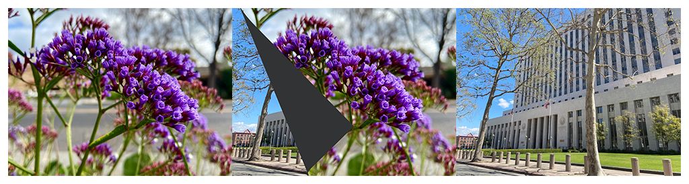

> Navigation: [Technologies](../../technologies.md) · [Core Image](../../coreimage.md) · [CIFilter](../cifilter-swift.class.md)

# pageCurlTransition()

<sub>Type Method</sub>

Simulates the curl of a page, revealing the target image.

<sub>iOS, iPadOS, Mac Catalyst, macOS, tvOS, visionOS</sub>

```swift
class func pageCurlTransition() -> any CIFilter & CIPageCurlTransition
```

## Return Value

The transition image.

## Discussion

This method applies the page curl transition filter to an image. The effect transitions from one image to another by simulating a curling page, revealing the target image as the page curls.

The page curl transition filter uses the following properties:

- **`inputImage`** — The starting image with the type [CIImage](../ciimage.md).
- **`targetImage`** — The ending image with the type [CIImage](../ciimage.md).
- **`backsideImage`** — An image used as the backside of the curl with the type [CIImage](../ciimage.md).
- **`extent`** — A [CGRect](../../corefoundation/cgrect.md) representing the size of the effect.
- **`time`** — A `float` representing the parametric time of the transition from start (at time 0) to end (at time 1) as an [NSNumber](../../foundation/nsnumber.md).
- **`angle`** — A `float` representing the angle of the motion of the curl as an [NSNumber](../../foundation/nsnumber.md).
- **`radius`** — A `float` representing the radius of the curl as an [NSNumber](../../foundation/nsnumber.md).

The following code creates a filter that produces a page curling back to reveal the target image.

```swift
func pageCurl(inputImage: CIImage, targetImage: CIImage, backsideImage: CIImage) -> CIImage {
    let pageCurlTransition = CIFilter.pageCurlTransition()
    pageCurlTransition.inputImage = inputImage
    pageCurlTransition.targetImage = targetImage
    pageCurlTransition.backsideImage = backsideImage
    pageCurlTransition.extent = CGRect(x: 54, y: 90, width: 300, height: 300)
    pageCurlTransition.time = 5.6
    pageCurlTransition.angle = 0.9
    pageCurlTransition.radius = 150
    return pageCurlTransition.outputImage!
}
```



<sub>Three photographs. In the photo on the left, there are multiple small purple flowers photographed close up with good lighting, and the background has a slight blur. In the photograph on the right is a tall building with two trees directly in front of the building. In the center photograph, a page curl transition filter is applied, resulting in a still photo of the moving transition. The left photograph is overlaid on the photo on the right with the bottom left corner of the top image appearing to be curled to reveal the city photograph, like the page of a book.</sub>

## See Also

### Filters

- [+ accordionFoldTransitionFilter](<accordionfoldtransition().md>) — Transitions by folding and crossfading an image to reveal the target image.
- [+ barsSwipeTransitionFilter](<barsswipetransition().md>) — Transitions between two images by removing rectangular portions of an image.
- [+ copyMachineTransitionFilter](<copymachinetransition().md>) — Simulates the effect of a copy machine scanner light to transiton between two images.
- [+ disintegrateWithMaskTransitionFilter](<disintegratewithmasktransition().md>) — Transitions between two images using a mask image.
- [+ dissolveTransitionFilter](<dissolvetransition().md>) — Transitions between two images with a fade effect.
- [+ flashTransitionFilter](<flashtransition().md>) — Creates a flash of light to transition between two images.
- [+ modTransitionFilter](<modtransition().md>) — Transitions between two images by applying irregularly shaped holes.
- [+ pageCurlWithShadowTransitionFilter](<pagecurlwithshadowtransition().md>) — Simulates the curl of a page, revealing the target image with added shadow.
- [+ rippleTransitionFilter](<rippletransition().md>) — Simulates a ripple in a pond to transiton from one image to another.
- [+ swipeTransitionFilter](<swipetransition().md>) — Gradually transitions from one image to another with a swiping motion.
