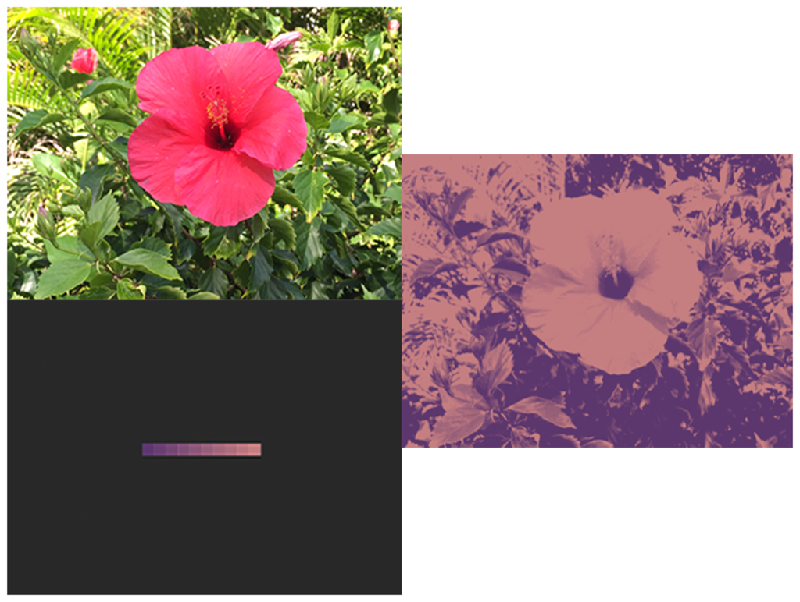

> Navigation: [Technologies](../../technologies.md) · [Core Image](../../coreimage.md) · [CIFilter](../cifilter-swift.class.md)

# palettize()

<sub>Type Method</sub>

Replaces colors with colors from a palette image.

<sub>iOS, iPadOS, Mac Catalyst, macOS, tvOS, visionOS</sub>

```swift
class func palettize() -> any CIFilter & CIPalettize
```

## Return Value

The modified image.

## Discussion

This method applies the palette filter to an image. The effect uses the palette image that is _K_ x 1 pixels in size containing a set of colors, replacing the image colors.

The palettize filter uses the following properties:

- **`inputImage`** — An image with the type [CIImage](../ciimage.md).
- **`paletteImage`** — An image with the dimensions of _N_ x 1 where _N_ represents the colors to add to the image, with type [CIImage](../ciimage.md).
- **`perceptual`** — A Boolean value that specifies if the filter applies the color palette in a perceptual color space.

The following code creates a filter that replaces the colors of the input image with the specified colors found in the palette image:

```swift
func palettize(inputImage: CIImage, paletteImage: CIImage) -> CIImage {
    let palettizeFilter = CIFilter.palettize()
    palettizeFilter.inputImage = inputImage
    palettizeFilter.paletteImage = paletteImage
    palettizeFilter.perceptual = true
    return palettizeFilter.outputImage!
}
```



<sub>One photograph on the left above a gradient image, and a second photograph on the right. The photograph on the left shows a pink flower surrounded by foliage. The image below it is a gradient image displaying a gradual color shift from a dark purple to a light pink. The photo on the right shows the same picture of the pink flower with a palettize filter applied. The photograph displays brightness of the flower image with only the colors provided in the color palette image.</sub>

## See Also

### Color Effect Filters

- [+ colorCrossPolynomialFilter](<colorcrosspolynomial().md>) — Adjusts an image’s color by applying polynomial cross-products.
- [+ colorCubeFilter](<colorcube().md>) — Adjusts an image’s pixels using a three-dimensional color table.
- [+ colorCubeWithColorSpaceFilter](<colorcubewithcolorspace().md>) — Adjusts an image’s pixels using a three-dimensional color table in specified color space.
- [+ colorCubesMixedWithMaskFilter](<colorcubesmixedwithmask().md>) — Alters an image’s pixels using a three-dimensional color tables and a mask image.
- [+ colorCurvesFilter](<colorcurves().md>) — Adjusts an image’s color curves.
- [+ colorInvertFilter](<colorinvert().md>) — Inverts an image’s colors.
- [+ colorMapFilter](<colormap().md>) — Performs a transformation of the input image colors to colors from a gradient image.
- [+ colorMonochromeFilter](<colormonochrome().md>) — Adjusts an image’s colors to shades of a single color.
- [+ colorPosterizeFilter](<colorposterize().md>) — Flattens an image’s colors.
- [+ convertLabToRGBFilter](<convertlabtorgb().md>) — Converts an image from CIELAB to RGB color space.
- [+ convertRGBtoLabFilter](<convertrgbtolab().md>) — Converts an image from RGB to CIELAB color space.
- [+ ditherFilter](<dither().md>) — Applies randomized noise to produce a processed look.
- [+ documentEnhancerFilter](<documentenhancer().md>) — Adjusts an image’s shadows and contrast.
- [+ falseColorFilter](<falsecolor().md>) — Replaces an image’s colors with specified colors.
- [+ LabDeltaE](<labdeltae().md>) — Compares an image’s color values.
