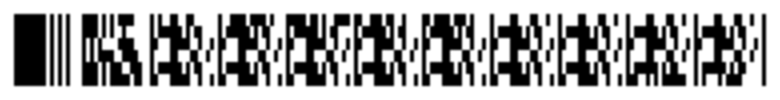

> Navigation: [Technologies](../../technologies.md) · [Core Image](../../coreimage.md) · [CIFilter](../cifilter-swift.class.md)

# pdf417BarcodeGenerator()

<sub>Type Method</sub>

Generates a high-density linear barcode.

<sub>iOS, iPadOS, Mac Catalyst, macOS, tvOS, visionOS</sub>

```swift
class func pdf417BarcodeGenerator() -> any CIFilter & CIPDF417BarcodeGenerator
```

## Return Value

The generated image.

## Discussion

This method generates a PDF417 barcode as an image. PDF417 is a high-density stacked linear barcode format defined in the ISO 15438 standard. Use this filter to generate alphanumeric or numeric-only barcodes. Commonly used on identification cards or inventory management because of the large amount of data the barcode can hold.

The PDF417 barcode generator filter uses the following properties:

- **`message`** — An [NSData](../../foundation/nsdata.md) object representing the data to be encoded as a barcode.
- **`minWidth`** — A `float` representing the minimum width of the barcode’s data area, in pixels as an [NSNumber](../../foundation/nsnumber.md).
- **`maxWidth`** — A `float` representing the maximum width of the barcode’s data area, in pixels, as an [NSNumber](../../foundation/nsnumber.md).
- **`maxHeight`** — A `float` representing the maximum height of the barcode’s data area, in pixels, as an [NSNumber](../../foundation/nsnumber.md).
- **`minHeight`** — A `float` representing the minimum height of the barcode’s data area, in pixels, as an [NSNumber](../../foundation/nsnumber.md).
- **`dataColums`** — A `float` representing the number of columns in the data area as an [NSNumber](../../foundation/nsnumber.md).
- **`rows`** — A `float` representing the number of rows in the data area as an [NSNumber](../../foundation/nsnumber.md).
- **`preferredAspectRatio`** — A `float` representing the desired aspect ratio as an [NSNumber](../../foundation/nsnumber.md).
- **`compactionMode`** — An option that determines which method the generator uses to compress data as an [NSNumber](../../foundation/nsnumber.md). See the note below for the possible values.
- **`compactStyle`** — A `Boolean` value of `0` or `1` that determines the omission of redundant elements to make the generated barcode more compact as an [NSNumber](../../foundation/nsnumber.md).
- **`correctionLevel`** — A `float` between 0 and 8 that determines the amount of redundancy to include in the barcode’s data to prevent errors when the barcode is read. If left unspecified, the generator chooses a correction level based on the size of the message data.
- **`alwaysSpecifyCompaction`** — A `Boolean` value of `0` or `1` that determines the inclusion of information about the compaction mode in the barcode as an [NSNumber](../../foundation/nsnumber.md). If a PDF417 barcode doesn’t contain compaction mode information, the reader assumes text-based compaction.

The `compactionMode` property takes one of the following numeric values:

| Value | Name | Description |
|---|---|---|
| `1` | Automatic | The generator automatically chooses a compression method. This option is the default. |
| `2` | Numeric | Valid only when the message is an ASCII-encoded string of digits, achieving optimal compression for that type of data. |
| `3` | Text | Valid only when the message is all ASCII-encoded alphanumeric and punctuation characters, achieving optimal compression for that type of data. |
| `4` | Byte | Valid for any data, but least compact. |

Select either 1 or the appropriate valid value for your data that gives the most compact output.

The following code creates a filter that generates a PDF417 barcode:

```swift
func pdf417Barcode(inputMessage: String) -> CIImage {
    let pdf417BarcodeGenerator = CIFilter.pdf417BarcodeGenerator()
    pdf417BarcodeGenerator.message = inputMessage.data(using: .ascii)!
    pdf417BarcodeGenerator.minWidth = 56
    pdf417BarcodeGenerator.maxWidth = 58
    pdf417BarcodeGenerator.maxHeight = 283
    pdf417BarcodeGenerator.minHeight = 13
    pdf417BarcodeGenerator.dataColumns = 9
    pdf417BarcodeGenerator.rows = 6
    pdf417BarcodeGenerator.preferredAspectRatio = 0.0
    pdf417BarcodeGenerator.compactionMode = 1
    pdf417BarcodeGenerator.compactStyle = 1
    pdf417BarcodeGenerator.correctionLevel = 0.01
    pdf417BarcodeGenerator.alwaysSpecifyCompaction = 0
    return pdf417BarcodeGenerator.outputImage!
}
```



<sub>An image of a black and white PDF417 barcode made of vertical lines of various widths and squares representing the encoded data of 47212826.</sub>

## See Also

### Filters

- [+ attributedTextImageGeneratorFilter](<attributedtextimagegenerator().md>) — Generates an attributed-text image.
- [+ aztecCodeGeneratorFilter](<azteccodegenerator().md>) — Generates a low-density barcode.
- [+ barcodeGeneratorFilter](<barcodegenerator().md>) — Generates a barcode as an image from the descriptor.
- [+ blurredRectangleGeneratorFilter](<blurredrectanglegenerator().md>) — Generates a blurred rectangle.
- [+ checkerboardGeneratorFilter](<checkerboardgenerator().md>) — Generates a checkerboard image.
- [+ code128BarcodeGeneratorFilter](<code128barcodegenerator().md>) — Generates a high-density, linear barcode.
- [+ lenticularHaloGeneratorFilter](<lenticularhalogenerator().md>) — Generates a lenticular halo image.
- [+ meshGeneratorFilter](<meshgenerator().md>) — Generates a pattern made from an array of line segments.
- [+ QRCodeGenerator](<qrcodegenerator().md>) — Generates a quick response (QR) code image.
- [+ randomGeneratorFilter](<randomgenerator().md>) — Generates a random filter image.
- [+ roundedRectangleGeneratorFilter](<roundedrectanglegenerator().md>) — Generates a rounded rectangle image.
- [+ roundedRectangleStrokeGeneratorFilter](<roundedrectanglestrokegenerator().md>) — Creates an image containing the outline of a rounded rectangle.
- [+ starShineGeneratorFilter](<starshinegenerator().md>) — Generates a star-shine image.
- [+ stripesGeneratorFilter](<stripesgenerator().md>) — Generates a line of stripes as an image
- [+ sunbeamsGeneratorFilter](<sunbeamsgenerator().md>) — Generates an image resembling the sun.
