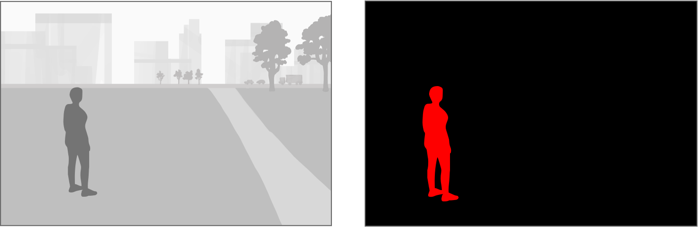

> Navigation: [Technologies](../../technologies.md) · [Core Image](../../coreimage.md) · [CIFilter](../cifilter-swift.class.md)

# personSegmentation()

<sub>Type Method</sub>

Creates a mask where red pixels indicate areas of the image that are likely to contain a person.

<sub>iOS, iPadOS, Mac Catalyst, macOS, tvOS, visionOS</sub>

```swift
class func personSegmentation() -> any CIFilter & CIPersonSegmentation
```

## Return Value

A [CIImage](../ciimage.md) containing the mask.

## Discussion

The person-segmentation filter creates a mask that contains red pixels in the areas of the input image that are likely to contain people.

The person-segmentation filter takes the following properties:

- **`inputIImage`** — A [CIImage](../ciimage.md) containing the image to segment.
- **`qualityLevel`** — The size and quality of the resulting segmentation mask. 0 is accurate, `1` is balanced, and `2` is fast.

The following code applies the person-segmentation filter to an image:

```swift
func personSegmentation(inputImage: CIImage) -> CIImage {
    let personSegmentationFilter = CIFilter.personSegmentation()
    personSegmentationFilter.inputImage = inputImage
    personSegmentationFilter.qualityLevel = 0
    return personSegmentationFilter.outputImage!
}

```



<sub>An illustration of two images, side-by-side. The original image, on the left, contains a single individual against a background of a field, trees, and buildings. The other image, on the right, shows the individual after segmentation. The background is all set to black and the pixels that make up the individual are all set to red.</sub>

## See Also

### Filters

- [+ blendWithAlphaMaskFilter](<blendwithalphamask().md>) — Blends two images by using an alpha mask image.
- [+ blendWithBlueMaskFilter](<blendwithbluemask().md>) — Blends two images by using a blue mask image.
- [+ blendWithMaskFilter](<blendwithmask().md>) — Blends two images by using a mask image.
- [+ blendWithRedMaskFilter](<blendwithredmask().md>) — Blends two images by using a red mask image.
- [+ bloomFilter](<bloom().md>) — Adjusts an image’s colors by applying a blur effect.
- [+ cannyEdgeDetectorFilter](<cannyedgedetector().md>) — Applies the Canny edge-detection algorithm to an image.
- [+ comicEffectFilter](<comiceffect().md>) — Creates an image with a comic book effect.
- [+ coreMLModelFilter](<coremlmodel().md>) — Filters an image with a Core ML model.
- [+ crystallizeFilter](<crystallize().md>) — Creates an image made with a series of colorful polygons.
- [+ depthOfFieldFilter](<depthoffield().md>) — Simulates a depth of field effect.
- [+ edgesFilter](<edges().md>) — Hilghlights edges of objects found within an image.
- [+ edgeWorkFilter](<edgework().md>) — Produces a black-and-white image that looks similar to a woodblock print.
- [+ gaborGradientsFilter](<gaborgradients().md>) — Highlights textures in an image.
- [+ gloomFilter](<gloom().md>) — Adjusts an image’s color by applying a gloom filter.
- [+ heightFieldFromMaskFilter](<heightfieldfrommask().md>) — Creates a realistic shaded height-field image.
