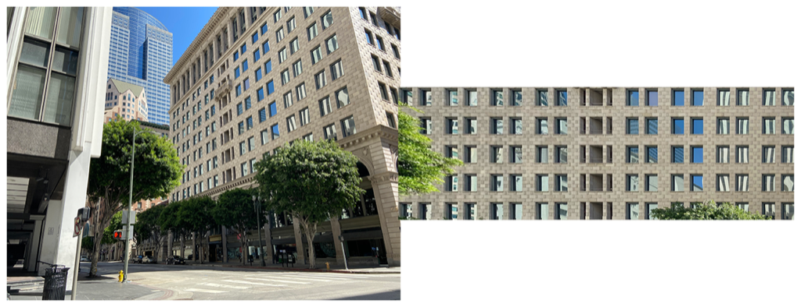

> Navigation: [Technologies](../../technologies.md) · [Core Image](../../coreimage.md) · [CIFilter](../cifilter-swift.class.md)

# perspectiveCorrection()

<sub>Type Method</sub>

Transforms an image’s perspective.

<sub>iOS, iPadOS, Mac Catalyst, macOS, tvOS, visionOS</sub>

```swift
class func perspectiveCorrection() -> any CIFilter & CIPerspectiveCorrection
```

## Return Value

The adjusted image.

## Discussion

This method applies the perspective correction filter to an image. The effect applies a perspective correction transforming nonrectangular area in the source image to a rectangular output image.

The perspective correction filter uses the following properties:

- **`inputImage`** — An image with the type [CIImage](../ciimage.md).
- **`topLeft`** — A [CGPoint](../../corefoundation/cgpoint.md) in the input image mapped to the top-left corner of the output image.
- **`topRight`** — A [CGPoint](../../corefoundation/cgpoint.md) in the input image mapped to the top-right corner of the output image.
- **`bottomLeft`** — A [CGPoint](../../corefoundation/cgpoint.md) in the input image mapped to the bottom-left corner of the output image.
- **`bottomRight`** — A [CGPoint](../../corefoundation/cgpoint.md) in the input image mapped to the bottom-right corner of the output image.

The following code creates a filter that corrects the perspective to appear straight:

```swift
func perspectiveCorrection(inputImage: CIImage) -> CIImage {
    let perspectiveCorrectionFilter = CIFilter.perspectiveCorrection()
    perspectiveCorrectionFilter.inputImage = inputImage
    perspectiveCorrectionFilter.topRight = CGPoint(x: 0, y: 3024)
    perspectiveCorrectionFilter.topLeft = CGPoint(x: 4032, y: 3024)
    perspectiveCorrectionFilter.bottomRight = CGPoint(x: 200, y: 0)
    perspectiveCorrectionFilter.bottomLeft = CGPoint(x: 4032, y: 0)
    return perspectiveCorrectionFilter.outputImage!
}
```



<sub>Two photographs of a large building on the corner of an intersection. The building has small windows and is made of a brick structure. The photo on the left has no modifications to size or color. In the photo on the right, a perspective correction filter is applied, resulting in the perspective of the windows appearing as if the photo was taken in the front of the building.</sub>

## See Also

### Filters

- [+ bicubicScaleTransformFilter](<bicubicscaletransform().md>) — Produces a high-quality scaled version of an image.
- [+ edgePreserveUpsampleFilter](<edgepreserveupsample().md>) — Creates a high-quality upscaled image.
- [+ keystoneCorrectionCombinedFilter](<keystonecorrectioncombined().md>) — Adjusts the image vertically and horizontally to remove distortion.
- [+ keystoneCorrectionHorizontalFilter](<keystonecorrectionhorizontal().md>) — Horizontally adjusts an image to remove distortion.
- [+ keystoneCorrectionVerticalFilter](<keystonecorrectionvertical().md>) — Vertically adjusts an image to remove distortion.
- [+ lanczosScaleTransformFilter](<lanczosscaletransform().md>) — Creates a high-quality, scaled version of a source image.
- [+ perspectiveRotateFilter](<perspectiverotate().md>) — Rotates an image in a 3D space.
- [+ perspectiveTransformFilter](<perspectivetransform().md>) — Alters an image’s geometry to adjust the perspective.
- [+ perspectiveTransformWithExtentFilter](<perspectivetransformwithextent().md>) — Alters an image’s geometry to adjust the perspective while applying constraints.
- [+ straightenFilter](<straighten().md>) — Rotates and crops an image.
