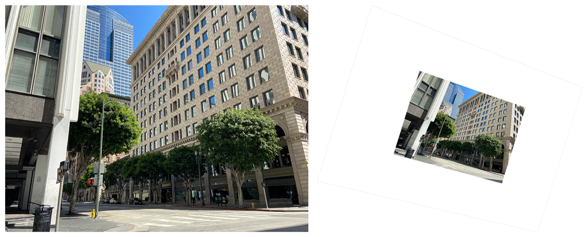

> Navigation: [Technologies](../../technologies.md) · [Core Image](../../coreimage.md) · [CIFilter](../cifilter-swift.class.md)

# perspectiveRotate()

<sub>Type Method</sub>

Rotates an image in a 3D space.

<sub>iOS, iPadOS, Mac Catalyst, macOS, tvOS, visionOS</sub>

```swift
class func perspectiveRotate() -> any CIFilter & CIPerspectiveRotate
```

## Return Value

The adjusted image.

## Discussion

This method applies the perspective rotate filter to an image. The effect rotates the image in 3D space to simulate the observer changing viewing position.

The perspective rotate filter uses the following properties:

- **`inputImage`** — An image with the type [CIImage](../ciimage.md).
- **`pitch`** — A `float` representing the adjustment along the pitch axis in 3D space as an [NSNumber](../../foundation/nsnumber.md).
- **`yaw`** — A `float` representing the adjustment along the vertical axis as an [NSNumber](../../foundation/nsnumber.md).
- **`roll`** — A `float` representing the amount of horizontal axis in 3D space as an [NSNumber](../../foundation/nsnumber.md).
- **`focalLength`** — A `float` representing the simulated focal length as an [NSNumber](../../foundation/nsnumber.md).

The following code creates a filter that rotates the image:

```swift
func perspectiveRotate(inputImage: CIImage) -> CIImage {
    let perspectiveRotateFilter = CIFilter.perspectiveRotate()
    perspectiveRotateFilter.inputImage = inputImage
    perspectiveRotateFilter.pitch = 0
    perspectiveRotateFilter.yaw = 0.1
    perspectiveRotateFilter.roll = 0.3
    perspectiveRotateFilter.focalLength = 18
    return perspectiveRotateFilter.outputImage!
}
```



<sub>Two photographs of a large building on the corner of an intersection. The building has small windows and is made of a brick structure. The photo on the left has no modifications to size or color. In the photo on the right, a perspective rotate filter is applied, resulting in the image becoming smaller and rotated.</sub>

## See Also

### Filters

- [+ bicubicScaleTransformFilter](<bicubicscaletransform().md>) — Produces a high-quality scaled version of an image.
- [+ edgePreserveUpsampleFilter](<edgepreserveupsample().md>) — Creates a high-quality upscaled image.
- [+ keystoneCorrectionCombinedFilter](<keystonecorrectioncombined().md>) — Adjusts the image vertically and horizontally to remove distortion.
- [+ keystoneCorrectionHorizontalFilter](<keystonecorrectionhorizontal().md>) — Horizontally adjusts an image to remove distortion.
- [+ keystoneCorrectionVerticalFilter](<keystonecorrectionvertical().md>) — Vertically adjusts an image to remove distortion.
- [+ lanczosScaleTransformFilter](<lanczosscaletransform().md>) — Creates a high-quality, scaled version of a source image.
- [+ perspectiveCorrectionFilter](<perspectivecorrection().md>) — Transforms an image’s perspective.
- [+ perspectiveTransformFilter](<perspectivetransform().md>) — Alters an image’s geometry to adjust the perspective.
- [+ perspectiveTransformWithExtentFilter](<perspectivetransformwithextent().md>) — Alters an image’s geometry to adjust the perspective while applying constraints.
- [+ straightenFilter](<straighten().md>) — Rotates and crops an image.
