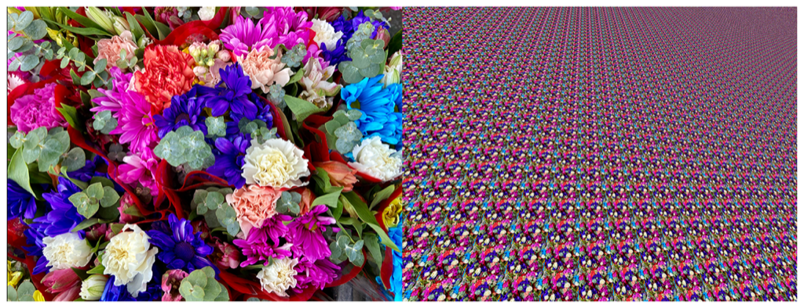

> Navigation: [Technologies](../../technologies.md) · [Core Image](../../coreimage.md) · [CIFilter](../cifilter-swift.class.md)

# perspectiveTile()

<sub>Type Method</sub>

Tiles an image by adjusting the perspective of the image.

<sub>iOS, iPadOS, Mac Catalyst, macOS, tvOS, visionOS</sub>

```swift
class func perspectiveTile() -> any CIFilter & CIPerspectiveTile
```

## Return Value

The tiled image.

## Discussion

This method applies the perspective tile filter to an image. The effect adjusts the perspective of the image and then tiles the result.

The perspective tile filter uses the following properties:

- **`inputImage`** — An image with the type [CIImage](../ciimage.md).
- **`topLeft`** — A [CGPoint](../../corefoundation/cgpoint.md) of the input image mapped to the top-left corner of the tile.
- **`topRight`** — A [CGPoint](../../corefoundation/cgpoint.md) of the input image mapped to the top-right corner of the tile.
- **`bottomLeft`** — A [CGPoint](../../corefoundation/cgpoint.md) of the input image mapped to the bottom-left corner of the tile.
- **`bottomRight`** — A [CGPoint](../../corefoundation/cgpoint.md) of the input image mapped to the bottom-right corner of the tile.

The following code creates a filter that tiles the image and adjusts the perspective to add depth:

```swift
func perspective(inputImage: CIImage) -> CIImage {
    let perspectiveTile = CIFilter.perspectiveTile()
    perspectiveTile.inputImage = inputImage
    perspectiveTile.topLeft = CGPoint(x: 118, y: 484)
    perspectiveTile.topRight = CGPoint(x: 646, y: 507)
    perspectiveTile.bottomLeft = CGPoint(x: 548, y: 140)
    perspectiveTile.bottomRight = CGPoint(x: 155, y: 153)
    return perspectiveTile.outputImage!
}
```



<sub>Two photographs. The photo on the left is of a bouquet of colorful flowers up close with good lighting and focus. In the photo on the right, a perspective tile filter is applied, resulting in the entire image becoming tiled and distorted.</sub>

## See Also

### Filters

- [+ affineClampFilter](<affineclamp().md>) — Performs a transform on the image and extends the image edges to infinity.
- [+ affineTileFilter](<affinetile().md>) — Performs a transform on the image and tiles the result.
- [+ eightfoldReflectedTileFilter](<eightfoldreflectedtile().md>) — Creates an eight-way reflected pattern.
- [+ fourfoldReflectedTileFilter](<fourfoldreflectedtile().md>) — Creates a four-way reflected pattern.
- [+ fourfoldRotatedTileFilter](<fourfoldrotatedtile().md>) — Creates a tiled image by rotating a tile in increments of 90 degrees.
- [+ fourfoldTranslatedTileFilter](<fourfoldtranslatedtile().md>) — Creates a tiled image by applying four translation operations.
- [+ glideReflectedTileFilter](<glidereflectedtile().md>) — Tiles an image by rotating and reflecting a tile from the image.
- [+ kaleidoscopeFilter](<kaleidoscope().md>) — Creates a 12-way kaleidoscopic image from an image.
- [+ opTileFilter](<optile().md>) — Produces an effect that mimics a style of visual art that uses optical illusions.
- [+ parallelogramTileFilter](<parallelogramtile().md>) — Warps the image to create a parallelogram and tiles the result.
- [+ sixfoldReflectedTileFilter](<sixfoldreflectedtile().md>) — Produces a tiled image from a source image by applying a six-way reflected symmetry.
- [+ sixfoldRotatedTileFilter](<sixfoldrotatedtile().md>) — Creates a tiled image by rotating in increments of 60 degrees.
- [+ triangleKaleidoscopeFilter](<trianglekaleidoscope().md>) — Create a triangular kaleidoscope effect and then tiles the result.
- [+ triangleTileFilter](<triangletile().md>) — Tiles a triangular area of an image.
- [+ twelvefoldReflectedTileFilter](<twelvefoldreflectedtile().md>) — Creates a tiled image by rotating in increments of 30 degrees.
