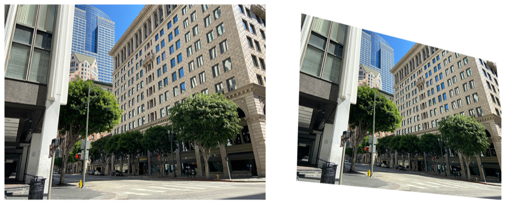

> Navigation: [Technologies](../../technologies.md) · [Core Image](../../coreimage.md) · [CIFilter](../cifilter-swift.class.md)

# perspectiveTransformWithExtent()

<sub>Type Method</sub>

Alters an image’s geometry to adjust the perspective while applying constraints.

<sub>iOS, iPadOS, Mac Catalyst, macOS, tvOS, visionOS</sub>

```swift
class func perspectiveTransformWithExtent() -> any CIFilter & CIPerspectiveTransformWithExtent
```

## Return Value

The adjusted image.

## Discussion

This method applies the perspective transform with extent filter to an image. The effect alters the geometry of an image to simulate the observer changing viewing position. The extent filter crops the image within the bounds specified. You can use the perspective filter to skew an image.

The perspective transform with extent filter uses the following properties:

- **`inputImage`** — An image with the type [CIImage](../ciimage.md).
- **`topLeft`** — A [CGPoint](../../corefoundation/cgpoint.md) in the input image mapped to the top-left corner of the output image.
- **`topRight`** — A [CGPoint](../../corefoundation/cgpoint.md) in the input image mapped to the top-right corner of the output image.
- **`bottomLeft`** — A [CGPoint](../../corefoundation/cgpoint.md) in the input image mapped to the bottom-left corner of the output image.
- **`bottomRight`** — A [CGPoint](../../corefoundation/cgpoint.md) in the input image mapped to the bottom-right corner of the output image.
- **`extent`** — A [CGRect](../../corefoundation/cgrect.md) representing the dimensions of the output image.

The following code creates a filter that changes the perspective of the input image:

```swift
func perspectiveTransformWithExtent(inputImage: CIImage) -> CIImage {
    let perspectiveTransformFilter = CIFilter.perspectiveTransformWithExtent()
    perspectiveTransformFilter.inputImage = inputImage
    perspectiveTransformFilter.topLeft = CGPoint(x: 100, y: 3984)
    perspectiveTransformFilter.topRight = CGPoint(x: 3732, y: 3025)
    perspectiveTransformFilter.bottomLeft = CGPoint(x: 0, y: 500)
    perspectiveTransformFilter.bottomRight = CGPoint(x: 4032, y: 120)
    perspectiveTransformFilter.extent = CGRect(x: 0, y: 0, width: 3800, height: 3200)
    return perspectiveTransformFilter.outputImage!
}
```



<sub>Two photographs of a large building on the corner of an intersection. The building has small windows and is made of a brick structure. The photo on the left has no modifications to size or color. In the photo on the right, a perspective transform is applied, resulting in it appearing as though the photograph was taken from a different angle.</sub>

## See Also

### Filters

- [+ bicubicScaleTransformFilter](<bicubicscaletransform().md>) — Produces a high-quality scaled version of an image.
- [+ edgePreserveUpsampleFilter](<edgepreserveupsample().md>) — Creates a high-quality upscaled image.
- [+ keystoneCorrectionCombinedFilter](<keystonecorrectioncombined().md>) — Adjusts the image vertically and horizontally to remove distortion.
- [+ keystoneCorrectionHorizontalFilter](<keystonecorrectionhorizontal().md>) — Horizontally adjusts an image to remove distortion.
- [+ keystoneCorrectionVerticalFilter](<keystonecorrectionvertical().md>) — Vertically adjusts an image to remove distortion.
- [+ lanczosScaleTransformFilter](<lanczosscaletransform().md>) — Creates a high-quality, scaled version of a source image.
- [+ perspectiveCorrectionFilter](<perspectivecorrection().md>) — Transforms an image’s perspective.
- [+ perspectiveRotateFilter](<perspectiverotate().md>) — Rotates an image in a 3D space.
- [+ perspectiveTransformFilter](<perspectivetransform().md>) — Alters an image’s geometry to adjust the perspective.
- [+ straightenFilter](<straighten().md>) — Rotates and crops an image.
