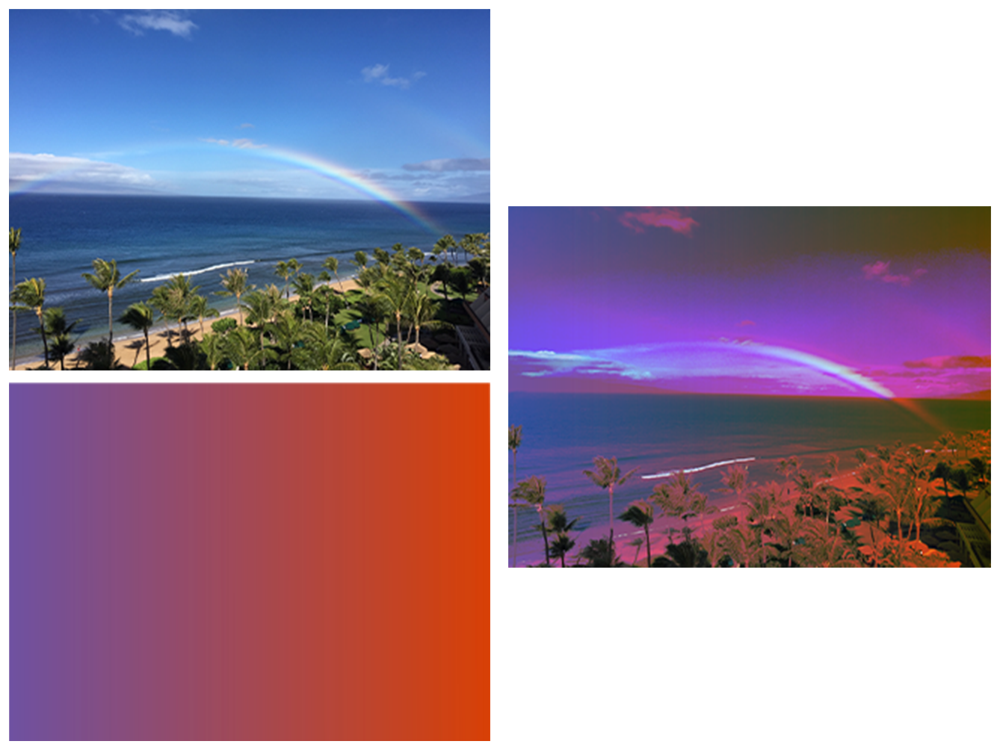

> Navigation: [Technologies](../../technologies.md) · [Core Image](../../coreimage.md) · [CIFilter](../cifilter-swift.class.md)

# pinLightBlendMode()

<sub>Type Method</sub>

Blends colors of two images by replacing brighter colors.

<sub>iOS, iPadOS, Mac Catalyst, macOS, tvOS, visionOS</sub>

```swift
class func pinLightBlendMode() -> any CIFilter & CICompositeOperation
```

## Return Value

The modified image.

## Discussion

This method applies the pin-light-blend mode filter to an image. The effect calculates the brightness of the colors in the background image. Colors that are lighter than 50 percent gray remain unchanged, while the filter replaces colors that are darker than 50 percent with the corresponding color values of the input image. The effect then uses the calculated result to create the output image.

The pin-light-blend mode filter uses the following properties:

- **`inputImage`** — An image with the type [CIImage](../ciimage.md).
- **`backgroundImage`** — An image with the type [CIImage](../ciimage.md).

The following code creates a filter that results in the image becoming darker with more saturation and the colors of the gradient image:

```swift
func pinLightBlendMode(inputImage: CIImage, backgroundImage: CIImage) -> CIImage {
    let colorBlendFilter = CIFilter.pinLightBlendMode()
    colorBlendFilter.inputImage = inputImage
    colorBlendFilter.backgroundImage = backgroundImage
    return colorBlendFilter.outputImage!
}
```



<sub>The image on the top left shows a beach with multiple palm trees and a rainbow arching across the blue sky.  The image below is a gradient image displaying a gradual color shift from purple to a dark orange. The image on the right shows the output from applying a pin-light-blend mode filter applied. The result displays the colors of both images blended together  producing a slightly darker photo.</sub>

## See Also

### Filters

- [+ additionCompositingFilter](<additioncompositing().md>) — Blends colors from two images by addition.
- [+ colorBlendModeFilter](<colorblendmode().md>) — Blends color from two images using the luminance values from the background image and the hue and saturation values from the input image.
- [+ colorBurnBlendModeFilter](<colorburnblendmode().md>) — Blends color from two images while darkening the image.
- [+ colorDodgeBlendModeFilter](<colordodgeblendmode().md>) — Blends color from two images using dodging.
- [+ darkenBlendModeFilter](<darkenblendmode().md>) — Blends colors from two images while darkening lighter pixels.
- [+ differenceBlendModeFilter](<differenceblendmode().md>) — Subtracts color values to blend colors.
- [+ divideBlendModeFilter](<divideblendmode().md>) — Divides color values to blend colors.
- [+ exclusionBlendModeFilter](<exclusionblendmode().md>) — Subtracts color values to blend colors with less contrast.
- [+ hardLightBlendModeFilter](<hardlightblendmode().md>) — Blends colors of two images by screening and multiplying.
- [+ hueBlendModeFilter](<hueblendmode().md>) — Blends colors of two images by computing the sum of image color values.
- [+ lightenBlendModeFilter](<lightenblendmode().md>) — Blends colors from two images by brightening colors.
- [+ linearBurnBlendModeFilter](<linearburnblendmode().md>) — Blends color from two images while increasing contrast.
- [+ linearDodgeBlendModeFilter](<lineardodgeblendmode().md>) — Blends colors of two images with dodging.
- [+ linearLightBlendModeFilter](<linearlightblendmode().md>) — A combination of linear burn and linear dodge blend modes.
- [+ luminosityBlendModeFilter](<luminosityblendmode().md>) — Blends color from two images by calculating the color, hue, and saturation.
