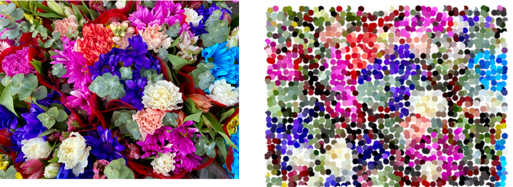

> Navigation: [Technologies](../../technologies.md) · [Core Image](../../coreimage.md) · [CIFilter](../cifilter-swift.class.md)

# pointillize()

<sub>Type Method</sub>

Applies a pointillize effect to an image.

<sub>iOS, iPadOS, Mac Catalyst, macOS, tvOS, visionOS</sub>

```swift
class func pointillize() -> any CIFilter & CIPointillize
```

## Return Value

A [CIImage](../ciimage.md) containing the pointillized image.

## Discussion

This filter applies a pointillize effect to an image. The effect generates an output image made of small, single-color, circular points distributed on a randomly perturbed grid.

The pointillize filter uses the following properties:

- **`inputImage`** — A [CIImage](../ciimage.md) containing the input image.
- **`radius`** — The radius in pixels of the circular points.
- **center** — Determines the origin of the grid.

The following code applies the pointillize filter with a radius of 40 pixels.

```swift
func pointillize(inputImage: CIImage) -> CIImage {
    let pointillizeFilter = CIFilter.pointillize()
    pointillizeFilter.inputImage = inputImage
    pointillizeFilter.radius = 40
    pointillizeFilter.center = CGPoint(x: 0,y: 0)
    return pointillizeFilter.outputImage!
}
```



<sub>Two images arranged horizontally. The left image contains a photo of a colorful bunch of flowers. The right image shows the result of applying the pointillize filter. The image is made of small circular points. The color of each point matches up with the color at the location of the dot in the original image.</sub>

## See Also

### Filters

- [+ blendWithAlphaMaskFilter](<blendwithalphamask().md>) — Blends two images by using an alpha mask image.
- [+ blendWithBlueMaskFilter](<blendwithbluemask().md>) — Blends two images by using a blue mask image.
- [+ blendWithMaskFilter](<blendwithmask().md>) — Blends two images by using a mask image.
- [+ blendWithRedMaskFilter](<blendwithredmask().md>) — Blends two images by using a red mask image.
- [+ bloomFilter](<bloom().md>) — Adjusts an image’s colors by applying a blur effect.
- [+ cannyEdgeDetectorFilter](<cannyedgedetector().md>) — Applies the Canny edge-detection algorithm to an image.
- [+ comicEffectFilter](<comiceffect().md>) — Creates an image with a comic book effect.
- [+ coreMLModelFilter](<coremlmodel().md>) — Filters an image with a Core ML model.
- [+ crystallizeFilter](<crystallize().md>) — Creates an image made with a series of colorful polygons.
- [+ depthOfFieldFilter](<depthoffield().md>) — Simulates a depth of field effect.
- [+ edgesFilter](<edges().md>) — Hilghlights edges of objects found within an image.
- [+ edgeWorkFilter](<edgework().md>) — Produces a black-and-white image that looks similar to a woodblock print.
- [+ gaborGradientsFilter](<gaborgradients().md>) — Highlights textures in an image.
- [+ gloomFilter](<gloom().md>) — Adjusts an image’s color by applying a gloom filter.
- [+ heightFieldFromMaskFilter](<heightfieldfrommask().md>) — Creates a realistic shaded height-field image.
