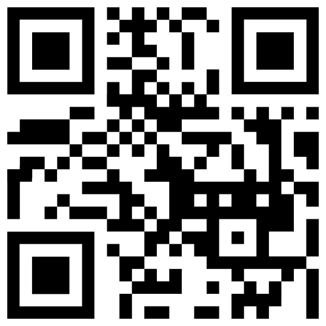

> Navigation: [Technologies](../../technologies.md) · [Core Image](../../coreimage.md) · [CIFilter](../cifilter-swift.class.md)

# qrCodeGenerator()

<sub>Type Method</sub>

Generates a quick response (QR) code image.

<sub>iOS, iPadOS, Mac Catalyst, macOS, tvOS, visionOS</sub>

```swift
class func qrCodeGenerator() -> any CIFilter & CIQRCodeGenerator
```

## Return Value

The generated image.

## Discussion

This method generates a QR code as an image. QR codes are a high-density matrix barcode format defined in the ISO/IEC 18004:2006 standard.

The QR code generator filter uses the following properties:

- **`message`** — A `string` representing the data to be encoded as a QR Code as [NSData](../../foundation/nsdata.md).
- **`correctionLevel`** — A single letter `string` representing the error-correction format as an [NSString](../../foundation/nsstring.md). L is 7 percent correction, M is 15 percent correction, Q is 25 percent correction, and H is 30 percent correction.

The following code creates a filter that generates a QR code:

```swift
func qrCode(inputMessage: String) -> CIImage {
    let qrCodeGenerator = CIFilter.qrCodeGenerator()
    qrCodeGenerator.message = inputMessage.data(using: .ascii)!
    qrCodeGenerator.correctionLevel = "H"
    return qrCodeGenerator.outputImage!
}
```



## See Also

### Filters

- [+ attributedTextImageGeneratorFilter](<attributedtextimagegenerator().md>) — Generates an attributed-text image.
- [+ aztecCodeGeneratorFilter](<azteccodegenerator().md>) — Generates a low-density barcode.
- [+ barcodeGeneratorFilter](<barcodegenerator().md>) — Generates a barcode as an image from the descriptor.
- [+ blurredRectangleGeneratorFilter](<blurredrectanglegenerator().md>) — Generates a blurred rectangle.
- [+ checkerboardGeneratorFilter](<checkerboardgenerator().md>) — Generates a checkerboard image.
- [+ code128BarcodeGeneratorFilter](<code128barcodegenerator().md>) — Generates a high-density, linear barcode.
- [+ lenticularHaloGeneratorFilter](<lenticularhalogenerator().md>) — Generates a lenticular halo image.
- [+ meshGeneratorFilter](<meshgenerator().md>) — Generates a pattern made from an array of line segments.
- [+ PDF417BarcodeGenerator](<pdf417barcodegenerator().md>) — Generates a high-density linear barcode.
- [+ randomGeneratorFilter](<randomgenerator().md>) — Generates a random filter image.
- [+ roundedRectangleGeneratorFilter](<roundedrectanglegenerator().md>) — Generates a rounded rectangle image.
- [+ roundedRectangleStrokeGeneratorFilter](<roundedrectanglestrokegenerator().md>) — Creates an image containing the outline of a rounded rectangle.
- [+ starShineGeneratorFilter](<starshinegenerator().md>) — Generates a star-shine image.
- [+ stripesGeneratorFilter](<stripesgenerator().md>) — Generates a line of stripes as an image
- [+ sunbeamsGeneratorFilter](<sunbeamsgenerator().md>) — Generates an image resembling the sun.
