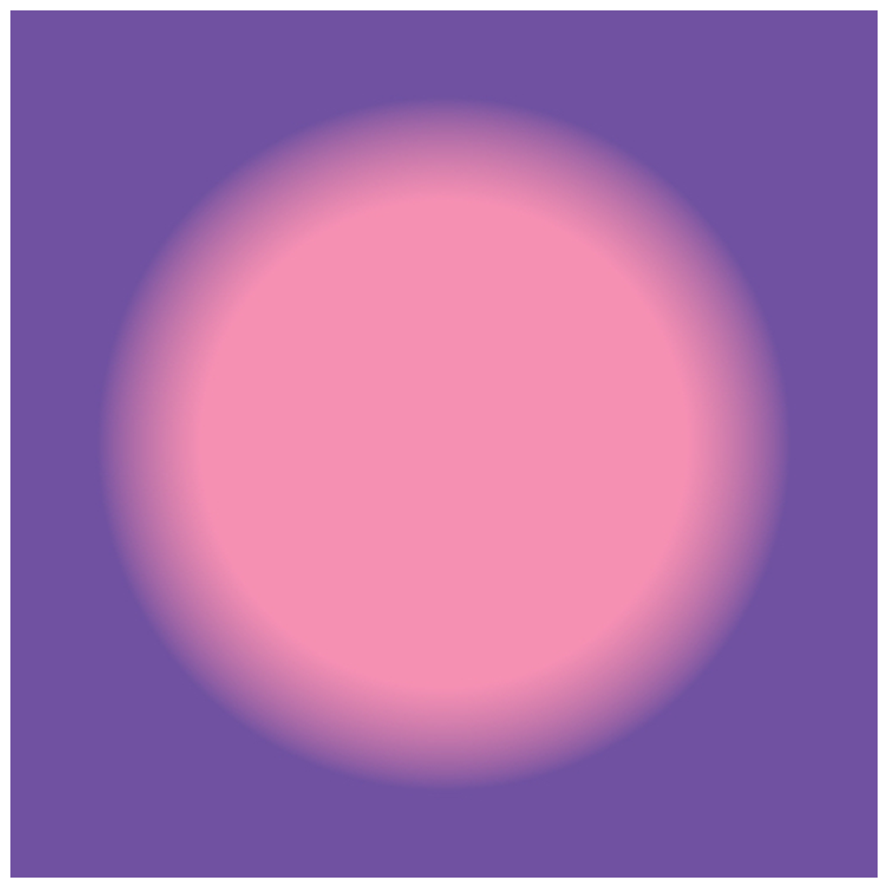

> Navigation: [Technologies](../../technologies.md) · [Core Image](../../coreimage.md) · [CIFilter](../cifilter-swift.class.md)

# radialGradient()

<sub>Type Method</sub>

Generates a gradient that varies radially between two circles having the same center.

<sub>iOS, iPadOS, Mac Catalyst, macOS, tvOS, visionOS</sub>

```swift
class func radialGradient() -> any CIFilter & CIRadialGradient
```

## Return Value

The generated image.

## Discussion

This method generates a radial-gradient image. The effect generates a color shift between the `radius0` and `radius1` properties.

The radial-gradient filter uses the following properties:

- **`center`** — A [CGPoint](../../corefoundation/cgpoint.md) representing the center of the effect as x and y coordinates.
- **`color0`** — A [CIColor](../cicolor.md) representing the first color to use in the gradient.
- **`color1`** — A [CIColor](../cicolor.md) representing the second color to use in the gradient.
- **`radius0`** — A `float` representing the radius of the starting circle to use in the gradient as a [NSNumber](../../foundation/nsnumber.md).
- **`radius1`** — A `float` representing the radius of the ending circle to use in the gradient as a [NSNumber](../../foundation/nsnumber.md).

The following code creates a filter that generates a gradient image:

```swift
func radial() -> CIImage {
    let radialGradient = CIFilter.radialGradient()
    radialGradient.center = CGPoint(x: 150, y: 150)
    radialGradient.radius0 = 5
    radialGradient.radius1 = 100
    radialGradient.color0 = CIColor(red: 246/255, green: 145/255, blue: 181/255)
    radialGradient.color1 = CIColor(red: 110/255, green: 81/255, blue: 161/255)
    return radialGradient.outputImage!
}
```



## See Also

### Filters

- [+ gaussianGradientFilter](<gaussiangradient().md>) — Generates a gradient that varies from one color to another using a Gaussian distribution.
- [+ hueSaturationValueGradientFilter](<huesaturationvaluegradient().md>) — Generates a gradient representing a specified color space.
- [+ linearGradientFilter](<lineargradient().md>) — Generates a color gradient that varies along a linear axis between two defined endpoints.
- [+ smoothLinearGradientFilter](<smoothlineargradient().md>) — Generates a gradient that blends colors along a linear axis between two defined endpoints.
