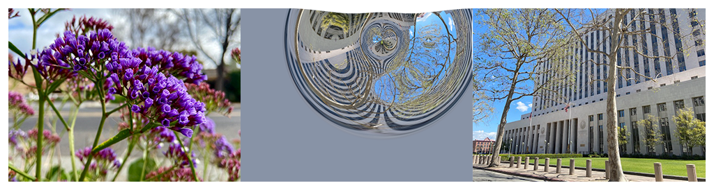

> Navigation: [Technologies](../../technologies.md) · [Core Image](../../coreimage.md) · [CIFilter](../cifilter-swift.class.md)

# rippleTransition()

<sub>Type Method</sub>

Simulates a ripple in a pond to transiton from one image to another.

<sub>iOS, iPadOS, Mac Catalyst, macOS, tvOS, visionOS</sub>

```swift
class func rippleTransition() -> any CIFilter & CIRippleTransition
```

## Return Value

The transition image.

## Discussion

This method applies the ripple transition filter to an image. The effect transitions from one image to another by creating a circular wave that expands from the center point, revealing the target image through the wave effect.

The ripple transition filter uses the following properties:

- **`inputImage`** — The starting image with the type [CIImage](../ciimage.md).
- **`targetImage`** — The ending image with the type [CIImage](../ciimage.md).
- **`center`** — A set of coordinates marking the center of the image as a [CGPoint](../../corefoundation/cgpoint.md).
- **`width`** — A `float` representing the width of the ripple effect as an [NSNumber](../../foundation/nsnumber.md).
- **`extent`** — A [CGRect](../../corefoundation/cgrect.md) representing the size of the ripple effect.
- **`scale`** — A `float` representing the scale of the effect as an [NSNumber](../../foundation/nsnumber.md).
- **`time`** — A `float` representing the parametric time of the transition from start (at time 0) to end (at time 1) as an [NSNumber](../../foundation/nsnumber.md).

The following code creates a filter that transitions from the input image to the target image with a water-like ripple effect.

```swift
func ripple (inputImage: CIImage, targetImage: CIImage) -> CIImage {
    let rippleTransition = CIFilter.rippleTransition()
    rippleTransition.inputImage = inputImage
    rippleTransition.targetImage = targetImage
    rippleTransition.center = CGPoint(x: 250, y: 150)
    rippleTransition.width = 100
    rippleTransition.extent = CGRect(x: 54, y: 80, width: 300, height: 300)
    rippleTransition.scale = 22
    rippleTransition.time = 0.3
    return rippleTransition.outputImage!
}
```



<sub>Three photographs. In the photo on the left, there are multiple small purple flowers photographed close up with good lighting, and the background has a slight blur. In the photograph on the right is a tall building with two trees directly in front of the building. In the center photograph, a ripple transition filter is applied, resulting in a still photo of the moving transition. The left photograph is overlaid on the phot on the right appearing as a ripple in a pond, slowly fading the flower image to become the city photograph.</sub>

## See Also

### Filters

- [+ accordionFoldTransitionFilter](<accordionfoldtransition().md>) — Transitions by folding and crossfading an image to reveal the target image.
- [+ barsSwipeTransitionFilter](<barsswipetransition().md>) — Transitions between two images by removing rectangular portions of an image.
- [+ copyMachineTransitionFilter](<copymachinetransition().md>) — Simulates the effect of a copy machine scanner light to transiton between two images.
- [+ disintegrateWithMaskTransitionFilter](<disintegratewithmasktransition().md>) — Transitions between two images using a mask image.
- [+ dissolveTransitionFilter](<dissolvetransition().md>) — Transitions between two images with a fade effect.
- [+ flashTransitionFilter](<flashtransition().md>) — Creates a flash of light to transition between two images.
- [+ modTransitionFilter](<modtransition().md>) — Transitions between two images by applying irregularly shaped holes.
- [+ pageCurlTransitionFilter](<pagecurltransition().md>) — Simulates the curl of a page, revealing the target image.
- [+ pageCurlWithShadowTransitionFilter](<pagecurlwithshadowtransition().md>) — Simulates the curl of a page, revealing the target image with added shadow.
- [+ swipeTransitionFilter](<swipetransition().md>) — Gradually transitions from one image to another with a swiping motion.
