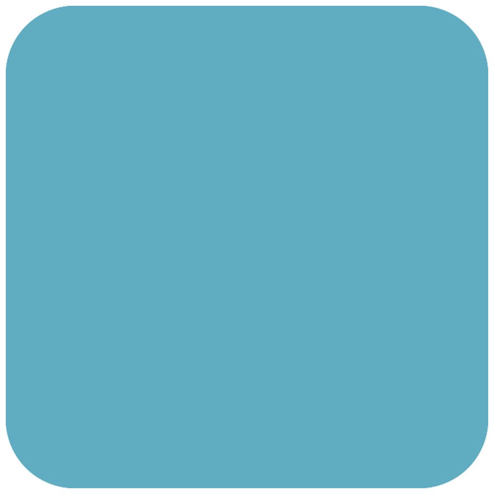

> Navigation: [Technologies](../../technologies.md) · [Core Image](../../coreimage.md) · [CIFilter](../cifilter-swift.class.md)

# roundedRectangleGenerator()

<sub>Type Method</sub>

Generates a rounded rectangle image.

<sub>iOS, iPadOS, Mac Catalyst, macOS, tvOS, visionOS</sub>

```swift
class func roundedRectangleGenerator() -> any CIFilter & CIRoundedRectangleGenerator
```

## Return Value

The generated image.

## Discussion

This method generates a rounded rectangle image with the specified size, corner radius, and color properties.

The rounded rectangle generator filter uses the following properties:

- **`color`** — A [CIColor](../cicolor.md) representing the color of the rounded rectangle.
- **`extent`** — A [CGRect](../../corefoundation/cgrect.md) representing the size of the rounded rectangle.
- **`radius`** — A `float` representing the curve of the rectangle’s corners.

The following code creates a filter that generates a light blue square with rounded corners:

```swift
func roundedRectangle () -> CIImage {
    let roundedRectangleGenerator = CIFilter.roundedRectangleGenerator()
    roundedRectangleGenerator.color = CIColor(red: 96/255, green: 173/255, blue: 193/255)
    roundedRectangleGenerator.extent = CGRect(x: 0, y: 1, width: 700, height: 700)
    roundedRectangleGenerator.radius = 100
    return roundedRectangleGenerator.outputImage!
}
```



## See Also

### Filters

- [+ attributedTextImageGeneratorFilter](<attributedtextimagegenerator().md>) — Generates an attributed-text image.
- [+ aztecCodeGeneratorFilter](<azteccodegenerator().md>) — Generates a low-density barcode.
- [+ barcodeGeneratorFilter](<barcodegenerator().md>) — Generates a barcode as an image from the descriptor.
- [+ blurredRectangleGeneratorFilter](<blurredrectanglegenerator().md>) — Generates a blurred rectangle.
- [+ checkerboardGeneratorFilter](<checkerboardgenerator().md>) — Generates a checkerboard image.
- [+ code128BarcodeGeneratorFilter](<code128barcodegenerator().md>) — Generates a high-density, linear barcode.
- [+ lenticularHaloGeneratorFilter](<lenticularhalogenerator().md>) — Generates a lenticular halo image.
- [+ meshGeneratorFilter](<meshgenerator().md>) — Generates a pattern made from an array of line segments.
- [+ PDF417BarcodeGenerator](<pdf417barcodegenerator().md>) — Generates a high-density linear barcode.
- [+ QRCodeGenerator](<qrcodegenerator().md>) — Generates a quick response (QR) code image.
- [+ randomGeneratorFilter](<randomgenerator().md>) — Generates a random filter image.
- [+ roundedRectangleStrokeGeneratorFilter](<roundedrectanglestrokegenerator().md>) — Creates an image containing the outline of a rounded rectangle.
- [+ starShineGeneratorFilter](<starshinegenerator().md>) — Generates a star-shine image.
- [+ stripesGeneratorFilter](<stripesgenerator().md>) — Generates a line of stripes as an image
- [+ sunbeamsGeneratorFilter](<sunbeamsgenerator().md>) — Generates an image resembling the sun.
