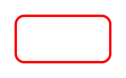

> Navigation: [Technologies](../../technologies.md) · [Core Image](../../coreimage.md) · [CIFilter](../cifilter-swift.class.md)

# roundedRectangleStrokeGenerator()

<sub>Type Method</sub>

Creates an image containing the outline of a rounded rectangle.

<sub>iOS, iPadOS, Mac Catalyst, macOS, tvOS, visionOS</sub>

```swift
class func roundedRectangleStrokeGenerator() -> any CIFilter & CIRoundedRectangleStrokeGenerator
```

## Return Value

A [CIImage](../ciimage.md) containing the stroked rectangle.

## Discussion

This filter creates an outline of a rounded rectangle.

The filter takes the following properties:

- **`extent`** — A [CGRect](../../corefoundation/cgrect.md) containing the position and size of the rectangle.
- **`width`** — The width of the stroke to draw.
- **`radius`** — The corner radius.

The following code generates an image containing a stroked rounded rectangle:

```swift
func roundedRectangleStroke() -> CIImage {
    let filter = CIFilter.roundedRectangleStrokeGenerator()
    filter.extent = CGRect(x: 0, y: 0, width: 200, height: 100)
    filter.color = CIColor.red
    filter.width = 5
    filter.radius = 20
    return filter.outputImage!
}
```



## See Also

### Filters

- [+ attributedTextImageGeneratorFilter](<attributedtextimagegenerator().md>) — Generates an attributed-text image.
- [+ aztecCodeGeneratorFilter](<azteccodegenerator().md>) — Generates a low-density barcode.
- [+ barcodeGeneratorFilter](<barcodegenerator().md>) — Generates a barcode as an image from the descriptor.
- [+ blurredRectangleGeneratorFilter](<blurredrectanglegenerator().md>) — Generates a blurred rectangle.
- [+ checkerboardGeneratorFilter](<checkerboardgenerator().md>) — Generates a checkerboard image.
- [+ code128BarcodeGeneratorFilter](<code128barcodegenerator().md>) — Generates a high-density, linear barcode.
- [+ lenticularHaloGeneratorFilter](<lenticularhalogenerator().md>) — Generates a lenticular halo image.
- [+ meshGeneratorFilter](<meshgenerator().md>) — Generates a pattern made from an array of line segments.
- [+ PDF417BarcodeGenerator](<pdf417barcodegenerator().md>) — Generates a high-density linear barcode.
- [+ QRCodeGenerator](<qrcodegenerator().md>) — Generates a quick response (QR) code image.
- [+ randomGeneratorFilter](<randomgenerator().md>) — Generates a random filter image.
- [+ roundedRectangleGeneratorFilter](<roundedrectanglegenerator().md>) — Generates a rounded rectangle image.
- [+ starShineGeneratorFilter](<starshinegenerator().md>) — Generates a star-shine image.
- [+ stripesGeneratorFilter](<stripesgenerator().md>) — Generates a line of stripes as an image
- [+ sunbeamsGeneratorFilter](<sunbeamsgenerator().md>) — Generates an image resembling the sun.
