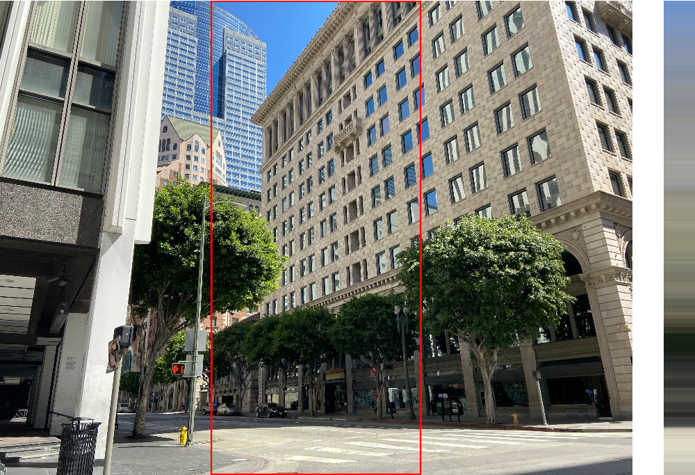

> Navigation: [Technologies](../../technologies.md) · [Core Image](../../coreimage.md) · [CIFilter](../cifilter-swift.class.md)

# rowAverage()

<sub>Type Method</sub>

Calculates the average color for the specified row of pixels in an image.

<sub>iOS, iPadOS, Mac Catalyst, macOS, tvOS, visionOS</sub>

```swift
class func rowAverage() -> any CIFilter & CIRowAverage
```

## Return Value

## Discussion

This method applies the row average filter to an image. This effect calculates the average color for a horizontal row over a region defined by `extent`. The height of the extent determines the width of the resulting image. The height is always 1 pixel.

The row average filter uses the following properties:

- **`inputImage`** — An image with the type [CIImage](../ciimage.md).
- **`extent`** — A [CGRect](../../corefoundation/cgrect.md) that specifies the subregion of the image that you want to process.

The following code creates a filter that calculates the row average for the middle section of an image:

```swift
func rowAverage(inputImage: CIImage) -> CIImage {
    let filter = CIFilter.rowAverage()
    filter.inputImage = inputImage
    filter.extent = CGRect(x: inputImage.extent.width/3, y: 0, width: inputImage.extent.width/3, height: inputImage.extent.height)
    return filter.outputImage!
}
```



<sub>Two images arranged horizontally side by side. The left image contains a photograph of a modern brick building. The middle of the image is highlighted by a rectangle. The right image contains the result of the row average filter applied to the highlighted region of the image. The right image has been rotated by 90 degrees and then stretched horizontally to make is easier to see. It contains colors from the highlighted region of the left image.</sub>

## See Also

### Filters

- [+ areaAverageFilter](<areaaverage().md>) — Returns a 1 x 1 pixel image that contains the average color for the region of interest.
- [+ areaHistogramFilter](<areahistogram().md>) — Returns a histogram of a specified area of the image.
- [+ areaLogarithmicHistogramFilter](<arealogarithmichistogram().md>) — Returns a logarithmic histogram of a specified area of the image.
- [+ areaMaximumFilter](<areamaximum().md>) — Calculates the maximum color components of a specified area of the image.
- [+ areaMaximumAlphaFilter](<areamaximumalpha().md>) — Finds the pixel with the highest alpha value.
- [+ areaMinimumFilter](<areaminimum().md>) — Calculates the minimum color component values for a specified area of the image.
- [+ areaMinimumAlphaFilter](<areaminimumalpha().md>) — Calculates the pixel within a specified area that has the smallest alpha value.
- [+ areaMinMaxFilter](<areaminmax().md>) — Calculates minimum and maximum color components for a specified area of the image.
- [+ areaMinMaxRedFilter](<areaminmaxred().md>) — Calculates the minimum and maximum red component value.
- [+ columnAverageFilter](<columnaverage().md>) — Calculates the average color for a specified column of an image.
- [+ histogramDisplayFilter](<histogramdisplay().md>) — Generates a histogram map from the image.
- [+ KMeansFilter](<kmeans().md>) — Applies the k-means algorithm to find the most common colors in an image.
