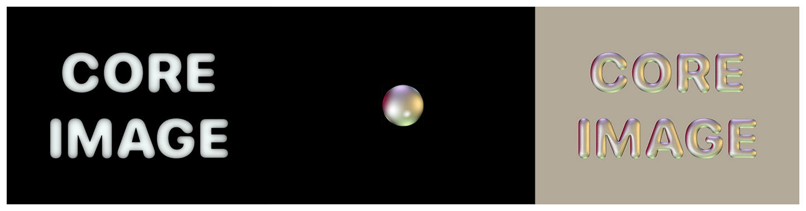

> Navigation: [Technologies](../../technologies.md) · [Core Image](../../coreimage.md) · [CIFilter](../cifilter-swift.class.md)

# shadedMaterial()

<sub>Type Method</sub>

Creates a shaded image from a height-field image.

<sub>iOS, iPadOS, Mac Catalyst, macOS, tvOS, visionOS</sub>

```swift
class func shadedMaterial() -> any CIFilter & CIShadedMaterial
```

## Return Value

The modified image.

## Discussion

This method applies the shaded material filter to an image. The effect produces a shaded image from a height-field image. Areas of the height field image that have a darker shaded area produce a stronger effect. You can combine the filter with [CIHeightFieldFromMask](../ciheightfieldfrommask.md) to produce quick shadings of masks, such as text.

The shaded material filter uses the following properties:

- **`inputImage`** — An image with the type [CIImage](../ciimage.md).
- **`shadingImage`** — An image representing the color shading effect with type [CIImage](../ciimage.md).
- **`scale`** — A `float` representing the strength of effect as an [NSNumber](../../foundation/nsnumber.md).

The following code creates a filter that results in an image containing glossy text by applying the shading image.

```swift
func shadowMaterial(inputImage: CIImage, shadeImage: CIImage) -> CIImage {
    let shadowMaterialFilter = CIFilter.shadedMaterial()
    shadowMaterialFilter.inputImage = inputImage
    shadowMaterialFilter.shadingImage = shadeImage
    shadowMaterialFilter.scale = 10
    return shadowMaterialFilter.outputImage!
}
```



<sub>Three pictures side by side. The first photo on the left is a black image with the text Core Image in the center with the shading detail inside the white text. The center photograph of a colorful sphere. In the photo on the right, a shaded material filter is applied, resulting in the color from the center image being overlaid onto the text, creating a shiny effect on the text and giving the image the effect of becoming three-dimensional.</sub>

## See Also

### Filters

- [+ blendWithAlphaMaskFilter](<blendwithalphamask().md>) — Blends two images by using an alpha mask image.
- [+ blendWithBlueMaskFilter](<blendwithbluemask().md>) — Blends two images by using a blue mask image.
- [+ blendWithMaskFilter](<blendwithmask().md>) — Blends two images by using a mask image.
- [+ blendWithRedMaskFilter](<blendwithredmask().md>) — Blends two images by using a red mask image.
- [+ bloomFilter](<bloom().md>) — Adjusts an image’s colors by applying a blur effect.
- [+ cannyEdgeDetectorFilter](<cannyedgedetector().md>) — Applies the Canny edge-detection algorithm to an image.
- [+ comicEffectFilter](<comiceffect().md>) — Creates an image with a comic book effect.
- [+ coreMLModelFilter](<coremlmodel().md>) — Filters an image with a Core ML model.
- [+ crystallizeFilter](<crystallize().md>) — Creates an image made with a series of colorful polygons.
- [+ depthOfFieldFilter](<depthoffield().md>) — Simulates a depth of field effect.
- [+ edgesFilter](<edges().md>) — Hilghlights edges of objects found within an image.
- [+ edgeWorkFilter](<edgework().md>) — Produces a black-and-white image that looks similar to a woodblock print.
- [+ gaborGradientsFilter](<gaborgradients().md>) — Highlights textures in an image.
- [+ gloomFilter](<gloom().md>) — Adjusts an image’s color by applying a gloom filter.
- [+ heightFieldFromMaskFilter](<heightfieldfrommask().md>) — Creates a realistic shaded height-field image.
