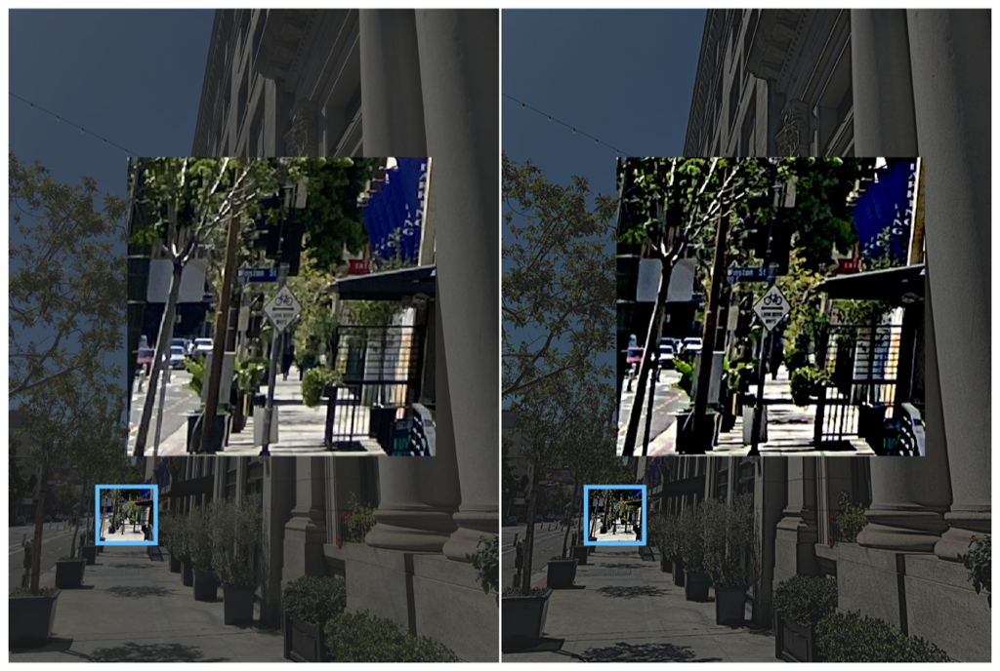

> Navigation: [Technologies](../../technologies.md) · [Core Image](../../coreimage.md) · [CIFilter](../cifilter-swift.class.md)

# sharpenLuminance()

<sub>Type Method</sub>

Applies a sharpening effect to an image.

<sub>iOS, iPadOS, Mac Catalyst, macOS, tvOS, visionOS</sub>

```swift
class func sharpenLuminance() -> any CIFilter & CISharpenLuminance
```

## Return Value

The modified image.

## Discussion

This method applies the sharpen luminance filter to an image. The effect increases image detail by adjusting the luminance of each pixel within the `radius` property. Sharpening the luminance doesn’t effect the chroma data of each pixel.

The bicubic sharpen luminance filter uses the following properties:

- **`inputImage`** — An image with the type [CIImage](../ciimage.md).
- **`radius`** — A `float` representing the area of effect as an [NSNumber](../../foundation/nsnumber.md).
- **`sharpness`** — A `float` representing the desired strength of the effect as an [NSNumber](../../foundation/nsnumber.md).

The following code creates a filter that results in detail from the sign in the image to be more visible:

```swift
func sharpen (inputImage: CIImage) -> CIImage? {
    let sharpenLuminance = CIFilter.sharpenLuminance()
    sharpenLuminance.inputImage = inputImage
    sharpenLuminance.radius = 10
    sharpenLuminance.sharpness = 1
    return sharpenLuminance.outputImage!
}
```



<sub>Two photographs of a downtown sidewalk with trees, a blue square highlighting the end of the sidewalk with a bike lane and street sign displayed. The photo on the left has no modifications to color. In the photo on the right a sharpen luminance filter has been applied resulting in the black of the bike lane sign becoming darker.</sub>

## See Also

### Filters

- [+ unsharpMaskFilter](<unsharpmask().md>) — Increases an image’s contrast between two colors.
