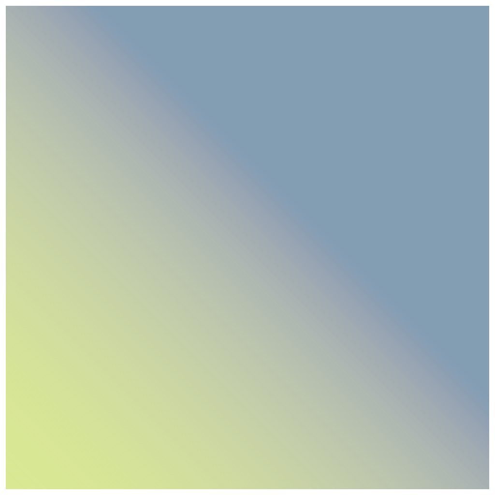

> Navigation: [Technologies](../../technologies.md) · [Core Image](../../coreimage.md) · [CIFilter](../cifilter-swift.class.md)

# smoothLinearGradient()

<sub>Type Method</sub>

Generates a gradient that blends colors along a linear axis between two defined endpoints.

<sub>iOS, iPadOS, Mac Catalyst, macOS, tvOS, visionOS</sub>

```swift
class func smoothLinearGradient() -> any CIFilter & CISmoothLinearGradient
```

## Return Value

The generated image.

## Discussion

This method generates a smooth linear-gradient image. The effect creates a gradient by gradually blending colors between `point0` and `point1` using the sigmoid curve function.

The smooth linear-gradient filter uses the following properties:

- **`point0`** — A [CGPoint](../../corefoundation/cgpoint.md) representing the starting position of the gradient.
- **`point1`** — A [CGPoint](../../corefoundation/cgpoint.md) representing the ending position of the gradient.
- **`color0`** — A [CIColor](../cicolor.md) representing the first color used in the gradient.
- **`color1`** — A [CIColor](../cicolor.md) representing the second color used in the gradient.

The following code creates a filter that generates a gradient image:

```swift
func smoothLinear() -> CIImage {
    let smoothLinearGradient = CIFilter.smoothLinearGradient()
    smoothLinearGradient.point0 = CGPoint(x: 0, y: 0)
    smoothLinearGradient.point1 = CGPoint(x: 200, y: 200)
    smoothLinearGradient.color0 = CIColor(red: 0/255, green: 112/255, blue: 201/255)
    smoothLinearGradient.color1 = CIColor(red: 216/255, green: 232/255, blue: 146/255)
    return smoothLinearGradient.outputImage!
}
```



## See Also

### Filters

- [+ gaussianGradientFilter](<gaussiangradient().md>) — Generates a gradient that varies from one color to another using a Gaussian distribution.
- [+ hueSaturationValueGradientFilter](<huesaturationvaluegradient().md>) — Generates a gradient representing a specified color space.
- [+ linearGradientFilter](<lineargradient().md>) — Generates a color gradient that varies along a linear axis between two defined endpoints.
- [+ radialGradientFilter](<radialgradient().md>) — Generates a gradient that varies radially between two circles having the same center.
