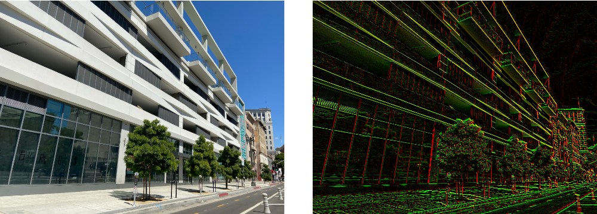

> Navigation: [Technologies](../../technologies.md) · [Core Image](../../coreimage.md) · [CIFilter](../cifilter-swift.class.md)

# sobelGradients()

<sub>Type Method</sub>

Calculates the Sobel gradients for an image.

<sub>iOS, iPadOS, Mac Catalyst, macOS, tvOS, visionOS</sub>

```swift
class func sobelGradients() -> any CIFilter & CISobelGradients
```

## Return Value

A [CIImage](../ciimage.md) containing the Sobel gradients.

## Discussion

This filter applies the Sobel operator to the color components of the input image. You would typically use the Sobel filter as part of an edge-detection algorithm for performing.

- **`inputImage`** — A [CIImage](../ciimage.md) containing the image to process.

The following code applies the [+ sobelGradientsFilter](<sobelgradients().md>) filter to an image.

```swift
func sobelGradients(inputImage: CIImage) -> CIImage {
    let sobel = CIFilter.sobelGradients()
    sobel.inputImage = inputImage
    return sobel.outputImage!
}
```



<sub>Two images arranged horizontally. The left image is a photograph of modern building with horizontal concrete beams and large tinted windows. The image on the right shows the result of applying the Sobel gradients filter. Edges in the image are highlighted and flat areas of the image are set to black.</sub>

## See Also

### Filters

- [+ blendWithAlphaMaskFilter](<blendwithalphamask().md>) — Blends two images by using an alpha mask image.
- [+ blendWithBlueMaskFilter](<blendwithbluemask().md>) — Blends two images by using a blue mask image.
- [+ blendWithMaskFilter](<blendwithmask().md>) — Blends two images by using a mask image.
- [+ blendWithRedMaskFilter](<blendwithredmask().md>) — Blends two images by using a red mask image.
- [+ bloomFilter](<bloom().md>) — Adjusts an image’s colors by applying a blur effect.
- [+ cannyEdgeDetectorFilter](<cannyedgedetector().md>) — Applies the Canny edge-detection algorithm to an image.
- [+ comicEffectFilter](<comiceffect().md>) — Creates an image with a comic book effect.
- [+ coreMLModelFilter](<coremlmodel().md>) — Filters an image with a Core ML model.
- [+ crystallizeFilter](<crystallize().md>) — Creates an image made with a series of colorful polygons.
- [+ depthOfFieldFilter](<depthoffield().md>) — Simulates a depth of field effect.
- [+ edgesFilter](<edges().md>) — Hilghlights edges of objects found within an image.
- [+ edgeWorkFilter](<edgework().md>) — Produces a black-and-white image that looks similar to a woodblock print.
- [+ gaborGradientsFilter](<gaborgradients().md>) — Highlights textures in an image.
- [+ gloomFilter](<gloom().md>) — Adjusts an image’s color by applying a gloom filter.
- [+ heightFieldFromMaskFilter](<heightfieldfrommask().md>) — Creates a realistic shaded height-field image.
