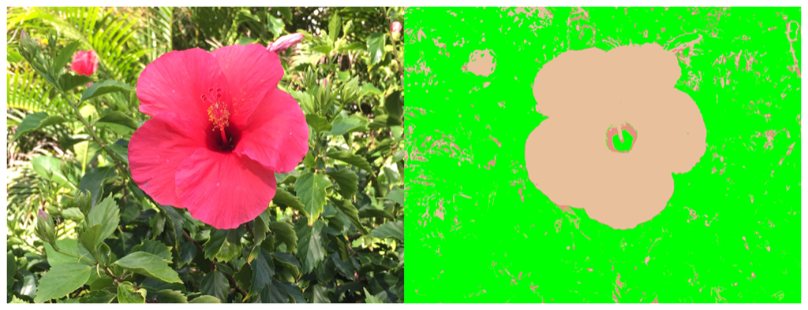

> Navigation: [Technologies](../../technologies.md) · [Core Image](../../coreimage.md) · [CIFilter](../cifilter-swift.class.md)

# spotColor()

<sub>Type Method</sub>

Replaces colors of an image with specifed colors.

<sub>iOS, iPadOS, Mac Catalyst, macOS, tvOS, visionOS</sub>

```swift
class func spotColor() -> any CIFilter & CISpotColor
```

## Return Value

The modified image.

## Discussion

This method applies the spot color filter to an image. The effect replaces one or more of the color ranges of the input image with properties.

The spot color filter uses the following properties:

- **`inputImage`** — An image with the type [CIImage](../ciimage.md).
- **`centerColor1`** — A [CIColor](../cicolor.md) representing the median value of the first color to be replaced.
- **`centerColor2`** — A [CIColor](../cicolor.md) representing the median value of the second color to be replaced.
- **`centerColor3`** — A [CIColor](../cicolor.md) representing the median value of the third color to be replaced.
- **`replacementColor1`** — A [CIColor](../cicolor.md) to replace the first color.
- **`replacementColor2`** — A [CIColor](../cicolor.md) to replace the second color.
- **`replacementColor3`** — A [CIColor](../cicolor.md) to replace the third color.
- **`closeness1`** — A `float` representing how closely the first center color must match before it’s replaced.
- **`closeness2`** — A `float` representing how closely the second center color must match before it’s replaced.
- **`closeness3`** — A `float` representing how closely the third center color must match before it’s replaced.
- **`contrast1`** — A `float` representing the contrast of the first replacement color as an [NSNumber](../../foundation/nsnumber.md).
- **`contrast2`** — A `float` representing the contrast of the second replacement color as an [NSNumber](../../foundation/nsnumber.md).
- **`contrast3`** — A `float` representing the contrast of the third replacement color as an [NSNumber](../../foundation/nsnumber.md).

The following code creates a filter that replaces the colors of the input image with the specified colors:

```swift
func spotColor(inputImage: CIImage) -> CIImage {
    let spotColorFilter = CIFilter.spotColor()
    spotColorFilter.inputImage = inputImage
    spotColorFilter.centerColor1 = .red
    spotColorFilter.replacementColor1 = .green
    spotColorFilter.closeness1 = 5
    spotColorFilter.contrast1 = 1
    return spotColorFilter.outputImage!
}
```



<sub>Two pictures of a pink flower surrounded by foliage. The photo on the left has no modifications to color. In the photo on the right, a spot color filter is applied, resulting in less color in the image with the center flower becoming brown and the foliage becoming a solid light green.</sub>

## See Also

### Filters

- [+ blendWithAlphaMaskFilter](<blendwithalphamask().md>) — Blends two images by using an alpha mask image.
- [+ blendWithBlueMaskFilter](<blendwithbluemask().md>) — Blends two images by using a blue mask image.
- [+ blendWithMaskFilter](<blendwithmask().md>) — Blends two images by using a mask image.
- [+ blendWithRedMaskFilter](<blendwithredmask().md>) — Blends two images by using a red mask image.
- [+ bloomFilter](<bloom().md>) — Adjusts an image’s colors by applying a blur effect.
- [+ cannyEdgeDetectorFilter](<cannyedgedetector().md>) — Applies the Canny edge-detection algorithm to an image.
- [+ comicEffectFilter](<comiceffect().md>) — Creates an image with a comic book effect.
- [+ coreMLModelFilter](<coremlmodel().md>) — Filters an image with a Core ML model.
- [+ crystallizeFilter](<crystallize().md>) — Creates an image made with a series of colorful polygons.
- [+ depthOfFieldFilter](<depthoffield().md>) — Simulates a depth of field effect.
- [+ edgesFilter](<edges().md>) — Hilghlights edges of objects found within an image.
- [+ edgeWorkFilter](<edgework().md>) — Produces a black-and-white image that looks similar to a woodblock print.
- [+ gaborGradientsFilter](<gaborgradients().md>) — Highlights textures in an image.
- [+ gloomFilter](<gloom().md>) — Adjusts an image’s color by applying a gloom filter.
- [+ heightFieldFromMaskFilter](<heightfieldfrommask().md>) — Creates a realistic shaded height-field image.
