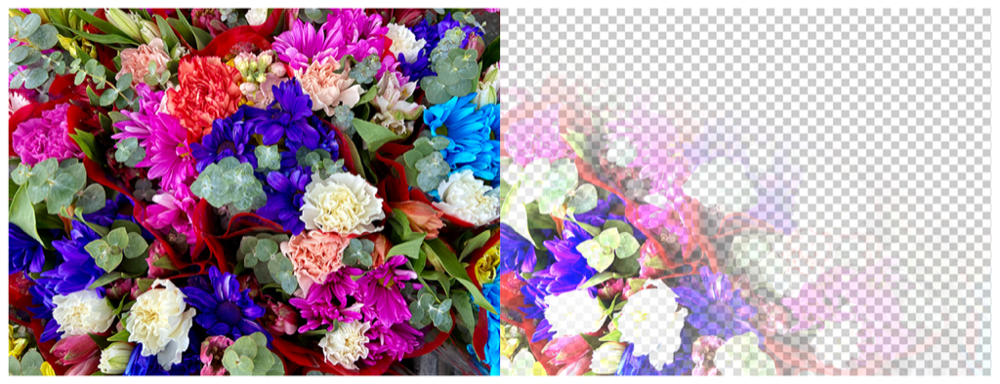

> Navigation: [Technologies](../../technologies.md) · [Core Image](../../coreimage.md) · [CIFilter](../cifilter-swift.class.md)

# spotLight()

<sub>Type Method</sub>

Highlights a definined area of the image.

<sub>iOS, iPadOS, Mac Catalyst, macOS, tvOS, visionOS</sub>

```swift
class func spotLight() -> any CIFilter & CISpotLight
```

## Return Value

The modified image.

## Discussion

This method applies the spotlight filter to an image. The effect applies a directional spotlight effect to an image while creating a transparent area not highlighted by the spotlight.

The spotlight filter uses the following properties:

- **`inputImage`** — An image with the type [CIImage](../ciimage.md).
- **`lightPointsAt`** — A [CIVector](../civector.md) with the x and y positions that the spotlight points at.
- **`brightness`** — A `float` representing the brightness of the spotlight as an [NSNumber](../../foundation/nsnumber.md).
- **`lightPosition`** — A [CIVector](../civector.md) containing the x and y position of the spotlight.
- **`concentration`** — A `float` representing the size of the spotlight in pixels as an [NSNumber](../../foundation/nsnumber.md).
- **`color`** — A [CIColor](../cicolor.md) representing the spotlight color.

The following code creates a filter that results in only the bottom left of the image becoming visible while the rest of the image gradually becomes transparent:

```swift
func spotlight(inputImage: CIImage) -> CIImage {
    let spotlightFilter = CIFilter.spotLight()
    spotlightFilter.inputImage = inputImage
    spotlightFilter.lightPointsAt = CIVector(x: 100, y: 100)
    spotlightFilter.brightness = 10
    spotlightFilter.lightPosition = CIVector(x: 100, y: 100)
    spotlightFilter.concentration = 20
    return spotlightFilter.outputImage!
}
```



<sub>Two pictures of a large amount of colorful  flowers. The photo on the left shows a group of flowers, in focus, with good light and no effects. In the photo on the right a spotlight  filter is applied, resulting in the photo becoming transparent with the bottom left corner being the most visible glimpse of the original image.</sub>

## See Also

### Filters

- [+ blendWithAlphaMaskFilter](<blendwithalphamask().md>) — Blends two images by using an alpha mask image.
- [+ blendWithBlueMaskFilter](<blendwithbluemask().md>) — Blends two images by using a blue mask image.
- [+ blendWithMaskFilter](<blendwithmask().md>) — Blends two images by using a mask image.
- [+ blendWithRedMaskFilter](<blendwithredmask().md>) — Blends two images by using a red mask image.
- [+ bloomFilter](<bloom().md>) — Adjusts an image’s colors by applying a blur effect.
- [+ cannyEdgeDetectorFilter](<cannyedgedetector().md>) — Applies the Canny edge-detection algorithm to an image.
- [+ comicEffectFilter](<comiceffect().md>) — Creates an image with a comic book effect.
- [+ coreMLModelFilter](<coremlmodel().md>) — Filters an image with a Core ML model.
- [+ crystallizeFilter](<crystallize().md>) — Creates an image made with a series of colorful polygons.
- [+ depthOfFieldFilter](<depthoffield().md>) — Simulates a depth of field effect.
- [+ edgesFilter](<edges().md>) — Hilghlights edges of objects found within an image.
- [+ edgeWorkFilter](<edgework().md>) — Produces a black-and-white image that looks similar to a woodblock print.
- [+ gaborGradientsFilter](<gaborgradients().md>) — Highlights textures in an image.
- [+ gloomFilter](<gloom().md>) — Adjusts an image’s color by applying a gloom filter.
- [+ heightFieldFromMaskFilter](<heightfieldfrommask().md>) — Creates a realistic shaded height-field image.
