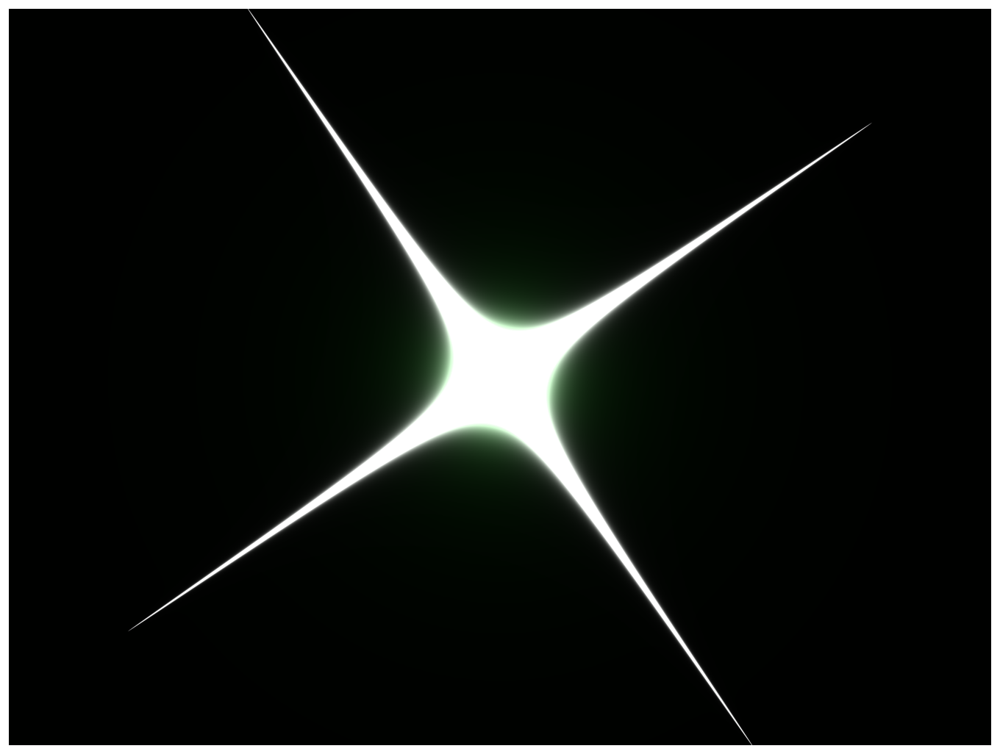

> Navigation: [Technologies](../../technologies.md) · [Core Image](../../coreimage.md) · [CIFilter](../cifilter-swift.class.md)

# starShineGenerator()

<sub>Type Method</sub>

Generates a star-shine image.

<sub>iOS, iPadOS, Mac Catalyst, macOS, tvOS, visionOS</sub>

```swift
class func starShineGenerator() -> any CIFilter & CIStarShineGenerator
```

## Return Value

The generated image.

## Discussion

This method generates a star-shine image. The effect is similar to a supernova effect. You can use this filter to simulate a lens flare.

The star-shine generator filter uses the following properties:

- **`center`** — A `vector` representing the center of the flare as a [CGPoint](../../corefoundation/cgpoint.md).
- **`color`** — A color representing the color of the flare as a [cgColor](../../uikit/uicolor/cgcolor.md).
- **`radius`** — A `float` representing the radius of the flare as an [NSNumber](../../foundation/nsnumber.md).
- **`crossScale`** — A `float` representing the cross flare size relative to the round central flare as an [NSNumber](../../foundation/nsnumber.md).
- **`crossAngle`** — A `float` representing the angle of the flare as an [NSNumber](../../foundation/nsnumber.md).
- **`crossOpacity`** — A `float` representing the thickness of the cross opacity as an [NSNumber](../../foundation/nsnumber.md).
- **`crossWidth`** — A `float` representing the cross width as an [NSNumber](../../foundation/nsnumber.md).
- **`epsilon`** — A `float` representing the epsilon as an [NSNumber](../../foundation/nsnumber.md).

The following code generates a star-shaped silhouette with a black background.

```swift
func starShine() -> CIImage {
    let starShineGenerator = CIFilter.starShineGenerator()
    starShineGenerator.center = CGPoint(x: 150, y: 150)
    starShineGenerator.color = .green
    starShineGenerator.radius = 50
    starShineGenerator.crossScale = 15
    starShineGenerator.crossAngle = 0.60
    starShineGenerator.crossOpacity = -2
    starShineGenerator.crossWidth = 2.5
    starShineGenerator.epsilon = -2.0
    return starShineGenerator.outputImage!
}
```



<sub>A picture of an object that is similar to a square with the corners stretched farther out from the body and a green gradient behind the star shine.</sub>

## See Also

### Filters

- [+ attributedTextImageGeneratorFilter](<attributedtextimagegenerator().md>) — Generates an attributed-text image.
- [+ aztecCodeGeneratorFilter](<azteccodegenerator().md>) — Generates a low-density barcode.
- [+ barcodeGeneratorFilter](<barcodegenerator().md>) — Generates a barcode as an image from the descriptor.
- [+ blurredRectangleGeneratorFilter](<blurredrectanglegenerator().md>) — Generates a blurred rectangle.
- [+ checkerboardGeneratorFilter](<checkerboardgenerator().md>) — Generates a checkerboard image.
- [+ code128BarcodeGeneratorFilter](<code128barcodegenerator().md>) — Generates a high-density, linear barcode.
- [+ lenticularHaloGeneratorFilter](<lenticularhalogenerator().md>) — Generates a lenticular halo image.
- [+ meshGeneratorFilter](<meshgenerator().md>) — Generates a pattern made from an array of line segments.
- [+ PDF417BarcodeGenerator](<pdf417barcodegenerator().md>) — Generates a high-density linear barcode.
- [+ QRCodeGenerator](<qrcodegenerator().md>) — Generates a quick response (QR) code image.
- [+ randomGeneratorFilter](<randomgenerator().md>) — Generates a random filter image.
- [+ roundedRectangleGeneratorFilter](<roundedrectanglegenerator().md>) — Generates a rounded rectangle image.
- [+ roundedRectangleStrokeGeneratorFilter](<roundedrectanglestrokegenerator().md>) — Creates an image containing the outline of a rounded rectangle.
- [+ stripesGeneratorFilter](<stripesgenerator().md>) — Generates a line of stripes as an image
- [+ sunbeamsGeneratorFilter](<sunbeamsgenerator().md>) — Generates an image resembling the sun.
