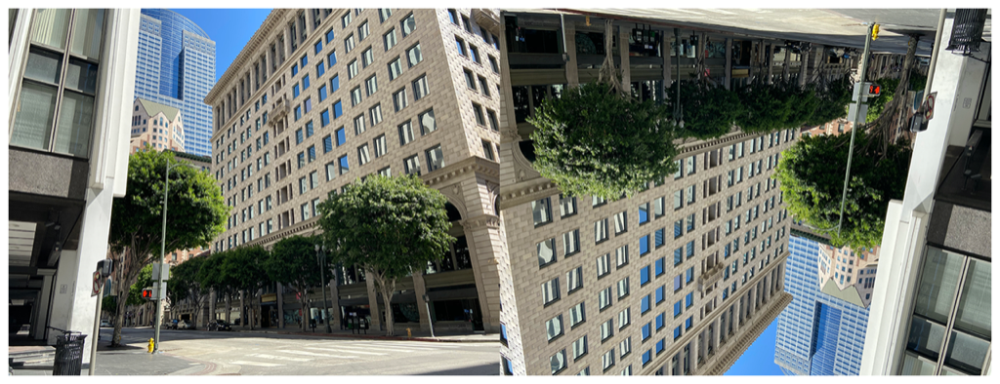

> Navigation: [Technologies](../../technologies.md) · [Core Image](../../coreimage.md) · [CIFilter](../cifilter-swift.class.md)

# straighten()

<sub>Type Method</sub>

Rotates and crops an image.

<sub>iOS, iPadOS, Mac Catalyst, macOS, tvOS, visionOS</sub>

```swift
class func straighten() -> any CIFilter & CIStraighten
```

## Return Value

The adjusted image.

## Discussion

This method applies the straighten filter to an image. The effect rotates the image based on the `angle` property while cropping and scaling the image to remain the same size as the original image.

The straighten filter uses the following properties:

- **`inputImage`** — An image with the type [CIImage](../ciimage.md).
- **`angle`** — A `float` representing the angle to rotate the image as an [NSNumber](../../foundation/nsnumber.md).

The following code creates a filter that rotates the image 135 degrees:

```swift
func straighten(inputImage: CIImage) -> CIImage {
    let straightenFilter = CIFilter.straighten()
    straightenFilter.inputImage = inputImage
    straightenFilter.angle = 135
    return straightenFilter.outputImage!
}
```



<sub>Two photographs of a large building on the corner of an intersection. The building has small windows and is made of a brick structure. The photo on the left has no modifications to size or color. In the photo on the right, a straighten filter is applied, resulting in the image becoming rotated and appearing upside down.</sub>

## See Also

### Filters

- [+ bicubicScaleTransformFilter](<bicubicscaletransform().md>) — Produces a high-quality scaled version of an image.
- [+ edgePreserveUpsampleFilter](<edgepreserveupsample().md>) — Creates a high-quality upscaled image.
- [+ keystoneCorrectionCombinedFilter](<keystonecorrectioncombined().md>) — Adjusts the image vertically and horizontally to remove distortion.
- [+ keystoneCorrectionHorizontalFilter](<keystonecorrectionhorizontal().md>) — Horizontally adjusts an image to remove distortion.
- [+ keystoneCorrectionVerticalFilter](<keystonecorrectionvertical().md>) — Vertically adjusts an image to remove distortion.
- [+ lanczosScaleTransformFilter](<lanczosscaletransform().md>) — Creates a high-quality, scaled version of a source image.
- [+ perspectiveCorrectionFilter](<perspectivecorrection().md>) — Transforms an image’s perspective.
- [+ perspectiveRotateFilter](<perspectiverotate().md>) — Rotates an image in a 3D space.
- [+ perspectiveTransformFilter](<perspectivetransform().md>) — Alters an image’s geometry to adjust the perspective.
- [+ perspectiveTransformWithExtentFilter](<perspectivetransformwithextent().md>) — Alters an image’s geometry to adjust the perspective while applying constraints.
