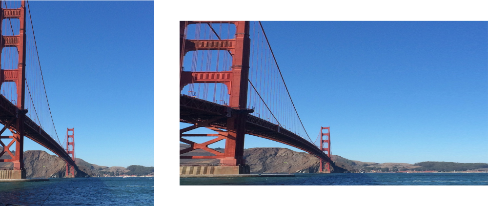

> Navigation: [Technologies](../../technologies.md) · [Core Image](../../coreimage.md) · [CIFilter](../cifilter-swift.class.md)

# stretchCrop()

<sub>Type Method</sub>

Distorts an image by stretching or cropping to fit a specified size.

<sub>iOS, iPadOS, Mac Catalyst, macOS, tvOS, visionOS</sub>

```swift
class func stretchCrop() -> any CIFilter & CIStretchCrop
```

## Return Value

The distorted image.

## Discussion

This method applies the stretch crop filter to an image. This effect distorts an image by stretching an image and then applies the crop extent. If the crop value is 0, the filter only uses stretching. If the value is 1, then the filter only uses cropping.

The stretch crop filter uses the following properties:

- **`inputImage`** — An image with the type [CIImage](../ciimage.md).
- **`centerStretchAmount`** — A `float` representing the amount of stretching of the center of the image as an [NSNumber](../../foundation/nsnumber.md).
- **`size`** — A [CGPoint](../../corefoundation/cgpoint.md) representing the desired size of the output image.
- **`cropAmount`** — A `float` representing the amount of cropping you apply to achieve the target size as an [NSNumber](../../foundation/nsnumber.md).

The following code creates a filter that results in a smaller image that’s distorted and cropped to be the defined size:

```swift
func stretchCrop(inputImage: CIImage) -> CIImage {
    let filter = CIFilter.stretchCrop()
    filter.inputImage = inputImage
    filter.cropAmount = 0.25
    filter.centerStretchAmount = 0.25
    filter.size = CGPoint(
        x: inputImage.extent.width * 2,
        y: inputImage.extent.size.height * 0.8
    )
    return filter.outputImage!
}
```



<sub>Two images arranged horizontally. The left image contains a photograph of the Golden Gate Bridge with a clear sky in the background. The right image shows the result of applying the stretch crop filter. The image has been stretched in the horizontal direction and cropped in the vertical direction.</sub>

## See Also

### Filters

- [+ bumpDistortionFilter](<bumpdistortion().md>) — Distorts an image with a concave or convex bump.
- [+ bumpDistortionLinearFilter](<bumpdistortionlinear().md>) — Linearly distorts an image with a concave or convex bump.
- [+ circleSplashDistortionFilter](<circlesplashdistortion().md>) — Distorts an image with radiating circles to the periphery of the image.
- [+ circularWrapFilter](<circularwrap().md>) — Distorts an image by increasing the distance of the center of the image.
- [+ displacementDistortionFilter](<displacementdistortion().md>) — Applies the grayscale values of the second image to the first image.
- [+ drosteFilter](<droste().md>) — Stylizes an image with the Droste effect.
- [+ glassDistortionFilter](<glassdistortion().md>) — Distorts an image by applying a glass-like texture.
- [+ glassLozengeFilter](<glasslozenge().md>) — Creates a lozenge-shaped lens and distorts the image.
- [+ holeDistortionFilter](<holedistortion().md>) — Distorts an image with a circular area that pushes the image outward.
- [+ lightTunnelFilter](<lighttunnel().md>) — Distorts an image by generating a light tunnel.
- [+ ninePartStretchedFilter](<ninepartstretched().md>) — Distorts an image by stretching it between two breakpoints.
- [+ ninePartTiledFilter](<nineparttiled().md>) — Distorts an image by tiling portions of it.
- [+ pinchDistortionFilter](<pinchdistortion().md>) — Distorts an image by creating a pinch effect with stronger distortion in the center.
- [+ torusLensDistortionFilter](<toruslensdistortion().md>) — Creates a torus-shaped lens to distort the image.
- [+ twirlDistortionFilter](<twirldistortion().md>) — Distorts an image by rotating pixels around a center point.
