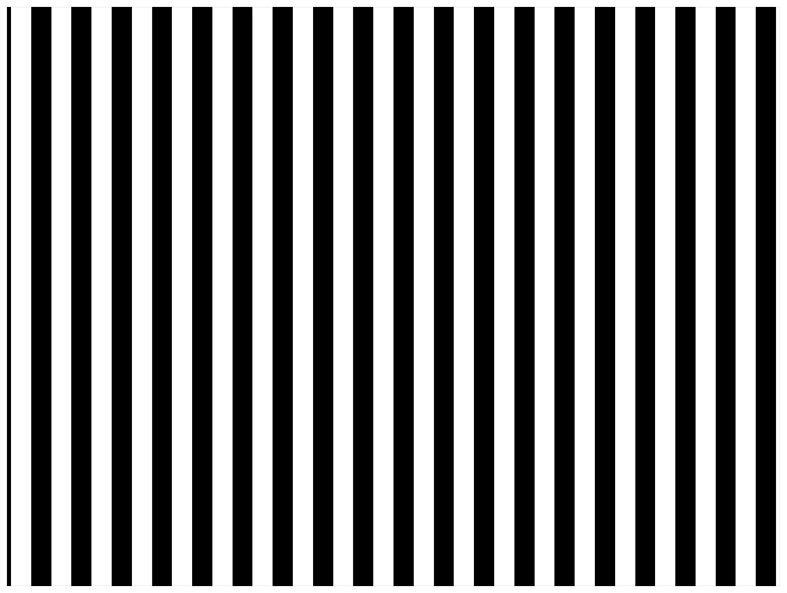

> Navigation: [Technologies](../../technologies.md) · [Core Image](../../coreimage.md) · [CIFilter](../cifilter-swift.class.md)

# stripesGenerator()

<sub>Type Method</sub>

Generates a line of stripes as an image

<sub>iOS, iPadOS, Mac Catalyst, macOS, tvOS, visionOS</sub>

```swift
class func stripesGenerator() -> any CIFilter & CIStripesGenerator
```

## Return Value

The generated image.

## Discussion

This method generates a vertical stripped line pattern as an image.

The stripes generator filter uses the following properties:

- **`center`** — A [CIVector](../civector.md) representing the center of the image.
- **`color0`** — A [CIColor](../cicolor.md) representing the stripes color.
- **`color1`** — A [CIColor](../cicolor.md) representing the background color.
- **`width`** — A `float` representing the width of the lines as an [NSNumber](../../foundation/nsnumber.md).
- **`sharpness`** — A `float` representing the sharpness of the lines as an [NSNumber](../../foundation/nsnumber.md).

The following code creates a filter that generates a black and white vertical striped image:

```swift
func stripes() -> CIImage {
    let stripesGenerator = CIFilter.stripesGenerator()
    stripesGenerator.center = CGPoint(x: 150, y: 150)
    stripesGenerator.color0 = .white
    stripesGenerator.color1 = .black
    stripesGenerator.width = 80
    stripesGenerator.sharpness = 1
    return stripesGenerator.outputImage!
}
```



## See Also

### Filters

- [+ attributedTextImageGeneratorFilter](<attributedtextimagegenerator().md>) — Generates an attributed-text image.
- [+ aztecCodeGeneratorFilter](<azteccodegenerator().md>) — Generates a low-density barcode.
- [+ barcodeGeneratorFilter](<barcodegenerator().md>) — Generates a barcode as an image from the descriptor.
- [+ blurredRectangleGeneratorFilter](<blurredrectanglegenerator().md>) — Generates a blurred rectangle.
- [+ checkerboardGeneratorFilter](<checkerboardgenerator().md>) — Generates a checkerboard image.
- [+ code128BarcodeGeneratorFilter](<code128barcodegenerator().md>) — Generates a high-density, linear barcode.
- [+ lenticularHaloGeneratorFilter](<lenticularhalogenerator().md>) — Generates a lenticular halo image.
- [+ meshGeneratorFilter](<meshgenerator().md>) — Generates a pattern made from an array of line segments.
- [+ PDF417BarcodeGenerator](<pdf417barcodegenerator().md>) — Generates a high-density linear barcode.
- [+ QRCodeGenerator](<qrcodegenerator().md>) — Generates a quick response (QR) code image.
- [+ randomGeneratorFilter](<randomgenerator().md>) — Generates a random filter image.
- [+ roundedRectangleGeneratorFilter](<roundedrectanglegenerator().md>) — Generates a rounded rectangle image.
- [+ roundedRectangleStrokeGeneratorFilter](<roundedrectanglestrokegenerator().md>) — Creates an image containing the outline of a rounded rectangle.
- [+ starShineGeneratorFilter](<starshinegenerator().md>) — Generates a star-shine image.
- [+ sunbeamsGeneratorFilter](<sunbeamsgenerator().md>) — Generates an image resembling the sun.
