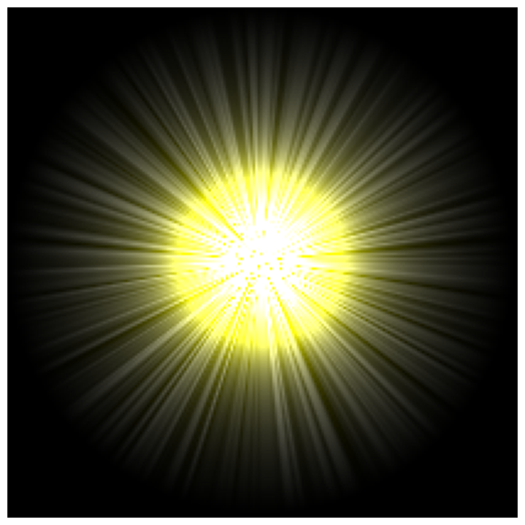

> Navigation: [Technologies](../../technologies.md) · [Core Image](../../coreimage.md) · [CIFilter](../cifilter-swift.class.md)

# sunbeamsGenerator()

<sub>Type Method</sub>

Generates an image resembling the sun.

<sub>iOS, iPadOS, Mac Catalyst, macOS, tvOS, visionOS</sub>

```swift
class func sunbeamsGenerator() -> any CIFilter & CISunbeamsGenerator
```

## Return Value

The generated image.

## Discussion

This method generates a sunbeam as an image. The effect generates a center-textured sun with striations. You can combine with other filters to create more sophisticated images.

The sunbeams generator filter uses the following properties:

- **`center`** — A vector representing the center of the image as a [CIVector](../civector.md).
- **`color`** — A [CIColor](../cicolor.md) representing the color of the sun.
- **`sunRadius`** — A `float` representing the radius of the center sun as an [NSNumber](../../foundation/nsnumber.md).
- **`maxStriationRadius`** — A `float` representing the striation radius as an [NSNumber](../../foundation/nsnumber.md).
- **`striationStrength`** — A `float` representing the striation strength as an [NSNumber](../../foundation/nsnumber.md).
- **`striationContrast`** — A `float` representing the striation contrast as an [NSNumber](../../foundation/nsnumber.md).
- **`time`** — A `float` representing the time as an [NSNumber](../../foundation/nsnumber.md).

The following code creates a filter that generates an image that resembles a yellow sun with sunbeams:

```swift
    func sunBeam () -> CIImage {
        let sunBeamGenerator = CIFilter.sunbeamsGenerator()
        sunBeamGenerator.center = CGPoint(x: 150, y: 150)
        sunBeamGenerator.color = CIColor(red: 0.96, green: 1, blue: 1, alpha: 1)
        sunBeamGenerator.sunRadius = 40
        sunBeamGenerator.maxStriationRadius = 2.58
        sunBeamGenerator.striationStrength = 0.50
        sunBeamGenerator.striationContrast = 1.38
        sunBeamGenerator.time = 0
        return sunBeamGenerator.outputImage!
    }
```



## See Also

### Filters

- [+ attributedTextImageGeneratorFilter](<attributedtextimagegenerator().md>) — Generates an attributed-text image.
- [+ aztecCodeGeneratorFilter](<azteccodegenerator().md>) — Generates a low-density barcode.
- [+ barcodeGeneratorFilter](<barcodegenerator().md>) — Generates a barcode as an image from the descriptor.
- [+ blurredRectangleGeneratorFilter](<blurredrectanglegenerator().md>) — Generates a blurred rectangle.
- [+ checkerboardGeneratorFilter](<checkerboardgenerator().md>) — Generates a checkerboard image.
- [+ code128BarcodeGeneratorFilter](<code128barcodegenerator().md>) — Generates a high-density, linear barcode.
- [+ lenticularHaloGeneratorFilter](<lenticularhalogenerator().md>) — Generates a lenticular halo image.
- [+ meshGeneratorFilter](<meshgenerator().md>) — Generates a pattern made from an array of line segments.
- [+ PDF417BarcodeGenerator](<pdf417barcodegenerator().md>) — Generates a high-density linear barcode.
- [+ QRCodeGenerator](<qrcodegenerator().md>) — Generates a quick response (QR) code image.
- [+ randomGeneratorFilter](<randomgenerator().md>) — Generates a random filter image.
- [+ roundedRectangleGeneratorFilter](<roundedrectanglegenerator().md>) — Generates a rounded rectangle image.
- [+ roundedRectangleStrokeGeneratorFilter](<roundedrectanglestrokegenerator().md>) — Creates an image containing the outline of a rounded rectangle.
- [+ starShineGeneratorFilter](<starshinegenerator().md>) — Generates a star-shine image.
- [+ stripesGeneratorFilter](<stripesgenerator().md>) — Generates a line of stripes as an image
