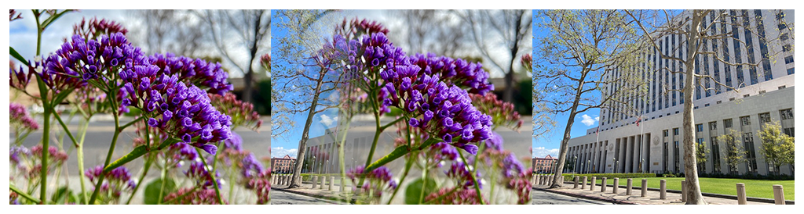

> Navigation: [Technologies](../../technologies.md) · [Core Image](../../coreimage.md) · [CIFilter](../cifilter-swift.class.md)

# swipeTransition()

<sub>Type Method</sub>

Gradually transitions from one image to another with a swiping motion.

<sub>iOS, iPadOS, Mac Catalyst, macOS, tvOS, visionOS</sub>

```swift
class func swipeTransition() -> any CIFilter & CISwipeTransition
```

## Return Value

The transition image.

## Discussion

This method applies the swipe transition filter to an image. The effect transitions from the input image to the target image by simulating a swiping motion.

The swipe transition filter uses the following properties:

- **`inputImage`** — The starting image with the type [CIImage](../ciimage.md).
- **`targetImage`** — The ending image with the type [CIImage](../ciimage.md).
- **`extent`** — A [CGRect](../../corefoundation/cgrect.md) representing the size of the rounded rectangle.
- **`time`** — A `float` representing the parametric time of the transition from start (at time 0) to end (at time 1) as an [NSNumber](../../foundation/nsnumber.md).
- **angle** — A `float` representing the angle of the motion of the swipe as an [NSNumber](../../foundation/nsnumber.md).
- **width** — A `float` representing the width of the swipe effect as an [NSNumber](../../foundation/nsnumber.md).
- **opacity** — A `float` representing the transparency of the swipe as an [NSNumber](../../foundation/nsnumber.md).

The following code creates a filter that transitions from the input image to the target image with a gradual fade from left to right.

```swift
func swipe(inputImage: CIImage, targetImage: CIImage) -> CIImage {
    let swipeTransiton = CIFilter.swipeTransition()
    swipeTransiton.inputImage = inputImage
    swipeTransiton.targetImage = targetImage
    swipeTransiton.extent = CGRect(x: 0, y: 0, width: 300, height: 300)
    swipeTransiton.time = 0.5
    swipeTransiton.angle = -0.7
    swipeTransiton.width = 203
    swipeTransiton.opacity = 0
    return swipeTransiton.outputImage!
}
```



<sub>Three photographs. In the photo on the left, there are multiple small purple flowers photographed close up with good lighting, and the background has a slight blur. In the photograph on the right is a tall building with two trees directly in front of the building. In the center photograph, a swipe transition filter is applied, resulting in a still photo of the moving transition. The left photograph is overlaid on the photo on the right with a slow fade from the left of the flower photo, revealing the city building photograph under it.</sub>

## See Also

### Filters

- [+ accordionFoldTransitionFilter](<accordionfoldtransition().md>) — Transitions by folding and crossfading an image to reveal the target image.
- [+ barsSwipeTransitionFilter](<barsswipetransition().md>) — Transitions between two images by removing rectangular portions of an image.
- [+ copyMachineTransitionFilter](<copymachinetransition().md>) — Simulates the effect of a copy machine scanner light to transiton between two images.
- [+ disintegrateWithMaskTransitionFilter](<disintegratewithmasktransition().md>) — Transitions between two images using a mask image.
- [+ dissolveTransitionFilter](<dissolvetransition().md>) — Transitions between two images with a fade effect.
- [+ flashTransitionFilter](<flashtransition().md>) — Creates a flash of light to transition between two images.
- [+ modTransitionFilter](<modtransition().md>) — Transitions between two images by applying irregularly shaped holes.
- [+ pageCurlTransitionFilter](<pagecurltransition().md>) — Simulates the curl of a page, revealing the target image.
- [+ pageCurlWithShadowTransitionFilter](<pagecurlwithshadowtransition().md>) — Simulates the curl of a page, revealing the target image with added shadow.
- [+ rippleTransitionFilter](<rippletransition().md>) — Simulates a ripple in a pond to transiton from one image to another.
