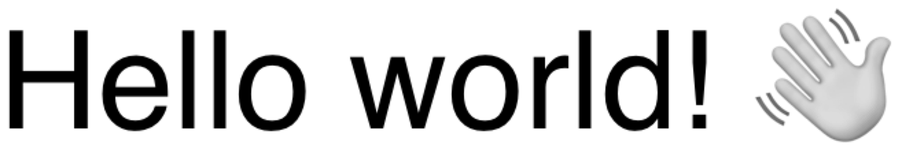

> Navigation: [Technologies](../../technologies.md) · [Core Image](../../coreimage.md) · [CIFilter](../cifilter-swift.class.md)

# textImageGenerator()

<sub>Type Method</sub>

Generates a text image.

<sub>iOS, iPadOS, Mac Catalyst, macOS, tvOS, visionOS</sub>

```swift
class func textImageGenerator() -> any CIFilter & CITextImageGenerator
```

## Return Value

The generated image.

## Discussion

This method generates a text image. The effect takes the input string property and the scale factor to scale up the text. You commonly combine this filter with other filters to create a watermark on images.

The text image generator filter uses the following properties:

- **`text`** — The `string` to render. The string can contain non-ASCII characters.
- **`fontName`** — A `string` representing the name of the font to be used to generate the image.
- **`fontSize`** — A `float` representing the size of the font as an [NSNumber](../../foundation/nsnumber.md).
- **`scaleFactor`** — A `float` representing the scale of the font for the generated text as an [NSNumber](../../foundation/nsnumber.md).

The following code creates a filter that generates a string of text as a grayscale image:

```swift
func textImage(inputText: String) -> CIImage {
    let textImageGenerator = CIFilter.textImageGenerator()
    textImageGenerator.text = inputText
    textImageGenerator.fontName = "Helvetica"
    textImageGenerator.fontSize = 25
    textImageGenerator.scaleFactor = 4
    return textImageGenerator.outputImage!
}
```



## See Also

### Filters

- [+ attributedTextImageGeneratorFilter](<attributedtextimagegenerator().md>) — Generates an attributed-text image.
- [+ aztecCodeGeneratorFilter](<azteccodegenerator().md>) — Generates a low-density barcode.
- [+ barcodeGeneratorFilter](<barcodegenerator().md>) — Generates a barcode as an image from the descriptor.
- [+ blurredRectangleGeneratorFilter](<blurredrectanglegenerator().md>) — Generates a blurred rectangle.
- [+ checkerboardGeneratorFilter](<checkerboardgenerator().md>) — Generates a checkerboard image.
- [+ code128BarcodeGeneratorFilter](<code128barcodegenerator().md>) — Generates a high-density, linear barcode.
- [+ lenticularHaloGeneratorFilter](<lenticularhalogenerator().md>) — Generates a lenticular halo image.
- [+ meshGeneratorFilter](<meshgenerator().md>) — Generates a pattern made from an array of line segments.
- [+ PDF417BarcodeGenerator](<pdf417barcodegenerator().md>) — Generates a high-density linear barcode.
- [+ QRCodeGenerator](<qrcodegenerator().md>) — Generates a quick response (QR) code image.
- [+ randomGeneratorFilter](<randomgenerator().md>) — Generates a random filter image.
- [+ roundedRectangleGeneratorFilter](<roundedrectanglegenerator().md>) — Generates a rounded rectangle image.
- [+ roundedRectangleStrokeGeneratorFilter](<roundedrectanglestrokegenerator().md>) — Creates an image containing the outline of a rounded rectangle.
- [+ starShineGeneratorFilter](<starshinegenerator().md>) — Generates a star-shine image.
- [+ stripesGeneratorFilter](<stripesgenerator().md>) — Generates a line of stripes as an image
