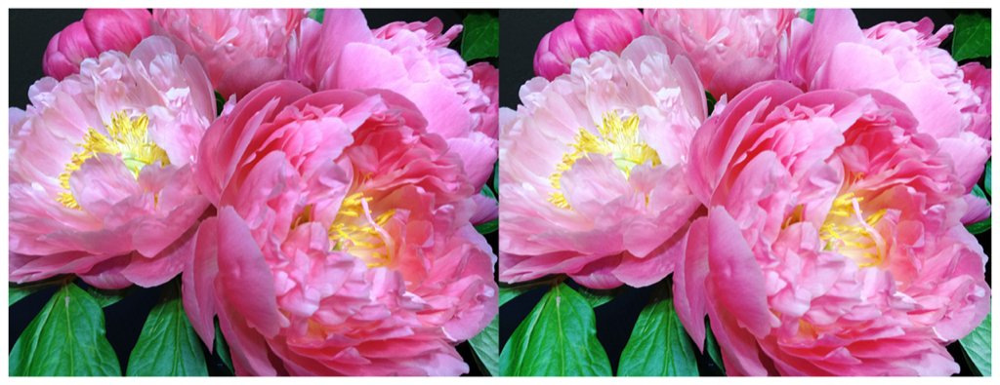

> Navigation: [Technologies](../../technologies.md) · [Core Image](../../coreimage.md) · [CIFilter](../cifilter-swift.class.md)

# toneCurve()

<sub>Type Method</sub>

Alters an image’s tone curve according to a series of data points.

<sub>iOS, iPadOS, Mac Catalyst, macOS, tvOS, visionOS</sub>

```swift
class func toneCurve() -> any CIFilter & CIToneCurve
```

## Return Value

The modified image.

## Discussion

This method applies the tone curve filter to an image. The effect calculates the adjustment of the tone curve by the sum of the red, green, and blue color values with the point value properties specified.

The tone curve filter uses the following properties:

- **`point0`** — A v`ector` containing the position of the first point of the tone curve as a [CIVector](../civector.md).
- **`point1`** — A v`ector` containing the position of the second point of the tone curve as a [CIVector](../civector.md).
- **`point2`** — A `vector` containing the position of the third point of the tone curve as a [CIVector](../civector.md).
- **`point3`** — A v`ector` containing the position of the fourth point of the tone curve as a [CIVector](../civector.md).
- **`point4`** — A v`ector` containing the position of the fifth point of the tone curve as a [CIVector](../civector.md).
- **`inputImage`** — An image with the type [CIImage](../ciimage.md).

The following code creates a filter that adds brightness to the input image:

```swift
func toneCurve(inputImage: CIImage) -> CIImage {
    let toneCurveFilter = CIFilter.toneCurve()
    toneCurveFilter.inputImage = inputImage
    toneCurveFilter.point0 = CGPoint(x: 0, y: 0)
    toneCurveFilter.point1 = CGPoint(x: 0.22, y: 0.25)
    toneCurveFilter.point2 = CGPoint(x: 0.4, y: 0.5)
    toneCurveFilter.point3 = CGPoint(x: 0.65, y: 0.75)
    toneCurveFilter.point4 = CGPoint(x: 1, y: 1)
    return toneCurveFilter.outputImage!
}
```



<sub>Two versions of a photograph side by side. The photo on the left shows a small bunch of flowers photographed close up, in focus, with good light and no effects. In the photo on the right, a tone curve filter is applied, resulting in a brighter image.</sub>

## See Also

### Filters

- [+ colorAbsoluteDifferenceFilter](<colorabsolutedifference().md>) — Calculates the absolute difference between each color component in the input images.
- [+ colorClampFilter](<colorclamp().md>) — Alters the colors in an image based on color components.
- [+ colorControlsFilter](<colorcontrols().md>) — Alters the brightness, contrast, and saturation of an image’s colors.
- [+ colorMatrixFilter](<colormatrix().md>) — Alters the colors in an image based on vectors provided.
- [+ colorPolynomialFilter](<colorpolynomial().md>) — Alters an image’s colors.
- [+ colorThresholdFilter](<colorthreshold().md>) — Compares the red, green, and blue components of the input image to a threshold and sets them to 1 or 0.
- [+ colorThresholdOtsuFilter](<colorthresholdotsu().md>) — Compares the red, green, and blue components of the input image against a threshold calculated using Otsu’s algorithm.
- [+ depthToDisparityFilter](<depthtodisparity().md>) — Converts from an image containing depth data to an image containing disparity data.
- [+ disparityToDepthFilter](<disparitytodepth().md>) — Creates depth data from an image containing disparity data.
- [+ exposureAdjustFilter](<exposureadjust().md>) — Adjusts an image’s exposure.
- [+ gammaAdjustFilter](<gammaadjust().md>) — Alters an image’s transition between black and white.
- [+ hueAdjustFilter](<hueadjust().md>) — Modifies an image’s hue.
- [+ linearToSRGBToneCurveFilter](<lineartosrgbtonecurve().md>) — Alters an image’s color intensity.
- [+ sRGBToneCurveToLinearFilter](<srgbtonecurvetolinear().md>) — Converts the colors in an image from sRGB to linear.
- [+ temperatureAndTintFilter](<temperatureandtint().md>) — Alters an image’s temperature and tint.
