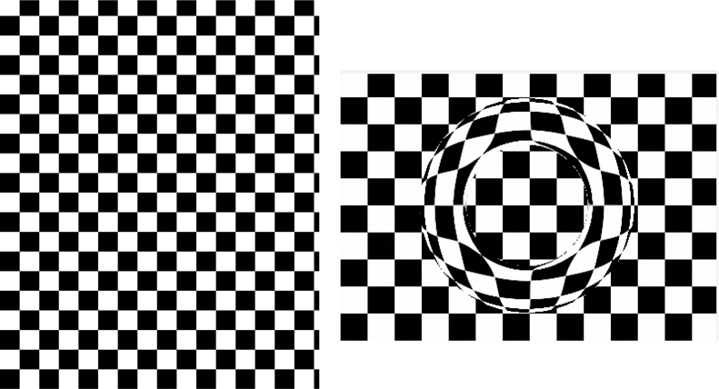

> Navigation: [Technologies](../../technologies.md) · [Core Image](../../coreimage.md) · [CIFilter](../cifilter-swift.class.md)

# torusLensDistortion()

<sub>Type Method</sub>

Creates a torus-shaped lens to distort the image.

<sub>iOS, iPadOS, Mac Catalyst, macOS, tvOS, visionOS</sub>

```swift
class func torusLensDistortion() -> any CIFilter & CITorusLensDistortion
```

## Return Value

The distorted image.

## Discussion

This method applies the torus lens distortion filter to an image. This effect distorts an image by creating a torus-shaped object, placing it over the input image, and applying the refraction.

The torus lens distortion filter uses the following properties:

- **`inputImage`** — An image with the type [CIImage](../ciimage.md).
- **`center`** — A set of coordinates marking the center of the image as a [CGPoint](../../corefoundation/cgpoint.md).
- **`radius`** — A `float` representing the amount of pixels the filter uses in the tours as an [NSNumber](../../foundation/nsnumber.md).
- **`refraction`** — A `float` representing the refraction of the glass as an [NSNumber](../../foundation/nsnumber.md).
- **`width`** — A `float` representing the width of the torus ring as an [NSNumber](../../foundation/nsnumber.md).

The following code creates a filter that results in a torus-shaped object placed over the image:

```swift
func torusLens(inputImage: CIImage) -> CIImage {
    let filter = CIFilter.torusLensDistortion()
    filter.inputImage = inputImage
    filter.radius = 620
    filter.refraction = 1.7
    filter.center = CGPoint(x: 1791, y: 1344)
    filter.width = 360
    return filter.outputImage!
}
```



<sub>Two images next to each other. The image on the left contains a black-and-white checkerboard pattern. The image on the right has the torus lens distortion filter applied. The image appears to have a ring of distortion around the center.</sub>

## See Also

### Filters

- [+ bumpDistortionFilter](<bumpdistortion().md>) — Distorts an image with a concave or convex bump.
- [+ bumpDistortionLinearFilter](<bumpdistortionlinear().md>) — Linearly distorts an image with a concave or convex bump.
- [+ circleSplashDistortionFilter](<circlesplashdistortion().md>) — Distorts an image with radiating circles to the periphery of the image.
- [+ circularWrapFilter](<circularwrap().md>) — Distorts an image by increasing the distance of the center of the image.
- [+ displacementDistortionFilter](<displacementdistortion().md>) — Applies the grayscale values of the second image to the first image.
- [+ drosteFilter](<droste().md>) — Stylizes an image with the Droste effect.
- [+ glassDistortionFilter](<glassdistortion().md>) — Distorts an image by applying a glass-like texture.
- [+ glassLozengeFilter](<glasslozenge().md>) — Creates a lozenge-shaped lens and distorts the image.
- [+ holeDistortionFilter](<holedistortion().md>) — Distorts an image with a circular area that pushes the image outward.
- [+ lightTunnelFilter](<lighttunnel().md>) — Distorts an image by generating a light tunnel.
- [+ ninePartStretchedFilter](<ninepartstretched().md>) — Distorts an image by stretching it between two breakpoints.
- [+ ninePartTiledFilter](<nineparttiled().md>) — Distorts an image by tiling portions of it.
- [+ pinchDistortionFilter](<pinchdistortion().md>) — Distorts an image by creating a pinch effect with stronger distortion in the center.
- [+ stretchCropFilter](<stretchcrop().md>) — Distorts an image by stretching or cropping to fit a specified size.
- [+ twirlDistortionFilter](<twirldistortion().md>) — Distorts an image by rotating pixels around a center point.
