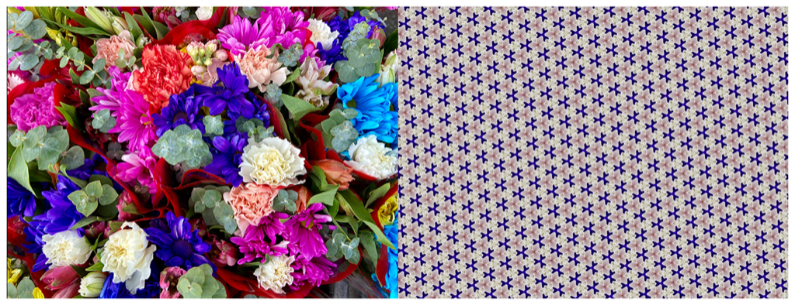

> Navigation: [Technologies](../../technologies.md) · [Core Image](../../coreimage.md) · [CIFilter](../cifilter-swift.class.md)

# triangleTile()

<sub>Type Method</sub>

Tiles a triangular area of an image.

<sub>iOS, iPadOS, Mac Catalyst, macOS, tvOS, visionOS</sub>

```swift
class func triangleTile() -> any CIFilter & CITriangleTile
```

## Return Value

The tiled image.

## Discussion

This method applies the triangle tile filter to an image. The effect creates a tiled pattern from a triangular area from the input image.

The triangle tile filter uses the following properties:

- **`inputImage`** — An image with the type [CIImage](../ciimage.md).
- **`center`** — A set of coordinates marking the center of the image as a [CGPoint](../../corefoundation/cgpoint.md).
- **`angle`** — A `float` representing the direction of distortion, in radians as an [NSNumber](../../foundation/nsnumber.md).
- **`width`** — A `float` representing the set width of each tile as an [NSNumber](../../foundation/nsnumber.md).

The following code creates a filter that produces a triangle of the input image and tiles the result:

```swift
func triangle(inputImage: CIImage) -> CIImage {
    let triangleTile = CIFilter.triangleTile()
    triangleTile.setValue(inputImage, forKey: kCIInputImageKey)
    triangleTile.center = CGPoint(x: 2016, y: 1512)
    triangleTile.angle = 1
    triangleTile.width = 250
    return triangleTile.outputImage!
}
```



<sub>Two photographs of a bouquet of multiple colorful flowers. The photo on the left is up close with good lighting and focus. In the photo on the right, a triangle tile filter is applied, resulting in a triangle portion of the image containing white and blue petals repeated throughout the entire image.</sub>

## See Also

### Filters

- [+ affineClampFilter](<affineclamp().md>) — Performs a transform on the image and extends the image edges to infinity.
- [+ affineTileFilter](<affinetile().md>) — Performs a transform on the image and tiles the result.
- [+ eightfoldReflectedTileFilter](<eightfoldreflectedtile().md>) — Creates an eight-way reflected pattern.
- [+ fourfoldReflectedTileFilter](<fourfoldreflectedtile().md>) — Creates a four-way reflected pattern.
- [+ fourfoldRotatedTileFilter](<fourfoldrotatedtile().md>) — Creates a tiled image by rotating a tile in increments of 90 degrees.
- [+ fourfoldTranslatedTileFilter](<fourfoldtranslatedtile().md>) — Creates a tiled image by applying four translation operations.
- [+ glideReflectedTileFilter](<glidereflectedtile().md>) — Tiles an image by rotating and reflecting a tile from the image.
- [+ kaleidoscopeFilter](<kaleidoscope().md>) — Creates a 12-way kaleidoscopic image from an image.
- [+ opTileFilter](<optile().md>) — Produces an effect that mimics a style of visual art that uses optical illusions.
- [+ parallelogramTileFilter](<parallelogramtile().md>) — Warps the image to create a parallelogram and tiles the result.
- [+ perspectiveTileFilter](<perspectivetile().md>) — Tiles an image by adjusting the perspective of the image.
- [+ sixfoldReflectedTileFilter](<sixfoldreflectedtile().md>) — Produces a tiled image from a source image by applying a six-way reflected symmetry.
- [+ sixfoldRotatedTileFilter](<sixfoldrotatedtile().md>) — Creates a tiled image by rotating in increments of 60 degrees.
- [+ triangleKaleidoscopeFilter](<trianglekaleidoscope().md>) — Create a triangular kaleidoscope effect and then tiles the result.
- [+ twelvefoldReflectedTileFilter](<twelvefoldreflectedtile().md>) — Creates a tiled image by rotating in increments of 30 degrees.
