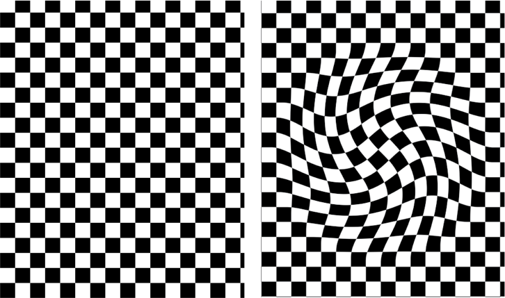

> Navigation: [Technologies](../../technologies.md) · [Core Image](../../coreimage.md) · [CIFilter](../cifilter-swift.class.md)

# twirlDistortion()

<sub>Type Method</sub>

Distorts an image by rotating pixels around a center point.

<sub>iOS, iPadOS, Mac Catalyst, macOS, tvOS, visionOS</sub>

```swift
class func twirlDistortion() -> any CIFilter & CITwirlDistortion
```

## Return Value

The distorted image.

## Discussion

This method applies the twirl distortion filter to an image. This effect distorts an image by rotating pixels around the defined center to create a twirling effect. You can specify the number of rotations to control the strength of the effect.

The twirl distortion filter uses the following properties:

- **`inputImage`** — An image with the type [CIImage](../ciimage.md).
- **`radius`** — A `float` representing the amount of pixels the filter uses to create the distortion as an [NSNumber](../../foundation/nsnumber.md).
- **`center`** — A set of coordinates marking the center of the image as a [CGPoint](../../corefoundation/cgpoint.md).
- **`angle`** — A `float` representing the angle of the twirl, in radians, as an [NSNumber](../../foundation/nsnumber.md).

The following code creates a filter that results in the center of the image becoming twirled:

```swift
func twirlDistort(inputImage: CIImage) -> CIImage {
    let filter = CIFilter.twirlDistortion()
    filter.inputImage = inputImage
    filter.radius = 600
    filter.angle = 3.141592653589793
    filter.center = CGPoint(x: 1791, y: 1344)
    return filter.outputImage!
}
```



<sub>Two images next to each other. The image on the left contains a black-and-white checkerboard pattern. The image on the right has the twirl distortion filter applied. The image appears to be twisted from the center with the twist decreasing towards the edges of the image.</sub>

## See Also

### Filters

- [+ bumpDistortionFilter](<bumpdistortion().md>) — Distorts an image with a concave or convex bump.
- [+ bumpDistortionLinearFilter](<bumpdistortionlinear().md>) — Linearly distorts an image with a concave or convex bump.
- [+ circleSplashDistortionFilter](<circlesplashdistortion().md>) — Distorts an image with radiating circles to the periphery of the image.
- [+ circularWrapFilter](<circularwrap().md>) — Distorts an image by increasing the distance of the center of the image.
- [+ displacementDistortionFilter](<displacementdistortion().md>) — Applies the grayscale values of the second image to the first image.
- [+ drosteFilter](<droste().md>) — Stylizes an image with the Droste effect.
- [+ glassDistortionFilter](<glassdistortion().md>) — Distorts an image by applying a glass-like texture.
- [+ glassLozengeFilter](<glasslozenge().md>) — Creates a lozenge-shaped lens and distorts the image.
- [+ holeDistortionFilter](<holedistortion().md>) — Distorts an image with a circular area that pushes the image outward.
- [+ lightTunnelFilter](<lighttunnel().md>) — Distorts an image by generating a light tunnel.
- [+ ninePartStretchedFilter](<ninepartstretched().md>) — Distorts an image by stretching it between two breakpoints.
- [+ ninePartTiledFilter](<nineparttiled().md>) — Distorts an image by tiling portions of it.
- [+ pinchDistortionFilter](<pinchdistortion().md>) — Distorts an image by creating a pinch effect with stronger distortion in the center.
- [+ stretchCropFilter](<stretchcrop().md>) — Distorts an image by stretching or cropping to fit a specified size.
- [+ torusLensDistortionFilter](<toruslensdistortion().md>) — Creates a torus-shaped lens to distort the image.
