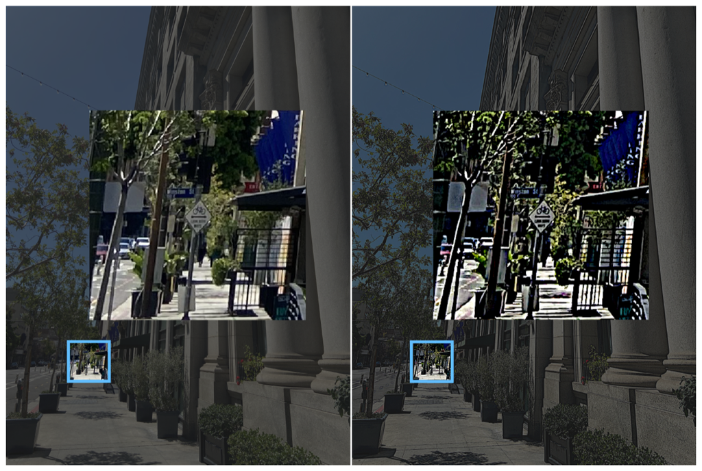

> Navigation: [Technologies](../../technologies.md) · [Core Image](../../coreimage.md) · [CIFilter](../cifilter-swift.class.md)

# unsharpMask()

<sub>Type Method</sub>

Increases an image’s contrast between two colors.

<sub>iOS, iPadOS, Mac Catalyst, macOS, tvOS, visionOS</sub>

```swift
class func unsharpMask() -> any CIFilter & CIUnsharpMask
```

## Return Value

The modified image.

## Discussion

This method applies the unsharp mask filter to an image. The effect increases the contrast of the edge between pixels of different colors within the defined radius property.

The unsharp mask filter uses the following properties:

- **`inputImage`** — An image with the type [CIImage](../ciimage.md).
- **`radius`** — A `float` representing the area of effect as an [NSNumber](../../foundation/nsnumber.md).
- **`intensity`** — A `float` representing the desired strength of the effect as an [NSNumber](../../foundation/nsnumber.md).

The following code creates a filter that results in the objects within the image becoming darker:

```swift
func unsharp (inputImage: CIImage) -> CIImage? {    
    let unsharpMask = CIFilter.unsharpMask()
    unsharpMask.inputImage = inputImage
    unsharpMask.radius = 5
    unsharpMask.intensity = 2.5
    return unsharpMask.outputImage!
}
```



<sub>Two photographs of a downtown sidewalk with trees, a blue square highlighting the end of the sidewalk with a bike lane and street sign displayed. The photo on the left has no modifications to color. In the photo on the right a unsharp mask filter has been applied resulting in darker color on the tree leafs and street signs. </sub>

## See Also

### Filters

- [+ sharpenLuminanceFilter](<sharpenluminance().md>) — Applies a sharpening effect to an image.
